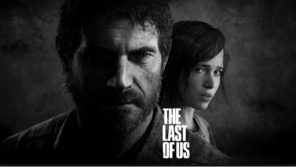
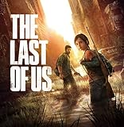

---
categories:
- ゲーム
date: Mon, 10 Feb 2014 17:19:06 +0000
slug: post-4291
tags:
- 眠気防止
title: 「The Last of Us」追加エピソード「残されたもの」配信決定！
---

ハロー。しんぺー(<a href="https://twitter.com/s_s_p_y" target="_blank">@s_s_p_y</a> )です。

ぼくが、ひっさびさに一目見て心の底からやりてーって思ったゲーム、それが「The Last of Us」です。

<h2>「The last of Us」のあらすじ</h2>
突如発生した謎のウィルス、観戦した人間は凶暴化し、他人を襲うようになった。感染者に噛まれた人間はやがて発症し、同じように感染していない者を襲った。こうして、都市は大混乱に陥った。
そのさ中、娘と弟と混乱から逃げようとする男性の姿があった。この物語の主人公、ジョエルだった。
大混乱の都市部に迷い込んだ3人は、街を出るため高速道路を目指し、走った。そして•••

20年後！！どん！！ってかwww多分ここが最初の衝撃なんで、まだやってない人のために書きません。

<h3>とある少女との出会い</h3>
生きるために違法な運び屋として生計をたてていたジョエルは、成り行きで少女エリーをある場所へと運ぶことになりました。
その過程で、大切なものを失い、お互い助け合い強固な絆を築き、待ち受ける悲劇に立ち向かうのでした。

ジョエルは少女を守るために戦い、そしてついた嘘とは•••

<h2>追加エピソード「残されたもの」</h2>

ティザームービー
<iframe width="560" height="315" src="//www.youtube.com/embed/Op_Imj7Iwhw?rel=0" frameborder="0" allowfullscreen></iframe>

<h3>内容の予想</h3>
少女2人で、サバイバルする話かな？？
そして残されたものってのは、エリーのことかなって思います。

つまり、これはジョエルと出会う前のエリーのお話なんじゃねーかと予想しまし。

そっかに設定でてるかな？

<h2>しんぺーはこう思った。</h2>

ぼくが他のゾンビ系ドラマやら映画やらと違っていると思うのが、アウトブレイクから20年後って設定です。
20年って、ある種ゾンビとの共存というか住み分けが明確化しているってことを表しているし、それなりの権力構造もできているってことで、その辺がリアルだなと思いました。

それと、ぼくゲームをひっさしぶりにやったってこともあって、その表現のリアルさに度肝を抜かれました。そして、ラストシーンにも•••

その続編というか、追加エピソードってことなら、やらいでか！
ってことで、ばっちり環境を整えたらダウンロード開始日まで本編を復習しつつ待ちたいと思いまっす！

<a href="http://www.amazon.co.jp/exec/obidos/ASIN/B00BXSZYXQ/warawareotoko-22/ref=nosim/" rel="nofollow" target="_blank">The Last of Us (ラスト・オブ・アス)</a>
posted with <a href="http://kaereba.com" rel="nofollow" target="_blank">カエレバ</a>

 ソニー・コンピュータエンタテインメント 2013-06-20    

<a href="http://www.amazon.co.jp/exec/obidos/ASIN/B00BXSZYXQ/warawareotoko-22/ref=nosim/" rel="nofollow" target="_blank">Amazon.co.jp で詳細を見る</a>

