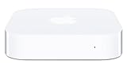
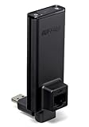
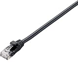
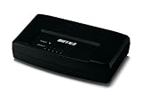
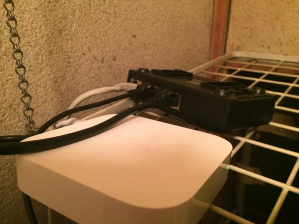
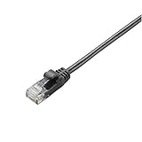
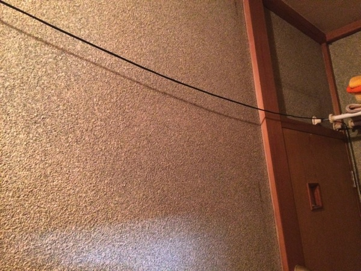
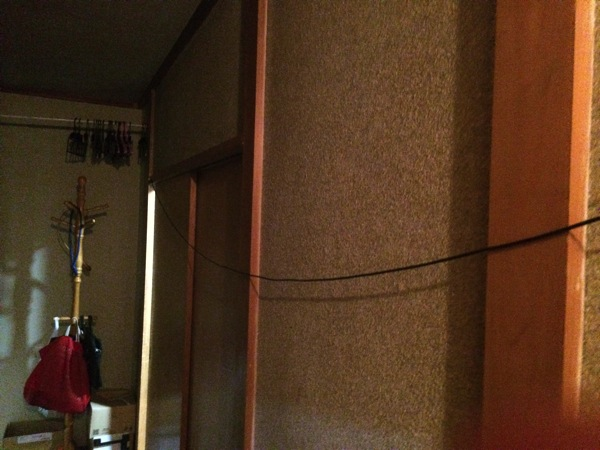

---
categories:
- ゲーム
date: Tue, 11 Feb 2014 09:09:51 +0000
slug: post-4302
tags:
- 眠気防止
title: 「The Last of Us~残されたもの~」をプレイするためにPS3をネットにつなげる方法
---

ハロー。しんぺー(<a href="https://twitter.com/s_s_p_y" target="_blank">@s_s_p_y</a> )です。

さて、もう日が迫ってます。せっせと整えた環境設定についてご紹介です。
どうでもいいけどティザームービーのエリーがなで肩すぎやしねーかとひやひやしております。

<h2>プレイステーション3をネットにつなぐ方法</h2>
普通に有線すればいいんですけど、ぼくはAirmac expressを使っていてなおかつポートを一個使用しちゃっていたので、有線することができませんでした。

しかも、プレステを設置している部屋からAiemacさんの所まで離れています。

<a href="http://www.amazon.co.jp/exec/obidos/ASIN/B008CVTN4I/warawareotoko-22/ref=nosim/" target="_blank" rel="nofollow">Apple AirMac Express ベースステーション MC414J/A</a>

posted with <a href="http://kaereba.com" target="_blank" rel="nofollow">カエレバ</a>

アップル 2012-06-13

<a href="http://www.amazon.co.jp/exec/obidos/ASIN/B008CVTN4I/warawareotoko-22/ref=nosim/" target="_blank" rel="nofollow">Amazon.co.jp で詳細を見る</a>

<h3>PS3をネットにつなごう（失敗編）</h3>
最初は、こんなものを使って無線でつなごうとか思ったりしました。

<a href="http://www.amazon.co.jp/exec/obidos/ASIN/B008MRUINC/warawareotoko-22/ref=nosim/" target="_blank" rel="nofollow">BUFFALO 11n/a/g/b 300Mbps 簡単無線LAN子機 WLI-UTX-AG300/C</a>

posted with <a href="http://kaereba.com" target="_blank" rel="nofollow">カエレバ</a>

バッファロー 2012-08-01

<a href="http://www.amazon.co.jp/exec/obidos/ASIN/B008MRUINC/warawareotoko-22/ref=nosim/" target="_blank" rel="nofollow">Amazon.co.jp で詳細を見る</a>

ただ、レビューにも書いている通り設定がめっちゃくちゃ難しいんですわ。
ドライバをダウンロードして設定しなくちゃいけないんですが、ググっても2つくらいしか解決している人がいなくて、しかもMacで設定できないっぽい。。。

ということで4000円くらいしたんですが結局使えませんでした。
<h3>PS3をネットにつなごう（成功編）</h3>
<h4>ネットに繋がってるPCとブリッジを組んで有線させる。</h4>
これね、ぼく詳しくないんでよく解らないんですけど。
ネットに無線で繋がってるPCとPS３を有線接続してブリッジ接続ってやつをすることで、PC経由でネットに接続ができちゃうっちゅーことらしいです。

必要なのはこれだけだと思います。少なくともこの方法でぼくが使ったのはこれだけでした。

<a href="http://www.amazon.co.jp/exec/obidos/ASIN/B002ZB7QRW/warawareotoko-22/ref=nosim/" target="_blank" rel="nofollow">ELECOM LANケーブル CAT6準拠 Gigabit スタンダード 0.3m ブラック LD-GPJ/BK03</a>

posted with <a href="http://kaereba.com" target="_blank" rel="nofollow">カエレバ</a>

エレコム 2009-11-26

<a href="http://www.amazon.co.jp/exec/obidos/ASIN/B002ZB7QRW/warawareotoko-22/ref=nosim/" target="_blank" rel="nofollow">Amazon.co.jp で詳細を見る</a>

当然あとはPCとかも必要ですけどねw

この方法の問題点としては、PSの横に起動中のPCがないとだめな点です。
ぼくの場合、使っていないWindowsのデスクトップを使っていたのでかなり邪魔でした。
それと速度が遅すぎて、不安定な所がありましたね。

あまりおすすめできる方法とは言えません。
<h3>PS3をネットにつなごう（大成功編）</h3>
もう、四の五の言わずにだまって優先しちゃいましょう。
それが一番です。

そこで調べました。

ポートが足りなかったら、こんなもんを使えばポートの数を増やす事ができます。

<a href="http://www.amazon.co.jp/exec/obidos/ASIN/B0047Y08FW/warawareotoko-22/ref=nosim/" target="_blank" rel="nofollow">BUFFALO 10/100M 5ポート スイッチングHub ブラック LSW3-TX-5EPL/B</a>

posted with <a href="http://kaereba.com" target="_blank" rel="nofollow">カエレバ</a>

バッファロー 2010-11-17

<a href="http://www.amazon.co.jp/exec/obidos/ASIN/B0047Y08FW/warawareotoko-22/ref=nosim/" target="_blank" rel="nofollow">Amazon.co.jp で詳細を見る</a>

これと下のケーブルでつながりました。
調べたらクロスケーブルがどうのって書いてあるページがありましたが、とりあえず下のケーブルで大丈夫でした。

<a href="http://www.amazon.co.jp/exec/obidos/ASIN/B002ZB7QRW/warawareotoko-22/ref=nosim/" target="_blank" rel="nofollow">ELECOM LANケーブル CAT6準拠 Gigabit スタンダード 0.3m ブラック LD-GPJ/BK03</a>

posted with <a href="http://kaereba.com" target="_blank" rel="nofollow">カエレバ</a>

エレコム 2009-11-26

<a href="http://www.amazon.co.jp/exec/obidos/ASIN/B002ZB7QRW/warawareotoko-22/ref=nosim/" target="_blank" rel="nofollow">Amazon.co.jp で詳細を見る</a>

こんな感じでつなげました。

<h4>PS3とLANまでの距離が遠い人はこんなのも買いましょう。</h4>
これね。なげーwwめっちゃなげーよww

<a href="http://www.amazon.co.jp/exec/obidos/ASIN/B001BY5BLC/warawareotoko-22/ref=nosim/" target="_blank" rel="nofollow">ELECOM LANケーブル CAT5e準拠 やわらか 15m ブラック LD-CTY/BK15</a>

posted with <a href="http://kaereba.com" target="_blank" rel="nofollow">カエレバ</a>

エレコム 2008-07-01

<a href="http://www.amazon.co.jp/exec/obidos/ASIN/B001BY5BLC/warawareotoko-22/ref=nosim/" target="_blank" rel="nofollow">Amazon.co.jp で詳細を見る</a>

今の所ちゃんとしていないのでwこんな感じでとりあえずたるんでますw

<h2>しんぺーはこう思った。</h2>
有線が最高です。
有線させなきゃなんにもならんですわ。

これでやっと環境は整った！

あとはダウンロードに備えてPSNカードを買ってくればおけおけ！

これでまたあの恐怖を味わうことができるぜい！楽しみだん！

<a href="http://www.amazon.co.jp/exec/obidos/ASIN/B00BXSZYXQ/warawareotoko-22/ref=nosim/" rel="nofollow" target="_blank">The Last of Us (ラスト・オブ・アス)</a>
posted with <a href="http://kaereba.com" rel="nofollow" target="_blank">カエレバ</a>

 ソニー・コンピュータエンタテインメント 2013-06-20    

<a href="http://www.amazon.co.jp/exec/obidos/ASIN/B00BXSZYXQ/warawareotoko-22/ref=nosim/" rel="nofollow" target="_blank">Amazon.co.jp で詳細を見る</a>

