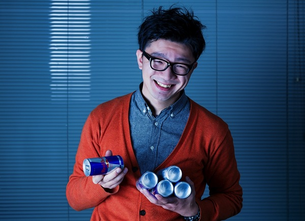

---
categories:
- ライフハック
date: Fri, 14 Feb 2014 04:02:30 +0000
slug: post-4324
tags:
- 眠気防止
title: 【仕事中眠け防止シリーズ】その4「アリナミンEX PLUS」を3日間飲んでみた結果
---

全く効果なし!ハロー。しんぺー(<a href="https://twitter.com/s_s_p_y" target="_blank">@s_s_p_y</a> )です。追加レポートです。

アリナミン飲んでも全然眠くなるわ。肩も凝るし。

こうかないっすぃんぐ！

<h2>本当に効果なし？</h2>

本当に効果なし。疲れすぎてたから？確かに休み明けからいつもより1時間早く起きて朝ご飯食べて、筋トレしてました。
その結果、睡眠時間は3時間くらいでしたよ。

画像著作者: Sudhanshu Pran Kaul

でも火曜日休みだったし、そこまでは疲れてないはずだよ！今日は筋トレとかできずに1時間遅く起きたし。
それでも午前中クソネミ。

<h2>アリナミンの効果感じられないから、あれ飲んだよ</h2>

キューピーコーワをね。今日はレッドブルはやめときました。

そしたら、そこから少しづつ眠気も吹っ飛び出しましたわ！

<h2>しんぺーはこう思った。</h2>

今、この記事はスタバでコーヒーを飲みながら書いています。

それでもウトウトしてしまうし。ぼくやっぱ疲れてるかも•••
それにしても今週は、眠かった。全くやる気も起きなかった。

と吐き気がする程、痙攣する程の眠気

早く帰ってちゃんと寝て、来週の戦いに備えようっと。

おやすみなさい←