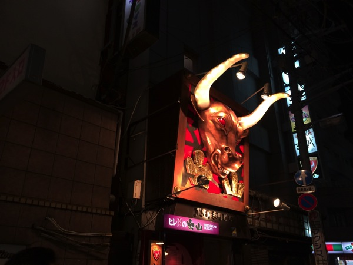
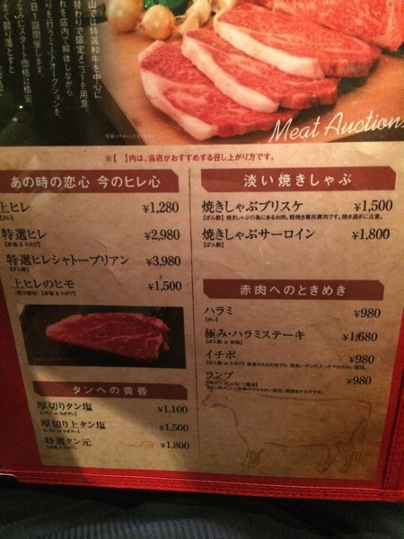
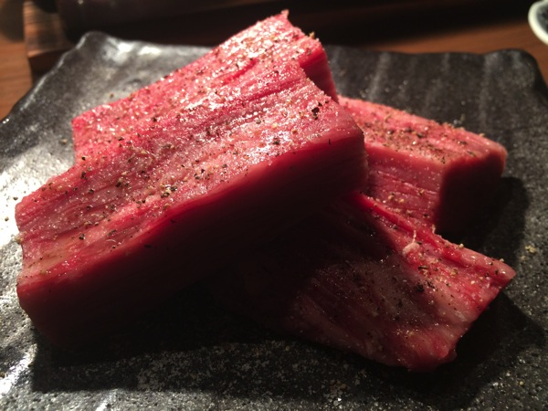

---
categories:
- グルメ
date: Tue, 18 Feb 2014 03:49:20 +0000
slug: post-4351
tags:
- 焼肉
title: 店内で高級肉をオークションで競り落として食べられる錦糸町の「ヒレ肉の宝山」行ってきたった！
---

ハロー。しんぺー(<a href="https://twitter.com/s_s_p_y" target="_blank">@s_s_p_y</a> )です。錦糸町のヒレ肉の宝山に行ってきました。

<h2>肉の宝山ってどんなお店？</h2>

メニューはこちら

そこそこお高目な気がしますが•••

ところがどっこい4人で14000円程度でした。１人3500円くらい！安い•••

お肉はこんな感じです！分厚くてうまい！！
<iframe class="vine-embed" src="https://vine.co/v/MZzYQEbiplv/embed/simple" width="480" height="480" frameborder="0"></iframe>

<h2>店内でオークション！競り落としたテーブルが食べられる！</h2>
美味しい部位を場合によっては他店よりも安く食べられる！それがこのお店の魅力です！
もちろんオークションなんで、場合によってはそんなに安くないかもしれませんw

でも、楽しい！美味しい！楽しい！

実演と説明でオークションスタートです。100円単位で切り上げてってみんなだいたい4000円前後でしぶりだすw

<iframe class="vine-embed" src="https://vine.co/v/MZzjV16n3j7/embed/simple" width="480" height="480" frameborder="0"></iframe>

<h2>しんぺーはこう思った。</h2>
こんなに美味しくてしかも安いお店なんてそうそうないですよw

すんげーおすすめの錦糸町の「ヒレ肉の宝山」はこちらです！

おすすめ！ぜったいいけ！

<strong><a href="http://tabelog.com/tokyo/A1312/A131201/13162354/" target="_blank">ヒレ肉の宝山 錦糸町店</a></strong>

<strong>関連ランキング：</strong><a href="http://tabelog.com/rstLst/yakiniku/">焼肉</a> | <a href="http://tabelog.com/tokyo/A1312/A131201/R3373/rstLst/">錦糸町駅</a>、<a href="http://tabelog.com/tokyo/A1312/A131201/R5442/rstLst/">住吉駅</a>、<a href="http://tabelog.com/tokyo/A1312/A131201/R3020/rstLst/">菊川駅</a>
