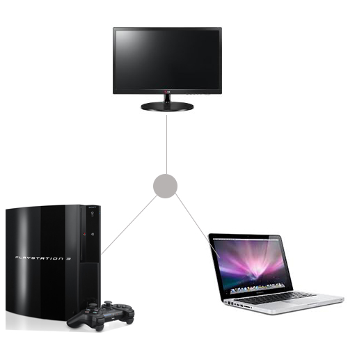
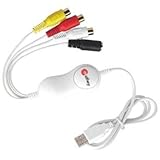
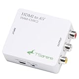
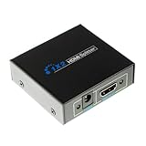
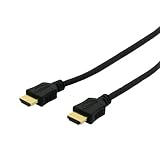
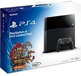

---
categories:
- ゲーム
date: Sun, 23 Feb 2014 04:31:25 +0000
slug: post-4394
tags:
- ゲーム
title: 「The Last of Us~残されたもの~」をMacでゲーム実況する方法
---

ハロー。しんぺー(<a href="https://twitter.com/s_s_p_y" target="_blank">@s_s_p_y</a> )です。

さて有線でつないでからというもの毎日一日も漏らさずに「The Last of Us」マルチプレイを楽しんでいます。

さて、いよいよゲーム実況を来週から開始します！
そこで今回は現在構築中のゲーム実況の環境をご紹介します。
こんな感じでPS3とテレビとmacをつなぎます。

<h2>ゲーム実況をするために必要なツール</h2>

まず大前提ですが、ぼくはMac book Proを使ってます。しかしMac book Proには映像データを入力でモニターに写す機能がありません。

HDMIも出力のみです。

例外としてiMacはモニターとして使えるように入力があるみたいです。

<a style="color:#0070C5;" href="https://www.warawareotoko.com/2014/01/27/post-4147/" target="_blank">ゲーム用に外部モニターを導入しましたよーって話 | Gadget Zombie Parasite</a>  

そこでMacに映像を入力するツールが必要になるわけですが、それがこういった類いのものになります。

<h3>mathey Mac対応ビデオキャプチャー VIDEO CAP For Mac MVCP-02MAC</h3>

テレビに出力されたPS3の映像をMacに取り込むためのツールです。
本来は、ビデオカメラの映像とかをMacに取り込むもののようです。

<a href="http://www.amazon.co.jp/exec/obidos/ASIN/B001MI15ZS/warawareotoko-22/ref=nosim/" rel="nofollow" target="_blank">mathey Mac対応ビデオキャプチャー VIDEO CAP For Mac MVCP-02MAC</a>
posted with <a href="http://kaereba.com" rel="nofollow" target="_blank">カエレバ</a>

 mathey 2009-01-05    

<a href="http://www.amazon.co.jp/exec/obidos/ASIN/B001MI15ZS/warawareotoko-22/ref=nosim/" rel="nofollow" target="_blank">Amazon.co.jp で詳細を見る</a>

ただしこれだけでは、使えません。こいつはアナログ出力されたものしか受け付けません。詳しくないのであってるかわかりませんが、要は3色端子でこいつに接続しないとダメな訳です。
PS3から3色でひっぱってくる場合はこのままでOKですが、ぼくの場合はHDMIで出力させたいと思いました。その方が画像もキレイかな？両方ためしてないので解りませんが•••

で必要になってくるのがHDMIを3色に変換してくれるツール、そいつがこれです。

<a href="http://www.amazon.co.jp/exec/obidos/ASIN/B008GXE0NQ/warawareotoko-22/ref=nosim/" rel="nofollow" target="_blank">TSdrena 電源不要 HDMI → アナログ(コンポジット) 小型コンバーター HAM-CHIC2　[相性保証付き]</a>
posted with <a href="http://kaereba.com" rel="nofollow" target="_blank">カエレバ</a>

 TSdrena     

<a href="http://www.amazon.co.jp/exec/obidos/ASIN/B008GXE0NQ/warawareotoko-22/ref=nosim/" rel="nofollow" target="_blank">Amazon.co.jp で詳細を見る</a>

これに関してはiPhone5以降の機種を車の中で使う場合の記事でも紹介しました。すんげー使えるガジェットです。安いし。

<a style="color:#0070C5;" href="https://www.warawareotoko.com/2013/10/06/iphone_carnavi/" target="_blank">iPhoneをカーナビに接続して音楽・動画・Youtubeを見る方法（機種別方法） | Gadget Zombie Parasite</a>  

<h3>PS3から出力される画像をテレビとMacに同時出力するための分配機</h3>

そのままです。PS3の動画を2つのモニターにHDMI出力させるためのものになります。

<a href="http://www.amazon.co.jp/exec/obidos/ASIN/B003U0M3BQ/warawareotoko-22/ref=nosim/" rel="nofollow" target="_blank">１入力２出力 対応HDMI 分配器 スプリッター　Y-アダプタ 1080p FullHD1.3b 2-port/ 1 to 2</a>
posted with <a href="http://kaereba.com" rel="nofollow" target="_blank">カエレバ</a>

 KanaaN     

<a href="http://www.amazon.co.jp/exec/obidos/ASIN/B003U0M3BQ/warawareotoko-22/ref=nosim/" rel="nofollow" target="_blank">Amazon.co.jp で詳細を見る</a>

環境によって最適の長さのケーブルを選択しましょう。

<a href="http://www.amazon.co.jp/exec/obidos/ASIN/B003V5Y32W/warawareotoko-22/ref=nosim/" rel="nofollow" target="_blank">【Amazon.co.jp限定】PLANEX ハイスピードHDMI Ver1.4ケーブル 1m (PS3/Xbox360) PL-HDMI01-EZ (FFP)</a>
posted with <a href="http://kaereba.com" rel="nofollow" target="_blank">カエレバ</a>

 プラネックス 2010-07-09    

<a href="http://www.amazon.co.jp/exec/obidos/ASIN/B003V5Y32W/warawareotoko-22/ref=nosim/" rel="nofollow" target="_blank">Amazon.co.jp で詳細を見る</a>

<h2>しんぺーはこう思った。</h2>

いよいよぼくのゲーム実況動画配信が始まります。
以前からちょくちょくあげていましたが、中途半端な感じでなおかつmacのゲームをプレイしていたので操作性がくっそ悪くてぐだぐだでした。

今回からは以前よりかはパワーアップしたものが出せるんじゃないかなと思います。
さらに、今は通信対戦で日々精進しておりますので割とゲームのブランクを埋められるくらいにはなってきたかと思います。

ゲームの面白い所は、ブログもそうですが、自分の精進とともに結果がついてくる所だと思います。
通信対戦でソッコーで負けてたのが、だんだんとうまくなって、やられる側からやる側になってく。その感じが凄い楽しいです。

それとチームプレイなんかで、明らかにレベルが低い自分のチームが強いチームを連携して追いつめていく感じも素敵です。

いやーこの年になってゲームに目覚めるとは思いませんでしたw

そしてついにプレステ4も発売されました！
当然いずれは購入します！

<a href="http://www.amazon.co.jp/exec/obidos/ASIN/B00FJ08HQU/warawareotoko-22/ref=nosim/" rel="nofollow" target="_blank">Playstation 4 First Limited Pack (プレイステーション4専用ソフト KNACK ダウンロード用 プロダクトコード 同梱)</a>
posted with <a href="http://kaereba.com" rel="nofollow" target="_blank">カエレバ</a>

 ソニー・コンピュータエンタテインメント 2014-02-22    

<a href="http://www.amazon.co.jp/exec/obidos/ASIN/B00FJ08HQU/warawareotoko-22/ref=nosim/" rel="nofollow" target="_blank">Amazon.co.jp で詳細を見る</a>

とりあえず来週からゲーム実況ができそうなので、随時アップしていきたいと思います！

といった所で、本日は以上です。おやすみなさい。