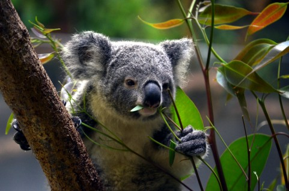

---
categories:
- DIR EN GREY
date: Sun, 23 Feb 2014 15:20:38 +0000
slug: post-4405
tags:
- DIR EN GREY
title: DIR EN GRE soundwave in Australiaまとめ
---

さて！昨日より始まりましたオーストラリアの移動型フェス「SOUNDWAVE」

中々現地からの情報が入ってきませんね。
<h2>とりあえずの第一報がこいつでした。</h2>

このやり取りからでしょうか。虜界隈でShinyaがコアラだっこしてんじゃね？ってなったのかと思います。
<blockquote class="twitter-tweet" lang="ja">
<a href="https://twitter.com/_x_Shinya_x_">@_x_Shinya_x_</a> 何度見てもめっちゃいい写真ですね！！！美しすぎる(((o(*ﾟ▽ﾟ*)o)))&#10;せっかくなので、コアラちゃん連れて帰って来て下さい☻w
&mdash; Lyuon (@lyuon56) <a href="https://twitter.com/lyuon56/statuses/436829670130999298">2014, 2月 21</a></blockquote>

そして•••Toshiyaがコアラをだっこするの図。Booチャンネル？だったかな、その時の公約が果たされましたね。
<blockquote class="twitter-tweet" lang="ja">
As promised on Nico Nico Live, I had a great time with them. -Toshiya <a href="http://t.co/96O6ou9VRU">http://t.co/96O6ou9VRU</a>&#10;<a href="http://t.co/E1q179wBBo">http://t.co/E1q179wBBo</a>
&mdash; DIR EN GREY (@DIRENGREY_web) <a href="https://twitter.com/DIRENGREY_web/statuses/437513137462317056">2014, 2月 23</a></blockquote>

さらにLIVEの動画。
<blockquote class="twitter-tweet" lang="ja">
DIR EN GREY Soundwave 2014 Brisbane: <a href="http://t.co/yODaWy1mrf">http://t.co/yODaWy1mrf</a> <a href="https://twitter.com/YouTube">@youtube</a>さんから
&mdash; しんぺー@sukekiyo (@s_s_p_y) <a href="https://twitter.com/s_s_p_y/statuses/437596698664120320">2014, 2月 23</a></blockquote>

<iframe src="//instagram.com/p/ktMlcYxm1E/embed/" width="612" height="710" frameborder="0" scrolling="no" allowtransparency="true"></iframe>

こっちは海外虜のinstagramとtweet
<iframe src="//instagram.com/p/kv9EnljDya/embed/" width="612" height="710" frameborder="0" scrolling="no" allowtransparency="true"></iframe>

<blockquote class="twitter-tweet" lang="ja">
Toshiya durante una entrevista http://t.co/sXZVGGHBz5 <a href="http://t.co/gXeLW34rA7">pic.twitter.com/gXeLW34rA7</a>
&mdash; Abandon Hope (@direngrey_esp) <a href="https://twitter.com/direngrey_esp/statuses/437545908717109248">2014, 2月 23</a></blockquote>

<iframe src="//instagram.com/p/kvrzg2xZy_/embed/" width="612" height="710" frameborder="0" scrolling="no" allowtransparency="true"></iframe>

<iframe src="//instagram.com/p/kvxct7FctW/embed/" width="612" height="710" frameborder="0" scrolling="no" allowtransparency="true"></iframe>

Tシャツはこんな感じみたい。表のプリントが気になる。
<iframe src="//instagram.com/p/ktfuK0ArL3/embed/" width="612" height="710" frameborder="0" scrolling="no" allowtransparency="true"></iframe>

表の画像あった！かわいい。
https://twitter.com/zhanghesbooty/status/437478805012107264

<h2>しんぺーはこう思った。</h2>

いつも思うけど海外は撮影OKなの？って。多分ダメですよね？

LIVE中に写真や動画や音声を取るのって日本じゃ考えられない、というかDIRのLIVEじゃ考えられない。
この前のLIVEでも撮ろうとしてた人がいて、注意されたみたいだけど。

しかし•••思うのです。

レディガガのLIVEに行った時に、盛り上がると回りが携帯を取り出して撮影を開始するっちゅー。これってなんか一種のヘドバンやらフィストバンギングやらと同じ種類の行為なのかなって思いました。

ノリ方の１つなのかなって。今、体験することを納めて、後に誰かに追体験させたいって感じなのかなと思いました。

でも、せっかく生で見に来てるのにモニターごしじゃ、なんか違うんじゃね？って思いました。

そして、やっぱり撮影自体もよくないだろって思いました。ステージ自体が作品なわけですから。

それをまとめちゃってるのもどうかと思いますが、データをそのままサーバにアップするわけではなく、リンクの引用にしていますという形を当ブログではとっています。のちにフェスが終わったくらいに非公開にするかもしれません。

難しい問題です。

といった所で本日は以上です。おやすみなさい。