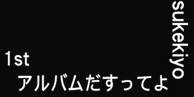
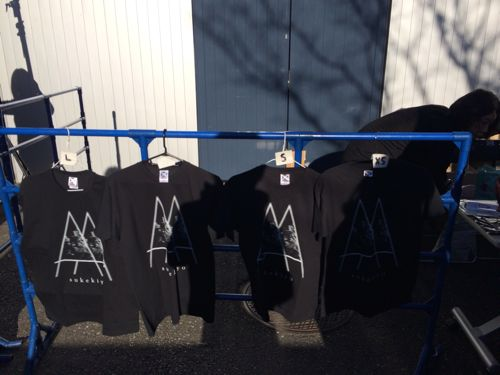
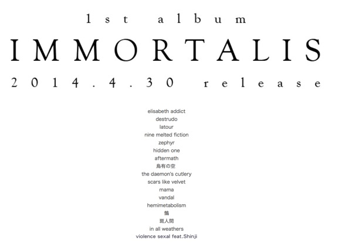

---
categories:
- sukekiyo
date: Tue, 25 Feb 2014 15:21:35 +0000
slug: post-4416
tags:
- sukekiyo
title: 二大宗教戦争完全集結宣言。sukekiyo 1stアルバム「IMMORTALIS」発売決定、豪華過ぎるゲストアーティストたち。
---

ハロー。しんぺー(<a href="https://twitter.com/s_s_p_y" target="_blank" rel="noopener noreferrer">@s<em>s</em>p_y</a> )です。
ぼくは今、興奮しています！！！

ついにsukekiyoの1stアルバムが発売決定！！

そしてそのゲストがマジですげー！！

<h2>sukekiyo 1stアルバムはバージョン違いの3つ！</h2>

まずは販売内容の詳細です。

<ol>
<li>初回生産限定/通常盤</li>
<li>京公式オンラインストア限定初回仕様限定盤</li>
<li>京公式オンラインストア限定初回生産盤</li>
</ol>

<h3>初回生産限定盤/通常盤</h3>

これは店頭販売でしょうか？
初回生産は3,800円•••、うむ、良心的な値段。
が•••しかし！！
初回生産限定盤のゲストが、ゲストがー！！こんなんで、こんなに安くていーんすか！？

<blockquote>
 SUGIZO(LUNA SEA / X JAPAN)、HISASHI(GLAY)、人時(黒夢)、石井秀仁(cali≠gari)、TK(凛として時雨)を始めとする名立たるアーティストとのリミックスを含むコラボレーション楽曲が収録され、DIR EN GREYデビュー当時、圧倒的人気を誇りライバル的な存在だったPIERROTのキリト(Angelo)とのフィーチャリングも実現。
</blockquote>

引用: http://sukekiyo-official.jp/sp/

ついに、ぼくのカリスマであるキリトと京が、夢のコラボ！
今までつらいことや死にたいことなんて山ほどあったけど、生きていてよかった。虜でよかった。ラーでよかった。
後述します。

<h3>京公式オンラインストア限定初回仕様限定盤</h3>

10,000円！た、高くないっすか•••
DVDとブックレット付きとTシャツ付き

2014/3/10(mon)～2014/3/31(mon)の間に、京オンラインで受付

http://www.e-fanclub.com/Penyunne<em>Zemeckis/webshop/i/ishop/direct</em>m_cat.asp?bun=3

<h3>京公式オンラインストア限定初回生産盤</h3>

オンラインストア初回仕様限定盤との違いはTシャツです。

どうしよ、sukekiyoTシャツの売れ残りだったら•••

<h2>二大宗教戦争完全集結宣言</h2>

むかーしむかしのことじゃった•••

ビジュアル系と呼ばれるバンドが隆盛し、栄華を極め、そして衰退の兆しを見せ出した90年代後半から2000年前半にかけて二つの宗教(バンド)の信者(ファン)間の抗争が勃発した。

これが世に言う、アルマゲドンである。

元暴走族で、工場勤務から成り上がったヘビメタ疑惑のあるヤンキーを唯一神とするピエラーと、インディーズながら当時のオリコンにランクインし、なおかつ日本武道館公演まで行い、Yoshikiプロデュースでさらにデビューシングル3枚同時発売しちゃうDIR EN GREYのファンである虜との確執がいつからあったのかは定かではない。

いつからか歪み、憎しみあい、抗争へと発展していったのだ。

安ピン事件

トンカチ事件

神宮橋での小競り合い

誠が嘘か、そんな紛争がいくつも起こったという。

しかし、唯一神キリトの集結宣言に宗教戦争に終幕が引かれたのである。

唯一神の宣言に対し、ラーは各会場やメッカ(橋)でのマナーを改め、自主的にゴミ拾いを行うものなども現れた。

やがて宗教性の違いにより分裂したPIERROTについては、アンサイクロペディアにある通りである。

そして、時は流れ、本日

sukekiyo1stアルバム「IMMORTALIS」の初回限定生産盤のゲストアーティストにキリトの名が連ねられることで、この宗教戦争は最終決着を迎えたのであった。
この事件は、さらには当時の二大カリスマの大連合であり、絶望を経験した者たちへの救いを意味するのであった•••

<h2>ちなみに話がそれましたがアルバムには『あの』アーティストも参加！</h2>

来たか•••あのアーティストが•••

SHINJI TAKEDAが•••

（2020/09/27追記：読み返してみてネタなのに、ネタと明記していないので追記します。
sukekiyoの初舞台であったSUGIZOのライブに出てた武田信治に圧倒的な違和感を抱いたので、ネタとしてここに書いたんだと思います。わかりにくい）

<h2>しんぺーはこう思った。</h2>

もう先に書いちゃいましたが。

ぼくは、最初PIERROTを聴いて目覚めました。
ぼくが生まれて初めて、何のバイアスもかからずにした選択だったと思います。

そして、それを好きになることで、浮き彫りになる他者との違い。
それを個性と呼んで享受できるほど、ぼくはこの世界になじんでいませんでした。

許容されざるものとして、ぼくはぼくを意味付けました。

その世界で唯一肯定してくれる存在がPIERRTでした。
キリトでした。

今でも一番好きな曲はPIERROTの「Birthday」です。

PIERROTの魅力。それは単なる救済ではない所です。

結局は人は自分の力で歩いていかなければ行けない事を説いています。
そして、それはDIR EN GREYにも共通する部分があると思います。

それを端的に感じさせてくれる曲が「鼓動」です。

「声殺して目を塞いで闇に溺れて彷徨って」

そして、それでも朝は来る。誰にでも平等に•••
決してそれは希望や光という意味ではない

こんなにも苦しんでいるのに、また日は繰り返す、皮肉にも。

「晴れ晴れしい朝よ、皮肉におはよう」

「おはよう」

<a href="http://www.amazon.co.jp/exec/obidos/ASIN/B00IMKDX3G/warawareotoko-22/ref=nosim/" rel="nofollow noopener noreferrer" target="_blank">IMMORTALIS(初回生産限定盤)</a>
posted with <a href="http://kaereba.com" rel="nofollow noopener noreferrer" target="_blank">カエレバ</a>

sukekiyo SMD itaku (music) 2014-04-30    

<a href="http://www.amazon.co.jp/gp/search?keywords=IMMORTALIS&__mk_ja_JP=%83J%83%5E%83J%83i&tag=warawareotoko-22" rel="nofollow noopener noreferrer" target="_blank" title="アマゾン">Amazonで見る</a>

<a href="http://hb.afl.rakuten.co.jp/hgc/1263948e.a4330505.1263948f.788da92c/?pc=http%3A%2F%2Fsearch.rakuten.co.jp%2Fsearch%2Fmall%2FIMMORTALIS%2F-%2Ff.1-p.1-s.1-sf.0-st.A-v.2%3Fx%3D0%26scid%3Daf_ich_link_urltxt%26m%3Dhttp%3A%2F%2Fm.rakuten.co.jp%2F" rel="nofollow noopener noreferrer" target="_blank" title="楽天市場">楽天市場で見る</a>

<a href="http://ck.jp.ap.valuecommerce.com/servlet/referral?sid=3041033&pid=882528283&vc_url=http%3A%2F%2Fshopping.search.yahoo.co.jp%2Fsearch%3FuIv%3Don%26ei%3DUTF-8%26tab_ex%3Dcommerce%26slider%3D0%26va%3DIMMORTALIS" rel="nofollow noopener noreferrer" target="_blank" title="Yahooショッピング">Yahooショッピングで見る</a>

