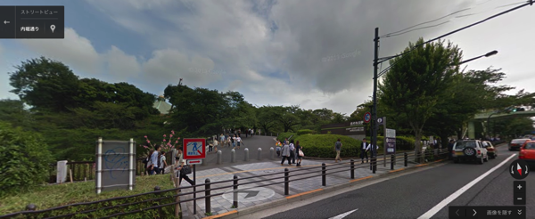
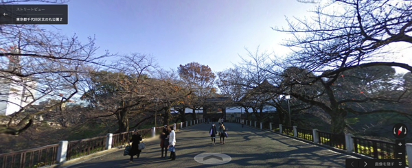
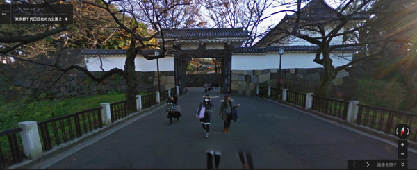
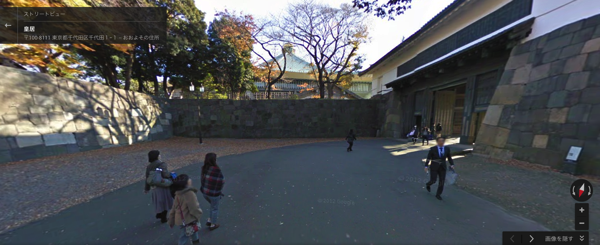
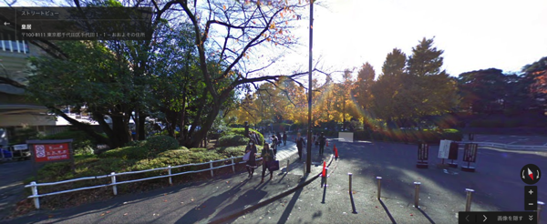
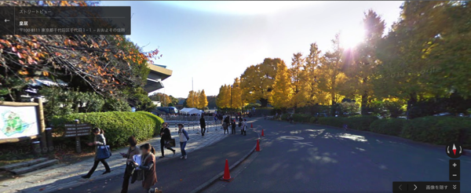
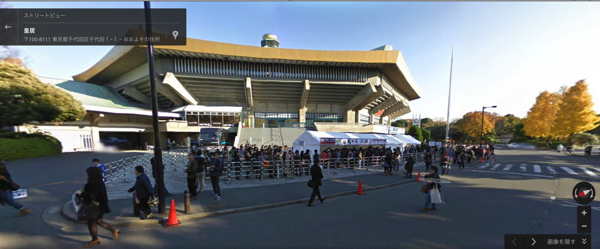

---
categories:
- DIR EN GREY
date: Sun, 02 Mar 2014 14:40:13 +0000
slug: post-4458
tags:
- DIR EN GREY
title: DIR EN GREY日本武道館公演「DUM SPIRO SPERO」の楽しみ方←これを外国人向けに英訳します
---

【この記事は日本に来る海外虜向けの記事の英訳前の記事です。】
※追記した方が良い内容やお気づきの点がございましたらお気軽にご指摘ください。これを今週前半までに英訳します。

ハロー。しんぺー(<a href="https://twitter.com/s_s_p_y" target="_blank">@s_s_p_y</a> )です。

さて、もういくつ寝るとDIR EN GREYの日本武道館2days「DUM SPIRO SPERO」ですね。

これを目当てに海外から日本に来るって人もいるのでしょうか？
来日する虜、もしくはその雰囲気だけでも味わいたい海外虜に向けて武道館のLIVEの参加方法と周辺情報と、その他の日本の観光スポットをご紹介いたします！

<h2>日本武道館</h2>

<h3>日本武道館とは•••</h3>
日本武道館とは日本のロックバンドにとって聖地です。

しかし本来は武道（柔道、剣道、弓道、空手道、合気道など）の稽古場、競技場として主に使用されています。
その他にも、企業や学校の入学式、卒業式などのイベントでも使用されます。

そう、つまり儀式を行うための施設なのです。しかし、ロックバンドの聖地として位置づけられたのは、1966年にビートルズがコンサートを行ったことに端を発します。

その後、様々なバンドがこのステージにたち、今ではメジャーデビューをしたバンドが、より高いレベルを目指すための登竜門的な役割を持っています。

<h3>アクセス</h3>

日本武道館に行く方法をご紹介します。
日本武道館はの最寄りの駅は九段下駅です。

まずは以下の駅まで行きましょう。以下の駅からの代表的な行き方ですが、電車に乗る前はちゃんと駅員さんや路線図で確認しましょう。

新宿から行く場合は都営新宿線を使います。

秋葉原からは東京メトロ日比谷線に乗って、茅場町までいきます。そこで東京メトロ東西線に乗り換えます。

渋谷からは東京メトロ半蔵門線に乗ってください。
九段下の2番出口から出ましょう。

出たらそのまま直進です。すぐに日本武道館の入口に着きます。

<h3>日本武道館の入口から会場まで</h3>

それと言い忘れましたが、日本武道館は、江戸城つまりは、天皇陛下の住まいである皇居の一部です。

春には満開の桜、秋には銀杏といった四季折々の美しい自然も楽しむことができます。

古い日本の景色を垣間見えることができる場所です。

<h2>日本武道館でのLIVEの参加方法</h2>

<h3>物販</h3>
先にご紹介しましたテントがたっているあたりが、ちょうど物販のスペースになるはずです。

<h3>アリーナ席</h3>
並び方

おそらく、整理番号を区切っての整列入場となるはずです。
たとえば1番〜100番まで。みたいな感じです。

あたなのチケットの番号が含まれる列に並びましょう。
解らなかったらスタッフがいたる所にいるはずなので、聞いてみましょう。
彼らは英語が話せないかもしれませんが、チケットを見せるだけできっと伝わるはずです。

<h3>スタンド席</h3>
席順
こちらは時間になったら入場できます。
席の番号はこちら。だいたいの目安です。

日本武道館 ステージの見え方 -- livehis  

<h3>トレイの場所</h3>
割と多めに存在していますし、すぐに目に付くと思います。

ただし、女性用トイレはかなりこみ合うでしょう。
会場に入る前に済ませておくのがおすすめです。

さて、こんなところです。武道館まで行く事ができれば、あとはスタッフなり、解らなければ回りの虜に聞きましょう。
きっとやさしく教えてくれるはずです。

<h2>その他の観光スポット</h2>

一応、LIVE以外の日本の事もすこし書いておきます。

<h3>新宿は見る物無し</h3>
ここはただの電気屋とその他のデパートがあるだけ。あとはオフィス街なので面白いものはないと思う。
それと歌舞伎町はやくざとゲイの街。
そして新大久保の方にいくとそこはコリアタウン

新宿は混沌

<h3>渋谷は正解から見た日本的なものを体感できる街</h3>

女子高生、ルーズソックスなんてものはもはやいないけど、それでも日本的な文化を感じられるんじゃないだろうか。

有名なスクランブル交差点があるし、ただし新宿よりも雑多な街で、より年齢層が若いと思う。

<h3>原宿は渋谷よりもゆったりしていてうるさくない日本的な雰囲気を味わえるまち</h3>

裏原宿や青山は、ゆっくり散歩するのに適している。
また代々木公園という大きな公演もあり、さらに明治神宮という広大な神社にはパワースポットもあるし、とても静かで日本を体感することができるのでおすすめ。

町並みも渋谷みたいにうるさくてごみごみはしていない。
独特の文化がある街。

キャリーぱみゅぱみゅ的なね。

<h2>しんぺーはこう思った。</h2>

日本武道館は大きい会場なので迷子になったりするかも。
それとLIVEハウスと少し勝手が違うので戸惑うかもね〜

でも大丈夫、わからなかった人に聞いてみましょう！

それではLIVEまであと少し！震えて待とう！

といったところで本日は以上です！おやすみなさい。