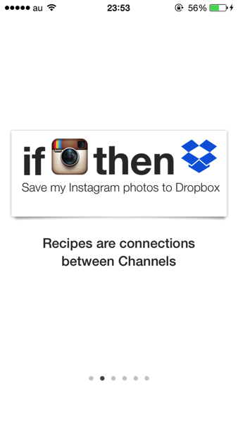
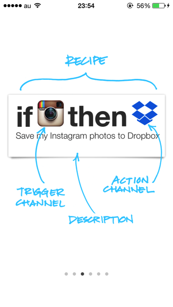
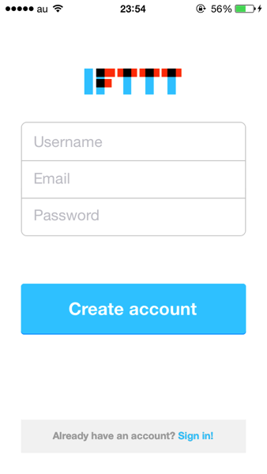
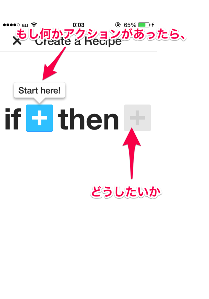
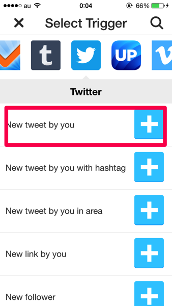
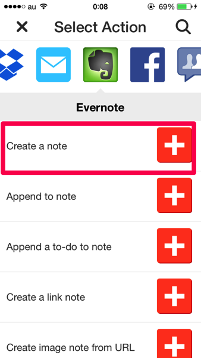
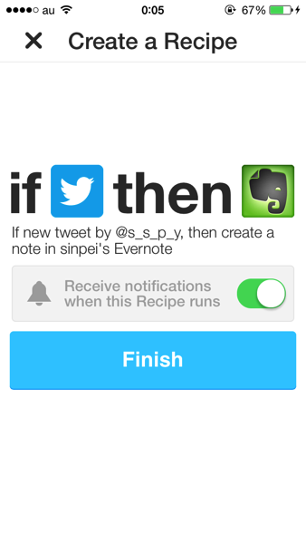
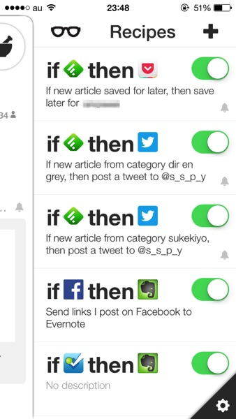

---
categories:
- アプリ
date: Tue, 04 Mar 2014 15:21:33 +0000
slug: post-4512
title: 色んな動作を完全自動にしてくれるアプリ「IFTTT」の設定方法
---

ハローしんぺー(<a href="https://twitter.com/s_s_p_y" target="_blank">@s_s_p_y</a> )です。

IFTTTをご存知ですか？色んな動作を完全自動で色んなところに連携してくれる凄いサービス（アプリ）です。

<a href="https://itunes.apple.com/jp/app/ifttt/id660944635?mt=8&uo=4&at=11ld5P" target="_blank" >IFTTT</a>

無料

(2014.03.04時点)

<a href="https://itunes.apple.com/jp/artist/ifttt/id660944638?uo=4&at=11ld5P" target="_blank" >IFTTT</a>

posted with <a href="http://pochireba.com" rel="nofollow" target="_blank">ポチレバ</a>

<h2>IFTTTとは</h2>

例えばinstagramで写真を撮ったら自動でDropboxに送ったり、foursquareでチェックインしたら自動でFacebookに送ったり、Facebookに投稿した内容をevernoteに自動で送ったりとか。とにかく設定だけしておけば、自動でやってくれるというアプリです。この設定をレシピといいます。

<h3>IFTTTの使い方</h3>

まずは登録。アプリをダウンロードしたら、そのまま登録しましょう。英語のアプリですが難しいことはありません。

設定が済んだら、あとは自分の好きなレシピをつくるだけ。右上のマークをタップします。

if ＝　もし何かが起こったら
then =　その時なにをしたいか

これを考えてください。

ここで試しに１つレシピを作ってみましょう。
tweetしたら、evernoteに送ってバックアップをとるという設定です。

左の青いプラスをタップします。
ここではTwitterの一番上の項目をタップします。

アカウントの認証などを求められる場合がありますので、そのまま進んで認証してください。

次に右をタップします。
ここではevernoteの一番上の項目を選択します。tweetされる度に新しいノートを作るという項目です。

最後にこのレシピが実行された時に通知をするかを決めます。頻繁に行われるものなら通知はオフでいいと思います。うるさいので。

はい、以上です。どうでしょうか？かんたんでしょう？

ま、この上記の設定は呟くたびにevernoteに新しいノートが作られるので少し現実的ではありませんがw

色々と工夫してみるのも楽しいかと思います。それと自分の作ったレシピは共有できますので、いいのができたら共有を。自分で作るのが難しい場合は、人のを探して色々とためしてみるのもいいかもしれませn。
その場合は、メガネアイコンをタップしください。

<h2>しんぺーはこう思った。</h2>

これがぼくのレシピです。また後日ご紹介していこうと思います。

ぼくは毎日DIR EN GREYのオフィを見に行くことはしません。そのため、最新情報をよく見逃してました。

しかし、これを使いだして自分に通知がくる様に設定を行った結果、最新情報を見逃すことがなくなりました。

さらにフォロワーの方にもその情報を共有できちゃうということで、一石二鳥でとても重宝しています。

ぜひぜひ自分だけのレシピを作って、日頃不便に思っていることを解消してみてください。

<a href="https://itunes.apple.com/jp/app/ifttt/id660944635?mt=8&uo=4&at=11ld5P" target="_blank" >IFTTT</a>

無料

(2014.03.04時点)

<a href="https://itunes.apple.com/jp/artist/ifttt/id660944638?uo=4&at=11ld5P" target="_blank" >IFTTT</a>

posted with <a href="http://pochireba.com" rel="nofollow" target="_blank">ポチレバ</a>

