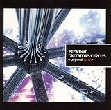

---
categories:
- sukekiyo
date: Thu, 06 Mar 2014 16:04:26 +0000
slug: post-4553
title: sukekiyoのアルバムに向けて。キリトを知らない人のためにキリトについてさわりだけ紹介したいと思います
---

ハローしんぺー(<a href="https://twitter.com/s_s_p_y" target="_blank">@s_s_p_y</a> )です。

sukekiyoのアルバムに参加することが決定しているAngeloボーカルのキリト様。
もう知ってる人はゼッタイ知ってると思うけど、フォロワーの方であまり知らない方もいたみたいなので、少しだけ偏向報道ならぬ偏向紹介をしたいと思います。嫌いにならないでね←

<h2>キリトというおとこ</h2>

キリトはAngeloのベースKohtaの実兄である。
キリトは元PIERROTの初代ギタリスト
キリトは元工場員
キリトは元暴走族

<h3>キリトがどんな人か理解するための動画</h3>

大変ショッキングな映像です。これを見てキリトを嫌いになる人もいるかもしれませn。

Youtubeで
「PIERROT attack to」で検索してみてください。

ファンクラブ限定DVDの映像なので、ここに積極的に埋め込むことはしません。すいません。。。

<a href="http://www.youtube.com" target="_blank">http://www.youtube.com</a>

<h2>しんぺーはこう思った。</h2>

ぼくは今のAngeloについてはほとんど追ってません。
なぜなら、ぼくの青春や精神を構築していたのは、あの5人であるPIERROTだったからです。
そしてPIERROT解散以降、キリトが歌う曲はPIERROTの解散ありきの曲になってしまったからです。
そこがAngeloの存在理由、起源になってしまったからです。

懐古するわけではありません。ただ、ぼくの好きだった景色はもうなくなったってことです。

AngeloはAngeloであってPIERROTではないし、キリトのソロもそれではない。

<blockquote>どこへ逃げようとも望んだものは手に入らない
何を叫ぼうとも壊したものはもう戻らない
</blockquote>

いずれPIERROTについては書いていきたいなとも思ったり思わなかったり。
あまり書く事に意味がない気がします。書かない可能性が高いと思います。

といったところで本日は以上です。おやすみなさい。

<a href="http://www.amazon.co.jp/exec/obidos/ASIN/B00092QRR4/warawareotoko-22/ref=nosim/" rel="nofollow" target="_blank">DICTATORS CIRCUS-A deformed BUD-</a>
posted with <a href="http://kaereba.com" rel="nofollow" target="_blank">カエレバ</a>

PIERROT ユニバーサル ミュージック 2005-06-08    

<a href="http://www.amazon.co.jp/gp/search?keywords=DICTATORS%20CIRCUS-A%20deformed%20BUD&__mk_ja_JP=%83J%83%5E%83J%83i&tag=warawareotoko-22" rel="nofollow" target="_blank" title="アマゾン" >Amazonで見る</a>

<a href="http://hb.afl.rakuten.co.jp/hgc/1263948e.a4330505.1263948f.788da92c/?pc=http%3A%2F%2Fsearch.rakuten.co.jp%2Fsearch%2Fmall%2FDICTATORS%2520CIRCUS-A%2520deformed%2520BUD%2F-%2Ff.1-p.1-s.1-sf.0-st.A-v.2%3Fx%3D0%26scid%3Daf_ich_link_urltxt%26m%3Dhttp%3A%2F%2Fm.rakuten.co.jp%2F" rel="nofollow" target="_blank" title="楽天市場" >楽天市場で見る</a>

<a href="http://ck.jp.ap.valuecommerce.com/servlet/referral?sid=3041033&pid=882528283&vc_url=http%3A%2F%2Fshopping.search.yahoo.co.jp%2Fsearch%3FuIv%3Don%26ei%3DUTF-8%26tab_ex%3Dcommerce%26slider%3D0%26va%3DDICTATORS%2520CIRCUS-A%2520deformed%2520BUD" rel="nofollow"  target="_blank" title="Yahooショッピング" >Yahooショッピングで見る</a>

