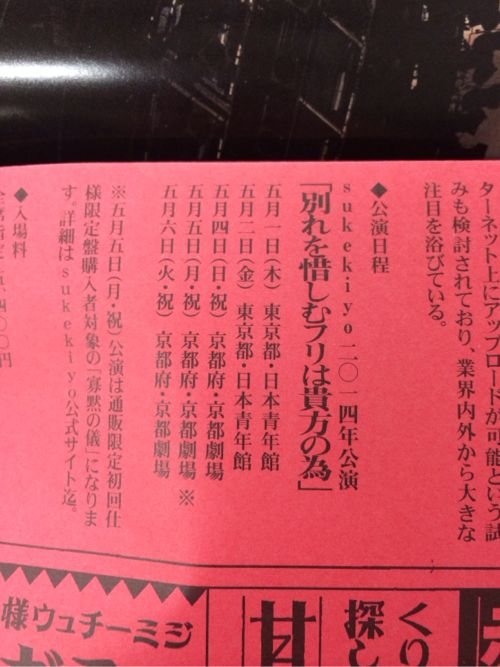
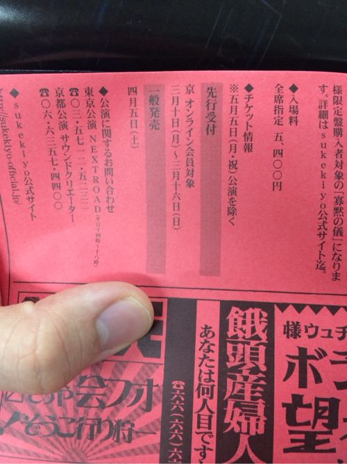

---
categories:
- sukekiyo
date: Sun, 09 Mar 2014 12:12:24 +0000
slug: post-4579
title: 【速報】sukekiyoLIVEやるってよ
---

ハローしんぺー(<a href="https://twitter.com/s_s_p_y" target="_blank">@s_s_p_y</a> )です。

<h2>sukekiyoLIVEやるってよ</h2>

これまたドS仕様w
■sukekiyo 二〇一四年公演 「別れを惜しむフリは貴方の為」 
五月一日（木）　東京都・日本青年館 
五月二日（金）　東京都・日本青年館 
五月四日（日・祝）　京都府・京都劇場 
五月六日（火・祝）　京都府・京都劇場 

■sukekiyo 二〇一四年公演 「別れを惜しむフリは貴方の為」 -寡黙の儀- 
五月五日（月・祝）　京都府・京都劇場 
※京公式オンラインストア限定 初回仕様限定盤 購入者限定公演となり、一般発売はございません。 
料金:全席指定　5,400円

<a style="color:#0070C5;" href="http://sukekiyo-official.jp/" target="_blank">sukekiyo official site</a>  

しかも京都の特別公演に関しては、ドレスコード着用の上に色々と決まりがある超特殊なLIVEみたいです。

撮影OKらしいけど、歓声や声援は上げちゃいけないってさ。

<h2>しんぺーはこう思った。</h2>

ようやく書けた！土日はLIVEやらアプリの講座やらで、その後はLIVEレポあげたりで、月曜と火曜は会社のイベントで使う動画編集やらなんやらで書けかったけど、ようやくかけるsukekiyoLIVEのことちゃんと書けました。

とりあえずすでにチケット発売しちゃってます。12時きっかりにぼくは予約することができました。
初日です！

アルバムで聞く前だからどんな感じになるか全く想像できないけど、まぁとにかく楽しみではあります。

それにしても感動のLIVEが終わった直後に文字通りの赤紙を配布して、徴収するそのドSさ！もっとぶって！もっともっと！

といったところで本日は以上です。おやすみなさい。

<a href="http://www.amazon.co.jp/exec/obidos/ASIN/B00IMKDX3G/warawareotoko-22/ref=nosim/" rel="nofollow" target="_blank">IMMORTALIS(初回生産限定盤)</a>
posted with <a href="http://kaereba.com" rel="nofollow" target="_blank">カエレバ</a>

sukekiyo Fire Wall Division 2014-04-30    

<a href="http://www.amazon.co.jp/gp/search?keywords=IMMORTALIS&__mk_ja_JP=%83J%83%5E%83J%83i&tag=warawareotoko-22" rel="nofollow" target="_blank" title="アマゾン" >Amazonで見る</a>

<a href="http://hb.afl.rakuten.co.jp/hgc/1263948e.a4330505.1263948f.788da92c/?pc=http%3A%2F%2Fsearch.rakuten.co.jp%2Fsearch%2Fmall%2FIMMORTALIS%2F-%2Ff.1-p.1-s.1-sf.0-st.A-v.2%3Fx%3D0%26scid%3Daf_ich_link_urltxt%26m%3Dhttp%3A%2F%2Fm.rakuten.co.jp%2F" rel="nofollow" target="_blank" title="楽天市場" >楽天市場で見る</a>

<a href="http://ck.jp.ap.valuecommerce.com/servlet/referral?sid=3041033&pid=882528283&vc_url=http%3A%2F%2Fshopping.search.yahoo.co.jp%2Fsearch%3FuIv%3Don%26ei%3DUTF-8%26tab_ex%3Dcommerce%26slider%3D0%26va%3DIMMORTALIS" rel="nofollow"  target="_blank" title="Yahooショッピング" >Yahooショッピングで見る</a>

<a href="http://www.amazon.co.jp/exec/obidos/ASIN/B00IMKDYMG/warawareotoko-22/ref=nosim/" rel="nofollow" target="_blank">IMMORTALIS</a>
posted with <a href="http://kaereba.com" rel="nofollow" target="_blank">カエレバ</a>

sukekiyo Fire Wall Division 2014-04-30    

<a href="http://www.amazon.co.jp/gp/search?keywords=IMMORTALIS&__mk_ja_JP=%83J%83%5E%83J%83i&tag=warawareotoko-22" rel="nofollow" target="_blank" title="アマゾン" >Amazonで見る</a>

<a href="http://hb.afl.rakuten.co.jp/hgc/1263948e.a4330505.1263948f.788da92c/?pc=http%3A%2F%2Fsearch.rakuten.co.jp%2Fsearch%2Fmall%2FIMMORTALIS%2F-%2Ff.1-p.1-s.1-sf.0-st.A-v.2%3Fx%3D0%26scid%3Daf_ich_link_urltxt%26m%3Dhttp%3A%2F%2Fm.rakuten.co.jp%2F" rel="nofollow" target="_blank" title="楽天市場" >楽天市場で見る</a>

<a href="http://ck.jp.ap.valuecommerce.com/servlet/referral?sid=3041033&pid=882528283&vc_url=http%3A%2F%2Fshopping.search.yahoo.co.jp%2Fsearch%3FuIv%3Don%26ei%3DUTF-8%26tab_ex%3Dcommerce%26slider%3D0%26va%3DIMMORTALIS" rel="nofollow"  target="_blank" title="Yahooショッピング" >Yahooショッピングで見る</a>

