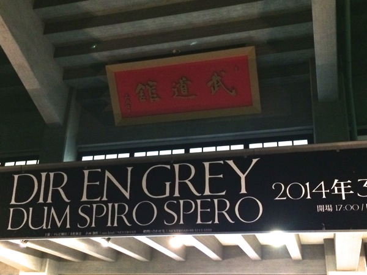
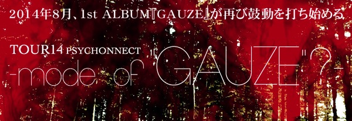
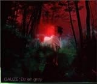
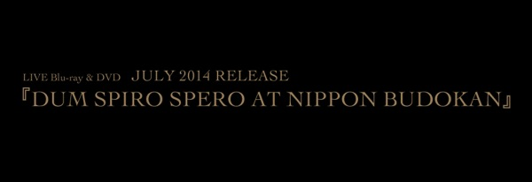
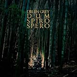

---
categories:
- DIR EN GREYのLIVEレポ
date: Sun, 09 Mar 2014 16:27:42 +0000
slug: post-4585
tags:
- DIR EN GREY
- LIVEレポ
title: DIR EN GREY「DUM SPIRO SPERO」一寸先の闇から生まれたのは、一筋の光
---

ハローしんぺー(<a href="https://twitter.com/s_s_p_y" target="_blank" rel="noopener">@s_s_p_y</a> )です。

DIR EN GREY「DUM SPIRO SPERO」日本武道館公演お疲れさまでした！

日本のみならず世界中から虜が集結した2日間でした。お会いできたかた、できなかったかた、これからもどうぞよろしくお願いします。

号泣と驚愕と歓喜、そんなLIVEでした。
<h2>まずはセトリ</h2>
いつも通りの拾い物。
<ol>
 	<li>MACABRE</li>
 	<li>流転の塔</li>
 	<li>激しさと、この胸の中で絡み付いた灼熱の闇</li>
 	<li>「欲巣にDREAMBOX」あるいは成熟の理念と冷たい雨</li>
 	<li>獣慾</li>
 	<li>DECAYED CROW</li>
 	<li>Bottom of the death valley</li>
 	<li>かすみ</li>
 	<li>砂上の唄</li>
 	<li>孤独に死す、故に孤独。</li>
 	<li>THE BLOSSOMING BEELZEBUB</li>
 	<li>業</li>
 	<li>Unraveling</li>
 	<li>DIABOLOS</li>
</ol>
EN1.
<ol>
 	<li>輪郭</li>
 	<li>umbrella</li>
 	<li>羅刹国</li>
 	<li>SUSTAIN THE UNTRUTH</li>
</ol>
EN2(MOVIE).
<ol>
 	<li>THEFINAL</li>
</ol>
EN3.
<ol>
 	<li>朔</li>
</ol>
冒頭のMACABREからという選択はバンドとしての自信と決意と覚悟が伺えます。
この時点で一気に引き込まれました。いつも通りの狂気と恐怖の世界。

そして、流転の塔でDUM SPIRO SPEROの終幕を降ろしはじめました。その後、激闇で一気にあがったボルテージが欲巣にDREAMBOXで恐怖とともにいっきに叩き付けられました。

また、注目なのはBottomの前奏のベースソロで日本武道館ということもあってか、Toshiyaが国歌を弾きました。最初ハッピーバースデーなのかと思いましたが←

さらにその後、砂上、孤独に死す、となつかしの歌に驚喜の声が漏れました。

人間を辞めたあとはアンコールで死にました。
SUSTAINの前に京がお立ち台の前に出てきて、こんなことを言いました。
<blockquote>一つお願いがあるんやけど、いつも一つになれるかーって言ってるけど、そんなん無理やんって良く言われるねん。

はぁー、

俺はそう思わへんから。

馬鹿みたいに繰り返すけど、

お前ら一つになれるかぁー！
お前らの声響かせてくれー！！</blockquote>
声殺した。

そして、メンバーが餌撒きもそぞろにはけ、暗転する会場にはアンコールの声が。。。
しかし、モニターに移ったには、会場の廊下を歩くメンバーの後ろ姿が
遠ざかる菩薩になんとなく心細くなりました。

このまま、終わっちゃうのかな。。。
UROBOROSのときの武道館のように最後、SUSTAINのPVでも流れるかなと思ってました。

しかし、流れてきたのはTHE FINALの歌詞とオルゴール

会場全体がさっきよりも１つになって歌いました。

その後、消えないDIR EN GREYの文字がモニターに映し出さ、メンバーが登場

「お前ら元気だなー」の京の声のあとで、ラストの朔

そして今度こそ本当にメンバーがはけたあと、驚愕のお知らせが。。。
<h2>驚愕のお知らせ3連発</h2>
<h3>NEW ALBUM 11月発売</h3>

きっとメンバーは今日が終わっても絶賛レコーディング中なんでしょうね。お疲れさまです！
<h3>SUMMER TOUR PSYCHONNECT-mode of "GAUZE"?-</h3>

15年前アルバム、しかもそれでツアーを！
ここまで原点回帰するバンドが過去いたのかっつー。昔から表現したいことが何一つ変わらなくて、だからこそ今の状態で過去を再現しようって、それはもう挑戦でしかない。

自分を究めるってやつだなと思いました。

これはもはや歓喜ではなく、どよめきがおきてました。
たぶん一番の驚きでしたw

<a href="http://www.amazon.co.jp/exec/obidos/ASIN/B00004S2O0/warawareotoko-22/ref=nosim/" target="_blank" rel="nofollow noopener">GAUZE</a>

posted with <a href="http://kaereba.com" target="_blank" rel="nofollow noopener">カエレバ</a>

Dir en grey イーストウエスト・ジャパン 1999-07-28

<a title="アマゾン" href="http://www.amazon.co.jp/gp/search?keywords=GAUZE&amp;__mk_ja_JP=%83J%83%5E%83J%83i&amp;tag=warawareotoko-22" target="_blank" rel="nofollow noopener">Amazonで見る</a>

<a title="楽天市場" href="http://hb.afl.rakuten.co.jp/hgc/1263948e.a4330505.1263948f.788da92c/?pc=http%3A%2F%2Fsearch.rakuten.co.jp%2Fsearch%2Fmall%2FGAUZE%2F-%2Ff.1-p.1-s.1-sf.0-st.A-v.2%3Fx%3D0%26scid%3Daf_ich_link_urltxt%26m%3Dhttp%3A%2F%2Fm.rakuten.co.jp%2F" target="_blank" rel="nofollow noopener">楽天市場で見る</a>

<a title="Yahooショッピング" href="http://ck.jp.ap.valuecommerce.com/servlet/referral?sid=3041033&amp;pid=882528283&amp;vc_url=http%3A%2F%2Fshopping.search.yahoo.co.jp%2Fsearch%3FuIv%3Don%26ei%3DUTF-8%26tab_ex%3Dcommerce%26slider%3D0%26va%3DGAUZE" target="_blank" rel="nofollow noopener">Yahooショッピングで見る</a>

<h3>「DUM SPIRO SPERO　AT NIPPON BUDOUKAN」DVD&amp;Blu-ray7月発売決定</h3>

詳細でてないですけど、一連の流れから監督は最近のドキュメンタリーの方だと思います。
<h2>しんぺーはこう思った。</h2>
THE FINALでは号泣した。救いのない詩。。。
その意味、そしてこの公演の意味、このアルバムの意味。
このバンドが表現する意味。

昨日、今日と何か不安を感じてた。不安と言ってもネガティブな感情ではなくて、新学期がはじまる春休みみたいな。ソフトすぎる言い回しだけど。一寸先の闇から生まれたのは一筋の希望だったってことなのかなと思った。

昨日の最後の一文がまさにそれで。先になにがあるかなんかわからない。だから不安なんだって。でも歩き続けるしかない。

だから、今や過去に拘泥するのではなく、立ち止まることなく歩き続けなければいけない。生きてる限り希望は持ち続けることができる。
<blockquote>Your path goes on And who knows what lies ahead</blockquote>
一寸先の闇から生まれたのは、一筋の光
そして、生きている限り、希望を持ち続けることができる。

だから歩き続けなければならない。不安でも。その先に何が待ち構えているかなんて誰にも解りはしない。

ただ歩き続けなければ。

<a href="http://www.amazon.co.jp/exec/obidos/ASIN/B0052PN848/warawareotoko-22/ref=nosim/" target="_blank" rel="nofollow noopener">DUM SPIRO SPERO</a>

posted with <a href="http://kaereba.com" target="_blank" rel="nofollow noopener">カエレバ</a>

DIR EN GREY SMD itaku (music) 2011-08-03

<a title="アマゾン" href="http://www.amazon.co.jp/gp/search?keywords=DUM%20SPIRO%20SPERO&amp;__mk_ja_JP=%83J%83%5E%83J%83i&amp;tag=warawareotoko-22" target="_blank" rel="nofollow noopener">Amazonで見る</a>

<a title="楽天市場" href="http://hb.afl.rakuten.co.jp/hgc/1263948e.a4330505.1263948f.788da92c/?pc=http%3A%2F%2Fsearch.rakuten.co.jp%2Fsearch%2Fmall%2FDUM%2520SPIRO%2520SPERO%2F-%2Ff.1-p.1-s.1-sf.0-st.A-v.2%3Fx%3D0%26scid%3Daf_ich_link_urltxt%26m%3Dhttp%3A%2F%2Fm.rakuten.co.jp%2F" target="_blank" rel="nofollow noopener">楽天市場で見る</a>

<a title="Yahooショッピング" href="http://ck.jp.ap.valuecommerce.com/servlet/referral?sid=3041033&amp;pid=882528283&amp;vc_url=http%3A%2F%2Fshopping.search.yahoo.co.jp%2Fsearch%3FuIv%3Don%26ei%3DUTF-8%26tab_ex%3Dcommerce%26slider%3D0%26va%3DDUM%2520SPIRO%2520SPERO" target="_blank" rel="nofollow noopener">Yahooショッピングで見る</a>

