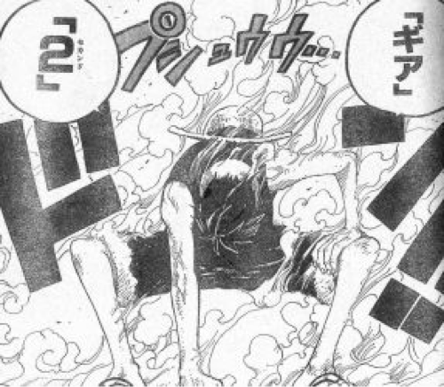
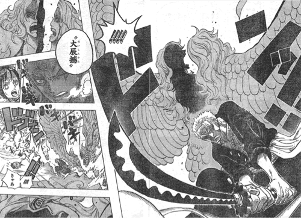

---
categories:
- ライフハック
date: Sat, 15 Mar 2014 05:54:12 +0000
slug: post-4616
tags:
- 早く帰りたい
title: どうしても早く帰りたい人におくる会社からの5つの脱出方法
---

ハロー。しんぺー(<a href="https://twitter.com/s_s_p_y" target="_blank">@s<em>s</em>p_y</a> )です。

「今日は早く帰りたい。でも周りはみんな残ってて帰りずらいなぁ」そんな思いをした人がいることでしょう。

「あの先輩につかまると長いから見つからないように何とか帰りたい」なんて思ってる時に限って「あれ？もう帰るの？」なんて言われたりします。

今回は、どうしても帰りたい日に使えるオフィス脱出方法についてご紹介します。

<h2>帰りにくいオフィスから脱出する方法</h2>
<h3>外出からの帰宅</h3>

外出があるような職種の人は、予め外での予定を入れておいて、外出先からそのまま帰っちゃいましょう。

安全かつ、不信感を与えない優良な方法です。

ただし、問題点としては内勤の人は使えない作戦ということと、必ずしもいいタイミングで外出予定が入れられるか解らない所という所です。

<h3>情報共有</h3>

職場での人間関係と自分の立場に依存する方法です。

数日前、当日の朝から「今日は早く帰る」ということを周りに伝えておきましょう。

雰囲気でも醸し出しつつ、例えば何時もの2倍の速度で動くとか、歩幅を短めにするとか、呼吸の間隔を縮めるとか、まばたきを頻繁にして目をむき出すとかです。

ぼくの同僚は、定時で帰宅することを予めメールで周知する人がいますが、そこまでやっちゃうと「なんなの？」っていう反感を買う可能性もありますので、やり過ぎには注意。

あくまで醸し出しましょう。

<h3>情報戦</h3>

はっきり言って、「嘘を付くこと」です。

<a href="http://www.amazon.co.jp/exec/obidos/ASIN/B00FY10G7M/warawareotoko-22/ref=nosim/" rel="nofollow" target="_blank">SUSTAIN THE UNTRUTH(完全生産限定盤)(DVD付)</a>
posted with <a href="http://kaereba.com" rel="nofollow" target="_blank">カエレバ</a>

DIR EN GREY SMD itaku (music) 2014-01-22    

ちょっと具合が悪いんで。通院のため。お客さんと会食があるんで。田舎から父方の祖父の従兄の嫁の元カレの元カノが上京してくるんです。近所のラーメン屋が閉店するんで。中央線が毎朝人身事故
起こさずに平常運転してるんで。

状況に応じて、情報戦をしかけてください。

まぁ、病院に行くんで、が1番いいでしょう。
その際も、歯医者が1番いいと思います。

虫歯が痛くてとか、差し歯が取れてとか、重大だはなさそうどけも、緊急を要するのが歯医者だと思います。

<h3>強行突破</h3>

終業時間になると同時に「失礼しまーす！」と言って帰る。

もう、なんと言われようが全てを振り切って帰る！

メロスのようになりふり構わず走って出て行く。

あ、ちょっと！とか言われても帰る！とにかくそのまま帰る。

ロロノアゾロの様な気合と気迫が必要になります。

<h3>最終奥義「分散準備」</h3>

これは、ぼくが1番よく使う方法です。

定時少し前から準備を開始します。

まずは、カバンを怪しまれない様に離れた場所まで運びます。

そのあとデスクに戻って来て、まだまだ仕事しますよ〜感を醸し出します。

で、しばからくしらコートをカバンの所に運びましょう。

怪しまれずに。

で、また席に戻って来て仕事をしてる感を出しましょう。

で、定時になって1、2分過ぎたくらいでおもむろに席を立ち、何も言わずに、あたかもトイレに立つかの如く、帰りましょう。

パソコンの電源は切らないのがベターですが、そうもいかない場合は他の人に切ってもらうなどの工夫をしましょう。

<h2>しんぺーはこう思った。</h2>

いかがだったでしょうか？

定時にあがりズラい、今日はどうしても帰りたいのに。

そんな人は是非試してみてください。

ぼくはLIVEの日なんかで、有給をとらなかった時に使います。

まぁ、でもLIVEの日は絶対に有給を取った方が安全ですけどね！

といったところで、本日は以上です。おやすみなさい。

Posted from するぷろ for iPhone.nm