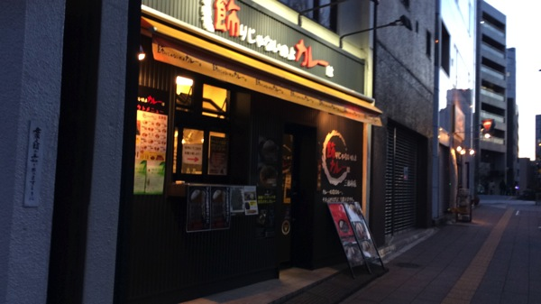
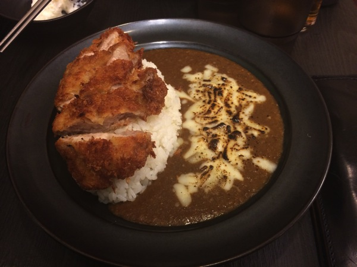
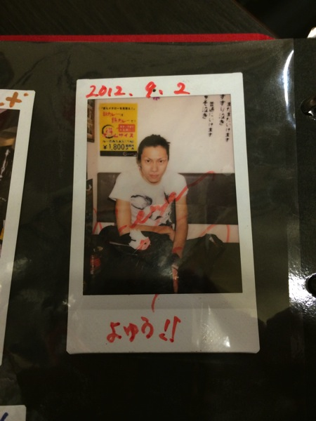

---
categories:
- DIR EN GREY
date: Fri, 21 Mar 2014 18:08:47 +0000
slug: post-4661
title: 上手の住人としてDIR EN GREY Die御用達の「飾りじゃないのよカレーは」行ってきたった！
---

ハローしんぺー(<a href="https://twitter.com/s_s_p_y" target="_blank">@s_s_p_y</a> )です。

上手の住人として「飾りじゃないのよカレーは」に行ってきました！

※ぼくはいつもDIR EN GREYのLIVEでは上手のDie前くらいに生息してます。

<h2>「飾りじゃないのよカレーは」とは</h2>

東京は三田にある激辛のカレー屋さんです。慶応大学の三田キャンパスに隣接しております。
さて、なぜ今回足を運んだかといいますと、それはもちろん我らがDIR EN GREYの上手ギターDie氏が数日前に現れたと聞いたからです！

こちらが店舗情報

<strong><a href="http://tabelog.com/tokyo/A1314/A131402/13137458/" target="_blank">飾りじゃないのよカレーは 三田本店</a></strong>

<strong>関連ランキング：</strong><a href="http://tabelog.com/rstLst/RC1201/">カレーライス</a> | <a href="http://tabelog.com/tokyo/A1314/A131402/R9477/rstLst/">三田駅</a>、<a href="http://tabelog.com/tokyo/A1314/A131402/R6076/rstLst/">田町駅</a>、<a href="http://tabelog.com/tokyo/A1314/A131401/R140/rstLst/">赤羽橋駅</a>

<h3>カレーはどんなんだったか？</h3>

これです。大学の近くということもあり、割とガッツリ系のメニューでした。
しかしながら女性でも食べきれるくらいの量だったと思います。

わりとさらさらしててどろっとしてるルーは、ビビって１辛にしましたが、もう3段階くらいあげてもいける気がしました。

ただ、Dieさんは9辛を完食したってことで、信じられません。

<h3>Die氏出現時の状況について</h3>

入口から入って一番奥のテーブル席に座られたようです。
店長さんが教えてくれました。

注文したあとで「すいません•••DIR EN GREYのDieさんが来られたと伺いまして•••」と切り出すと、やはりもうすでに多数の虜が来店しているということもあって、慣れた感じで座ったテーブルの案内と、初回訪問時の写真とレジ横のサインなどを持ってきてくれましたw

当然撮影しましたぜ！

  

日武の当日も、虜が気合入れのためにやってきたそうで、店内でかすみを流すなどの粋な計らいをしてくれたそうです。

ちなみに初回訪問時の写真がこちら

<h2>しんぺーはこう思った。</h2>

食べてる最中、店の扉が開くたびに「もしや•••」「まさか•••」「もやし•••」←
と思ってドキドキしましたが、そんなわきゃないっかwww

また行きたいと思います。

それと、このお店のメイン層が大学生ということもあり、SNSとの連動をかなり推進しておりました。
呟くときのハッシュタグの案内と、お店の写真をその場でアップすると割引があったり、これからの飲食店もネットの活用が大切なんだな〜って感じました。

今度はもう少し辛いのに挑戦したいと思います！

といったところで、本日は以上になります。おやすみなさい。