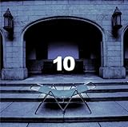
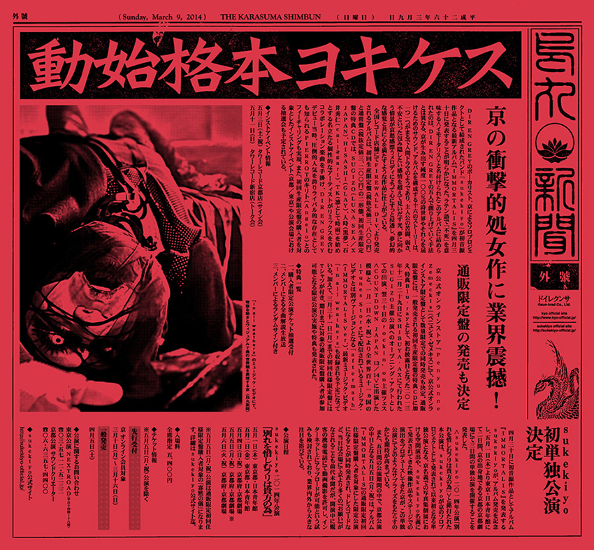

---
categories:
- sukekiyo
date: Sat, 05 Apr 2014 05:39:26 +0000
slug: post-4734
tags:
- sukekiyoまとめ
title: 今週のsukekiyoまとめ！3月〜4月5日(2014)
---

ハローしんぺー(<a href="https://twitter.com/s_s_p_y" target="_blank">@s_s_p_y</a> )です。

あと数週間でsukekiyoの1stアルバム「IMMORTALIS」が発売、そしてツアーです。
それもあって、ここ数週間の発表がいくつもありましたのでまとめておきたいと思います。

<h2>京さんタワレコ京都にあらわる</h2>

<blockquote class="twitter-tweet" lang="ja">
フラッとタワーレコード京都に来ましたよっと。 京 <a href="http://t.co/G1GTnjvaCG">pic.twitter.com/G1GTnjvaCG</a>
&mdash; sukekiyo (@sukekiyo_band) <a href="https://twitter.com/sukekiyo_band/statuses/445469937339887616">2014, 3月 17</a></blockquote>

<a href="https://twitter.com/search?q=京さん%20since%3A2014-03-17%20until%3A2014-03-18&src=typd">当時のTwitterの反応（検索ワード：京さん）</a>

ちなみに、この写真で京さんが履いている靴ですが、JIMMY CHOOという情報がありました。
以前、なんかの雑誌でジミーチューにはまってるとおっしゃっていたので、ほぼ確定かと思われます。
すでに販売時期は終わってるのか、JIMMY CHOOのサイトでは確認できませんでした。

<h2>1stアルバム「IMMORTALIS」の豪華すぎるゲストアーティスト</h2>

いままで発表されていたアーティストがこちら

<blockquote>aftermath　Collaboration with キリト (Angelo)
鵠　Remixed by PABLO (P.T.P)
zephyr　Remixed by TK (凛として時雨)
in all weathers　Remixed by Devilslug
nine melted fiction　Remixed by 石井 秀仁 (cali≠gari, GOATBED)
hemimetabolism　Remixed by SUGIZO (LUNA SEA, X JAPAN)
scars like velvet　Remixed by 室姫 深
the daemon's cutlery　Remixed by 人時
hidden one　Remixed by HISASHI (GLAY)
mama　Remixed by 橘 尭葉 / 妖精帝國
aftermath　Remixed by acid android

<a href="http://sukekiyo-official.jp">suekiyo official site　作品一覧</a>
</blockquote>

そして最終発表がありました。

<blockquote>
2014年4月30日に発表されます1st album『IMMORTALIS』初回盤特典CDに収録されるコラボレーション楽曲の最終アーティストとしてグラミー賞を受賞した経験もある、革新的ヘヴィ・ロックバンド、KORNのジョナサン・ディヴィス(Vo)によるコラボユニット「Devilslug」が決定致しました。

<a href="http://sukekiyo-official.jp">suekiyo official site　作品一覧</a></blockquote>

それぞれ聴いたことの内アーティストもまじってますので予習がてらご紹介

<h3>キリト（Angelo）</h3>

以前こちらの記事にも書きましたが、改めて。
<a style="color:#0070C5;" href="https://www.warawareotoko.com/2014/03/07/post-4553/" target="_blank">sukekiyoのアルバムに向けて。キリトを知らない人のためにキリトについてさわりだけ紹介したいと思います | Gadget Zombie Parasite</a>  

PIERROTの2代目ボーカルとして20世紀末に当時終息に向かっていたビジュアル系界にて最後の輝きを見せた。またPIERRROのファンであるピエラーとDIR EN GERYファンである虜の間で激しい抗争が繰り広げられた。（と言われている。）

PIERROT解散後にはBassを務める実弟のKOHTAとDrumsのTAKEOとともにAngeloを結成。また、解散した後輩バンドのD'espairsRayからギターのKaryuと同じく解散した後輩バンドのヴィドールからギターのギルを加入させ5人体制となり活動している。

なお、事務所はMain Gate Worksといいキリトが代表を務める。この個人事務所開設にあたっては、かの清春に助言を求めたという。

はい、前段長くなりました。だって10代の頃もぼくのカリスマだもん。。久しぶりにキリトのブログを読んだら今やもう42歳か•••。当時はかれも20代だったのに。。
すいません、また長くなっちゃった。Angeloの曲で聴いたことのあるものをご紹介。アルバムです。これ極めてPIERROTぽいです。最近のは聴いてないのでわかりませんが。

確かAngeloの1stアルバムです。PIERROTの1stアルバムのFINALEの最後の曲に「NEWBORN BABY」というのがあるので、それにかけているタイトルかと思います。

<a href="https://itunes.apple.com/jp/album/rebirth-of-newborn-baby/id251207241?uo=4&at=11ld5P" target="_blank" >REBIRTH OF NEWBORN BABY</a>

1,800円

(2014.04.05時点)

<a href="https://itunes.apple.com/jp/artist/angelo/id206269175?uo=4&at=11ld5P" target="_blank" >Angelo</a>

posted with <a href="http://pochireba.com" rel="nofollow" target="_blank">ポチレバ</a>

<h3>P.T.PのPABLO</h3>

オフィシャルサイトはこちら
<a href="http://www.paymoneytomypain.com">Pay money To my Pain official site</a>

wikipediaはこちら
<a href="http://ja.wikipedia.org/wiki/Pay_money_To_my_Pain">wikipedia</a>

すでに活動がとまっているバンドです。とまっているというと語弊があります。
ボーカルKが2012年12月30日に急逝（享年31）したため、現在バンドとしての活動がない状態です。

何度かLIVEを見た事があります。
Booクリスマス、SIMの主催するイベントでした。

どれもかなりパワフルで、BooクリスマスにいたってはボーカルKがマイクスタンドを客席に投げ込んでるのを見てドン引きしましたw。
そのあとで、清春さんが同ことをして恥ずかしそうに笑ってまいしたw。
「おれも若いことしたったw」みたいな感じでした。

あと、亡くなった年にDIR EN GREYがCOUNT DOWN JAPANに出てましたね。
メンバーが聞いたのはどのタイミングなのかわかりませんが、きっとショックだったでしょう。。。

ぼくが唯一きいたことのあるアルバムです。

<a href="https://itunes.apple.com/jp/album/remember-the-name/id569070981?uo=4&at=11ld5P" target="_blank" >Remember the Name</a>

1,800円

(2014.04.05時点)

<a href="https://itunes.apple.com/jp/artist/pay-money-to-my-pain/id263571696?uo=4&at=11ld5P" target="_blank" >Pay money To my Pain</a>

posted with <a href="http://pochireba.com" rel="nofollow" target="_blank">ポチレバ</a>

なお、今回リミックスを手がけたPABLO氏ですが、ギター担当のバンドリーダーです。かなりの実力派のようです。wikipediaによるとFAKE?や中島卓偉等のサポートを行っていたようです。さらにはリンプ・ビズキットのギタリスト・オーディションで最終選考まで残ったとのことです。

<h3>凛として時雨のTK</h3>

ぼくこのバンド名前しか知らない。いや、厳密にいうとPSYCHO-PASSの主題歌を歌ってたことしか知らない。

でもこの曲は好きです。PSYCHO-PASSの世界観とあってると思うし。

<a href="https://itunes.apple.com/jp/album/abnormalize-single/id574767861?uo=4&at=11ld5P" target="_blank" >abnormalize - Single</a>

500円

(2014.04.05時点)

<a href="https://itunes.apple.com/jp/artist/lintoshite-shi-yu/id276947803?uo=4&at=11ld5P" target="_blank" >凛として時雨</a>

posted with <a href="http://pochireba.com" rel="nofollow" target="_blank">ポチレバ</a>

で、今回のTK氏はコムロテツヤではありません。北嶋徹のイニシャルです。

<h3>Devilslug</h3>

<blockquote>
最終発表として公式サイトにて解禁されたのは、「in all weathers」を手掛けたDevilslug。実は、グラミー賞を受賞した経験もある、革新的ヘヴィ・ロックバンド、KORNのジョナサン・ディヴィス（Vo）によるコラボユニット。
引用元;MUSICman-NET
</blockquote>

KORNと言えば「THE FAMILY VALUES TOUR 2006」に参加したときからの交流ですね。それが今や7年前とかすげー昔だな•••

何か歴史を感じます。

ぼくが唯一持ってたアルバムがこれでした。

Untitled

1,500円

(2014.04.05時点)

<a href="https://itunes.apple.com/jp/artist/kon/id466532?uo=4&at=11ld5P" target="_blank" >コーン</a>

posted with <a href="http://pochireba.com" rel="nofollow" target="_blank">ポチレバ</a>

そっか、いつかDUM SPIRO SPEROに関してのインタビューで増田さんが言ってたのってこのアルバムのことだったのか！
何を言ってたかって言うと、DUM SPIRO SPEROのアルバム名が中々届かなくて、このアルバムみたいにタイトル無しになるんじゃないかとヒヤヒヤしたって言ってたな。

このアルバム「untitled」って名前じゃなくて、タイトル無しなんですねw
それってあらゆる商業的な常識を無視してるw超ロックw

<h3>石井 秀仁</h3>

あの桜井青様が才能に嫉妬したcali≠gariのボーカルです。
ぼくの大好きなバンドの１つです。

以前、復活後の野音のLIVEに行ったんですが、cali≠gariのLIVE童貞だったぼくは衝撃でした。
野音も初めてでしたし、あーいう空気感も初めてで、かなり怖かったですw

だった、会場外の公衆トイレでオシッコしてたら外から「や〜だ〜お久しぶり〜」っていう大きい声がして外に出てみたら、スキンヘッドの大きいお兄さん方10人くらいで集まってて「おお」ってなりました。

それとLIVE中に普段聞く様な割と高めな声援とかデスボじゃない声が多く聞こえましたw「あおさま〜」というねっとりとした野太い声が•••

さらに、LIVE終わりに会場の外にでるわけですけど、野音って外まっくらなんですよねw
初めて夜道を歩く女性の恐怖心が理解できました。

で、cali≠gariのおすすめアルバムですが、もう全部おすすめです。
その中でも好きなのはこちらでしょうか。

活動休止前のラストアルバムです。ベストアルバムかな？凄い良い曲がそろってます。

<a href="http://www.amazon.co.jp/exec/obidos/ASIN/B00009KM47/warawareotoko-22/ref=nosim/" rel="nofollow" target="_blank">グッド、バイ。</a>
posted with <a href="http://kaereba.com" rel="nofollow" target="_blank">カエレバ</a>

cali≠gari ビクターエンタテインメント 2003-06-22    

<a href="http://www.amazon.co.jp/gp/search?keywords=%83o%83C&__mk_ja_JP=%83J%83%5E%83J%83i&tag=warawareotoko-22" rel="nofollow" target="_blank" title="アマゾン" >Amazonで見る</a>

<a href="http://hb.afl.rakuten.co.jp/hgc/1263948e.a4330505.1263948f.788da92c/?pc=http%3A%2F%2Fsearch.rakuten.co.jp%2Fsearch%2Fmall%2F%25E3%2583%2590%25E3%2582%25A4%2F-%2Ff.1-p.1-s.1-sf.0-st.A-v.2%3Fx%3D0%26scid%3Daf_ich_link_urltxt%26m%3Dhttp%3A%2F%2Fm.rakuten.co.jp%2F" rel="nofollow" target="_blank" title="楽天市場" >楽天市場で見る</a>

<a href="http://ck.jp.ap.valuecommerce.com/servlet/referral?sid=3041033&pid=882528283&vc_url=http%3A%2F%2Fshopping.search.yahoo.co.jp%2Fsearch%3FuIv%3Don%26ei%3DUTF-8%26tab_ex%3Dcommerce%26slider%3D0%26va%3D%25E3%2583%2590%25E3%2582%25A4" rel="nofollow"  target="_blank" title="Yahooショッピング" >Yahooショッピングで見る</a>

そして活動再開後のアルバムでおすすめはこれ。
超いいです！なんつーか、オシャレ。本当に。アングラ的なオシャレさがあるんですよね。普通に聞いててもあがる感じです。

Amazonはこちら

<a href="http://www.amazon.co.jp/exec/obidos/ASIN/B00BW6GKD2/warawareotoko-22/ref=nosim/" rel="nofollow" target="_blank">１０</a>
posted with <a href="http://kaereba.com" rel="nofollow" target="_blank">カエレバ</a>

cali≠gari FlyingStar 2013-03-25    

itunesはこちらから

<a href="https://itunes.apple.com/jp/album/10/id326633222?uo=4&at=11ld5P" target="_blank" >10</a>

2,100円

(2014.04.05時点)

<a href="https://itunes.apple.com/jp/artist/cali-gari/id322408624?uo=4&at=11ld5P" target="_blank" >cali≠gari</a>

posted with <a href="http://pochireba.com" rel="nofollow" target="_blank">ポチレバ</a>

<h3>SUGIZO</h3>

説明は不要ですよね？
sukekyoのデビューLIVEであるSUGIZOのオープニングアクトについてのレポートはこちら

<a style="color:#0070C5;" href="https://www.warawareotoko.com/2013/12/30/post-3865/" target="_blank">いいか昨日はsukekiyoのLIVEじゃなくてSUGIZOのLIVEだったんだからなってことでLUNA SEAすらちゃんと聞いたことのないぼくのSUGIZOの感想 | Gadget Zombie Parasite</a>  

ぼくはLUNA SEAはほとんど聞いたことないですし、SUGIZO氏も全く聴いたことがありません。すいません。

<h3>室姫 深</h3>

全く知らない•••と思ったらTHE MAD CAPSULE MARKETSの結成メンバーとのこと
ということはTHE SPINのメンバーか！このTHE SPINですがひょんなことから知ったバンドですがけっこうお気に入りです。
女性ボーカルで割とジュディマリちっくな声なんですけど、メタル路線に進めばいいのにな〜とか思ってます。

<a href="https://itunes.apple.com/jp/album/puga-punomama-ep/id326562472?uo=4&at=11ld5P" target="_blank" >僕が僕のまま - EP</a>

750円

(2014.04.06時点)

<a href="https://itunes.apple.com/jp/artist/the-spin/id325920771?uo=4&at=11ld5P" target="_blank" >THE SPIN</a>

posted with <a href="http://pochireba.com" rel="nofollow" target="_blank">ポチレバ</a>

軽快なリズムで元気な女の子の声でいいんです！

<h3>人時</h3>

この方も説明いりますか？

不要ですよね？ってか、またまた大変失礼なお話ではありますが黒夢もあんまりちゃんと聴いたことがない•••

すいません。

そういえば、前述のBooクリスマスの時に清春さんとMIYAVIとのコラボで「この曲しかないやな〜！ゴシックサーカス！」って知らない•••

そこはせめて「乾いた風に吹かれ〜」ってキリトのときみたいにやってほしかった•••

<a href="https://itunes.apple.com/jp/album/wang-queno-kong-ep/id379048298?uo=4&at=11ld5P" target="_blank" >忘却の空 - EP</a>

600円

(2014.04.06時点)

<a href="https://itunes.apple.com/jp/artist/sads/id73406833?uo=4&at=11ld5P" target="_blank" >SADS</a>

posted with <a href="http://pochireba.com" rel="nofollow" target="_blank">ポチレバ</a>

<h3>HISASHI</h3>

GLAYのギタリスト！！以上！！

有名過ぎる人について改めて紹介する必要があるのか•••！！！

っていっても若い人とかは知っているのだろうか。例えばGLAYの20万人LIVE。LUNA SEAのアンリミテッド。ぼくですらほとんど覚えてないや。

ってことで一応GLAYはぼく少しわかります。

好きな曲はコレコレ！！
MERMAIDです。

当時この曲のシングルの特典で超特大のポスターがついてきたのを部屋に貼ってありました。後にも先にもあんなに大きいポスターはあれだけでした。
最初のギターと歌詞、そして疾走感それがこの曲の魅力であり、GLAYのかっこいい所かなってちょっと思ってます。

ONE LOVE

2,400円

(2014.04.06時点)

GLAY

posted with <a href="http://pochireba.com" rel="nofollow" target="_blank">ポチレバ</a>

<h3> 橘尭葉 / 妖精帝國</h3>

このメンバーの中で本当に純粋にまったくきいたことがない！！
予備情報一切なし！！

<a href="http://ja.wikipedia.org/wiki/妖精帝國">妖精帝國(wikipedia)</a>

京とのつながりに関しては全くわかりませーん！

全くきいたことがないので楽曲のご紹介もいたしません。IMMORTALISを聴いてから、興味があれば聴いてみたいと思います。こういう場合はあえて偏見なしの純粋な気持ちで聴いた方がいいからね。

<h3>acid android</h3>

L'Arc〜en〜Cielのドラマー、yukihiroのソロプロジェクト。
MTVか何かで聴いたことが1度あります。

確か全く誰か知らずに聴いたんですが、すんげーかこよかったんだよな！
<a href="http://ja.wikipedia.org/wiki/Acid_android">wikipedia</a>

それと前回のDIR EN GREYの武道館公演でラルクというかhydeから花来てたし、本人もきてたらしいのでバンドとしての交流はあるんでしょうね。

<a style="color:#0070C5;" href="https://www.warawareotoko.com/2014/03/10/post-4585/" target="_blank">DIR EN GREY「DUM SPIRO SPERO」一寸先の闇から生まれたのは、一筋の光 | Gadget Zombie Parasite</a>  

こちらも紹介楽曲なしです。

さて！参加アーティストの予習は以上です！

<h2>京都贔屓の京は京都出身じゃないwww</h2>

はい、我らが京さんからのエイプリルフールねたはこちらwww
っていっても4月1日限定だったのか、あの記事。今見たらもう変ってましたわ。残念。

<a href="http://sukekiyo-official.jp/assets/images/archive/img_karasuma_omote.jpg">烏丸新聞</a>

<a style="color:#0070C5;" href="http://sukekiyo-official.jp/assets/images/archive/img_karasuma_omote.jpg" target="_blank">img_karasuma_omote.jpg 850×787 ピクセル</a>  

<h2>追加公演けてーいww</h2>

イマサラかよ！ってしかも追加って言ってもツアーが始まる前にwアルバムが発売する前w

四月二八日(月)
恵比寿LIQUIDROOM	18:00／18:30
5,400円	スタンディング
NEXTROAD
03-5712-5232 (平日14:00～18:00)

こちらのチケット4月6日の18時までkyo onlineにて予約受付中です。
ぼくのさっきのtweet間違ってたw

<blockquote class="twitter-tweet" lang="ja">
sukekiyoチケットは今日の０時まで
&mdash; しんぺー@sukekiyo初日 (@s_s_p_y) <a href="https://twitter.com/s_s_p_y/statuses/452457467222319104">2014, 4月 5</a></blockquote>

<h2>「in all weathers」のMVに鬼束ちひろ</h2>

これもkyo onlineにて先行公開がされていました。
あれー似てるかな？とか思ってたらけど違うかーと思ったらそうだったwww

何か京がシンパシーを感じたみたい。。。どうなんだ？？

<iframe width="560" height="315" src="//www.youtube.com/embed/zT-NBH-SXE4?rel=0" frameborder="0" allowfullscreen></iframe>

<h2>しんぺーはこう思った。</h2>

なんかあれだな、ここまで豪華だと昔のキリトのソロを思い出す。

にしてもさしが京様

こだわり方が半端なさすぎる。

おそらく、このプロモーションも全て本人の希望なんでしょうね。

とにかく好き勝手やってると思う。
普段web制作に携わってるからわかるけど、クライアントやコンテンツオーナーからの要求というのは結構ゼッタイなわけです。
それがアーティスト、さらにそれが京さんだったらとか考えたらゾッとしますw

たぶん、今回のプロジェクトでスタッフ数名死亡してるんじゃないかとか思ってます。

ま、とにかくあと数週間！楽しみだん！

といったところで本日は以上です。おやすみなさい。

<a href="http://www.amazon.co.jp/exec/obidos/ASIN/B00IMKDX3G/warawareotoko-22/ref=nosim/" rel="nofollow" target="_blank">IMMORTALIS(初回生産限定盤)</a>
posted with <a href="http://kaereba.com" rel="nofollow" target="_blank">カエレバ</a>

sukekiyo Fire Wall Division 2014-04-30    

<a href="http://www.amazon.co.jp/gp/search?keywords=IMMORTALIS&__mk_ja_JP=%83J%83%5E%83J%83i&tag=warawareotoko-22" rel="nofollow" target="_blank" title="アマゾン" >Amazonで見る</a>

<a href="http://hb.afl.rakuten.co.jp/hgc/1263948e.a4330505.1263948f.788da92c/?pc=http%3A%2F%2Fsearch.rakuten.co.jp%2Fsearch%2Fmall%2FIMMORTALIS%2F-%2Ff.1-p.1-s.1-sf.0-st.A-v.2%3Fx%3D0%26scid%3Daf_ich_link_urltxt%26m%3Dhttp%3A%2F%2Fm.rakuten.co.jp%2F" rel="nofollow" target="_blank" title="楽天市場" >楽天市場で見る</a>

<a href="http://ck.jp.ap.valuecommerce.com/servlet/referral?sid=3041033&pid=882528283&vc_url=http%3A%2F%2Fshopping.search.yahoo.co.jp%2Fsearch%3FuIv%3Don%26ei%3DUTF-8%26tab_ex%3Dcommerce%26slider%3D0%26va%3DIMMORTALIS" rel="nofollow"  target="_blank" title="Yahooショッピング" >Yahooショッピングで見る</a>

