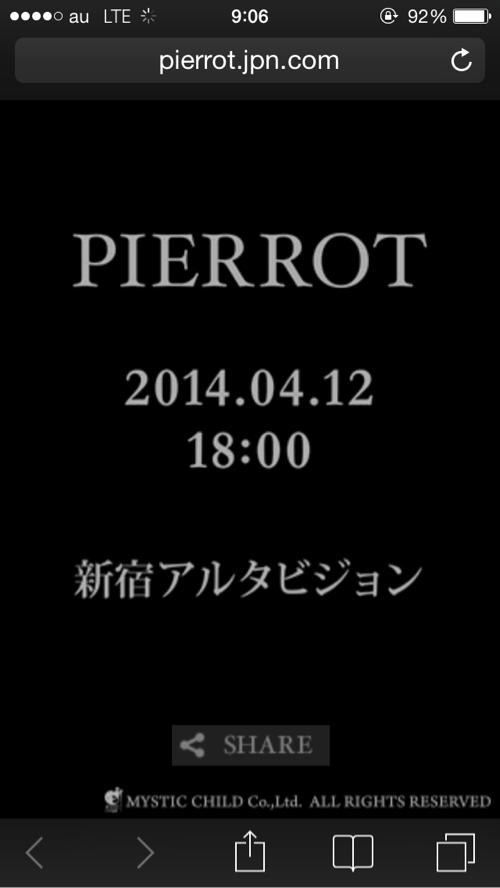
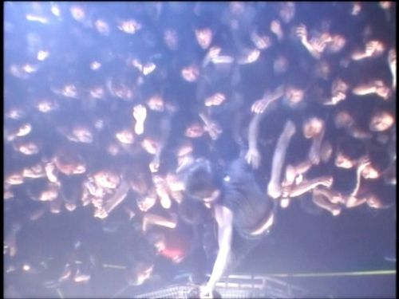

---
categories:
- PIERROT
date: Wed, 09 Apr 2014 00:17:05 +0000
slug: post-4772
tags:
- pierrot
title: PIERROT•••再始動か解散LIVEか
---

ハロー。しんぺー(<a href="https://twitter.com/s_s_p_y" target="_blank">@s_s_p_y</a> )です。

今朝タイムラインにて不可解なtweetを発見しました。

<h2>PIERROT、復活。</h2>

<blockquote class="twitter-tweet" lang="ja">
は？？？？え？？？
&mdash; しんぺー@sukekiyo初日 (@s_s_p_y) <a href="https://twitter.com/s_s_p_y/statuses/453681754344157184">2014, 4月 8</a></blockquote>

信じられるわけない。
でも、確かに予感はあった。

Angeloの楽屋に潤の姿。
<a style="color:#0070C5;" href="http://ameblo.jp/kiritoofficial/entry-11525458273.html" target="_blank">新木場終了｜キリトオフィシャルブログ「日刊思考回路」by Ameba</a>  

それでも唐突すぎて信じられない。

しばらく理解できないぼく。仕事も全く手につかず、妙なテンション。
<blockquote class="twitter-tweet" lang="ja">
ちょままてまてまてまてまてまて
&mdash; しんぺー@sukekiyo初日 (@s_s_p_y) <a href="https://twitter.com/s_s_p_y/statuses/453681799151886336">2014, 4月 8</a></blockquote>

そして、やっとこさ探しあてた謎のサイトがこれ。

<A Href="http://pierrot.jpn.com" Target="_blank">特設サイト</A>

それとタワレコに展示してあったアイジのギターストラップは、いまだにpierrotの時の•••小文字のね

<h2>この告知がなにを意味するのか</h2>

<blockquote class="twitter-tweet" lang="ja">
クリアスカイはインディーズ時代からのファンへの裏切り、マッドスカイはデビュー後からのファンへの裏切り。西武ドームの赤と青、神経がわれたわれる、有罪無罪。いつも裏と表の意味がある。じゃ4/12は何と対をなし、何を意味する？
&mdash; しんぺー@sukekiyo初日 (@s_s_p_y) <a href="https://twitter.com/s_s_p_y/statuses/453896949188407296">2014, 4月 9</a></blockquote>

2006年4月12日にPIERROTは解散しました。そして正式に解散LIVEを行っておりません。
当時、mixiで知りました。声が出なかったし、現実だとは思えなかった。

最後に見たテンポラリーデスィジョンツアーでの「解散しないから」の言葉が思い出されました。。。

そのあと、サイトに掲載されたメンバーの言葉。それでもリアルに感じられなかった。。。

今解っていること、ただ１つ明らかなのは、前を向かって歩き続けるメンバーがいて、次に進もうとしてるってことです。

それが正式なケジメとしての解散LIVEなのか、それとも復活LIVEなのか

今はわかりません。でも、その日、「あの場所」で明らかになるのでしょう。

虜勢の渡部さんも呟いているw

<blockquote class="twitter-tweet" lang="ja">
しかし、DIR EN GREYが15年ぶりにGAUZEツアーをやって、sukekiyoのアルバムで京とキリトさんのコラボが実現して、PIERROTが土曜日に新宿アルタビジョンで何かを発表しようとしている…。不思議な巡り合わせですね。
&mdash; 渡部です。 (@watanabedeath) 2014, 4月 9</blockquote>

<h3>ざわつくTwitter</h3>

著名人からパンピーに身をやつしたラー、現役のオバンギャまで様々な方がざついていました。
<blockquote class="twitter-tweet" lang="ja">
｀◎∀◎)!!!! RT <a href="https://twitter.com/jun_0110">@jun_0110</a>: ！！ RT <a href="https://twitter.com/PIERROT_0412">@PIERROT_0412</a>: PIERROT &#10;&#10;2014.04.12 &#10;18:00 &#10;&#10;新宿アルタビジョン&#10; &#10;<a href="http://t.co/lopHzrSqUK">http://t.co/lopHzrSqUK</a> <a href="http://t.co/WN3sdouOjs">pic.twitter.com/WN3sdouOjs</a>
&mdash; YUKKE (@mucc_yukke) <a href="https://twitter.com/mucc_yukke/statuses/453586216898658304">2014, 4月 8</a></blockquote>

<blockquote class="twitter-tweet" lang="ja">
PIERROTが？な何！？
&mdash; HISASHI (@HISASHI_) <a href="https://twitter.com/HISASHI_/statuses/453555657581801472">2014, 4月 8</a></blockquote>

<a href="http://matome.naver.jp/odai/2139697593233535101">PIERROTの発表に反応する音楽業界 V系著名人のツイートまとめ #PIERROT</a>

著名人ですらこれだから、当然バンギャは騒然www

仕事やめるのやめた人や、結婚なんかしてる場合じゃねーとか
宗教としてのPIERROTが戻ってきたぞ！！！

<a href="http://matome.naver.jp/odai/2139697522333380301">【バンギャ速報】突然の発表にあらぶるピエラーさんの名言まとめ #PIERROT</a>

<h2>PIERROT解散当時を振り返る</h2>

アルタ前。そこはPIERROTが前代未聞の「不可能が可能になり、可能が不可能になる」ことを体現させたゲノムコントロールの地。

モニター越しのカメラ目線の不自然なキリト

その後のニュースに取り上げられるPIERROT

鮮明に思い出せる。

<h2>しんぺーはこう思った。</h2>

PIERROT初の野郎限定で自然発生したダイブ。そして人生で最初で最後のダイブ。キリトに手ぱーんやられた！

ぼくが自ら選び、自らした最初の決断
それがPIERROTでした。

そして、痛みと強さを教わりました。

弱さとはそこに居続けること、立ち止まること。

強さとは振り払い、押し殺し立ち上がること。

そのPIERROTが復活するのなら、死ぬ気でついていくよ。

<blockquote class="twitter-tweet" lang="ja">
解散と対をなすなら復活だろうけど。ぼくが知ってるキリトなら再結成なんて寒いことはしない。でも例えばGAUZEツアーを見て、あーそーゆーのもありかとか少しでも思って、今再結成してみても面白いんじゃね？とか思って復活するってんなったかもしれないからキリトという男は読めない。
&mdash; しんぺー@sukekiyo初日 (@s_s_p_y) <a href="https://twitter.com/s_s_p_y/statuses/453898365567123456">April 9, 2014</a></blockquote>

PIERROTに支えられ、DIR EN GREYについていくぼくの人生ここに極まれり

<a href="https://itunes.apple.com/jp/album/dictators-circus-kijutsuteki/id457298391?uo=4&at=11ld5P" target="_blank" >Dictators Circus - Kijutsuteki Senritsu</a>

1,500円

(2014.04.10時点)

<a href="https://itunes.apple.com/jp/artist/pierrot/id76065141?uo=4&at=11ld5P" target="_blank" >PIERROT</a>

posted with <a href="http://pochireba.com" rel="nofollow" target="_blank">ポチレバ</a>

<a href="https://itunes.apple.com/jp/album/finale/id456884382?uo=4&at=11ld5P" target="_blank" >Finale</a>

1,500円

(2014.04.10時点)

<a href="https://itunes.apple.com/jp/artist/pierrot/id76065141?uo=4&at=11ld5P" target="_blank" >PIERROT</a>

posted with <a href="http://pochireba.com" rel="nofollow" target="_blank">ポチレバ</a>

<a href="https://itunes.apple.com/jp/album/screen-single/id457410787?uo=4&at=11ld5P" target="_blank" >Screen - Single</a>

450円

(2014.04.10時点)

<a href="https://itunes.apple.com/jp/artist/pierrot/id76065141?uo=4&at=11ld5P" target="_blank" >PIERROT</a>

posted with <a href="http://pochireba.com" rel="nofollow" target="_blank">ポチレバ</a>

