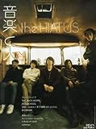
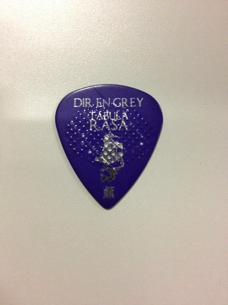
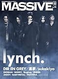
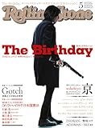

---
categories:
- sukekiyo
date: Fri, 11 Apr 2014 17:08:09 +0000
slug: post-4784
tags:
- sukekiyoまとめ
title: 今週のsukekiyoまとめ！4月5日〜11日(2014)
---

ハローしんぺー(<a href="https://twitter.com/s_s_p_y" target="_blank">@s_s_p_y</a> )です。

先週末からいくつかsukekiyo関連の雑誌がでました。さらに本日金曜日に初めて完全な音源がラジオで放送されました。

来週もいくつか刊行物があります。もうアルバム・ツアーまでノンストップです！その前に今週のsukekiyo情報をまとめます！

<h2>音楽と人</h2>

<a href="http://www.amazon.co.jp/exec/obidos/ASIN/B00J8PZF1C/warawareotoko-22/ref=nosim/" rel="nofollow" target="_blank">音楽と人 2014年 05月号 [雑誌]</a>
posted with <a href="http://kaereba.com" rel="nofollow" target="_blank">カエレバ</a>

 音楽と人 2014-04-05    

<a href="http://www.amazon.co.jp/gp/search?keywords=%8EG%8E%8F%20%89%B9%8Ay&__mk_ja_JP=%83J%83%5E%83J%83i&tag=warawareotoko-22" rel="nofollow" target="_blank" title="アマゾン" >Amazonで見る</a>

<a href="http://hb.afl.rakuten.co.jp/hgc/1263948e.a4330505.1263948f.788da92c/?pc=http%3A%2F%2Fsearch.rakuten.co.jp%2Fsearch%2Fmall%2F%25E9%259B%2591%25E8%25AA%258C%2520%25E9%259F%25B3%25E6%25A5%25BD%2F-%2Ff.1-p.1-s.1-sf.0-st.A-v.2%3Fx%3D0%26scid%3Daf_ich_link_urltxt%26m%3Dhttp%3A%2F%2Fm.rakuten.co.jp%2F" rel="nofollow" target="_blank" title="楽天市場" >楽天市場で見る</a>

<a href="http://ck.jp.ap.valuecommerce.com/servlet/referral?sid=3041033&pid=882528283&vc_url=http%3A%2F%2Fshopping.search.yahoo.co.jp%2Fsearch%3FuIv%3Don%26ei%3DUTF-8%26tab_ex%3Dcommerce%26slider%3D0%26va%3D%25E9%259B%2591%25E8%25AA%258C%2520%25E9%259F%25B3%25E6%25A5%25BD" rel="nofollow"  target="_blank" title="Yahooショッピング" >Yahooショッピングで見る</a>

ここ1週間で発売された雑誌は3つ。音楽と人、MASSIVE、Rolling Stoneです。
中でもアルバムの収録曲と、その歌詞にまで触れているのは現時点で音楽と人のみです。

基本的に内容はsukekiyoとDIR EE GREYとの制作過程の違いについて言及しています。そして、その性質の違いについて語られています。

このインタビューからは、sukekiyoのコアメンバーはDIR EN GREYのマニピュレーターとして付き合いが長い匠という感じが見て取れる。
そしてsukekiyoが決して京と追従者達というわけではないとのこと。京自身のアイデアやイメージがバンドという形式の中で再構築される様、それこそがバンドという形態であり、京自身が求める「スリル」であるようだ。

また、sukekiyoの活動にはDIR EN GREYとは違った「ワクワク感」を持たせたいとも思っているみたい。だから振り回されちゃうのもしょうがないってか？ww

後述するけどこんなことをインタビューで言ってる。

<blockquote>
＜こういうふうに自分が変っていくんだ＞ってそれを受け入れる事もできる。それを無理やり＜これが俺なんだ＞みたいに辛い抜いていくのもカッコいいとは思うけど、たぶん僕の場合は違うってことなんですよ。そういう自分も全部ひっくるめて＜僕です。＞って言いたいだけっていうか。その僕っていう部分が、ソロをやり始めたことでどんどん広がっている感じがして
</blockquote>

変ることを受け入れて、変らない部分と合わせて自分なんだって。
MASSIVEでToshiyaも同じようなことを言ってました。

<h3>薫の読弦</h3>

sukekiyoも良いけど、実は超絶おすすめしたいのがこちら我らがリーダーの連載「薫の読弦」です。

当時の薫はまだ高校生。音楽に目覚めて色んなライブハウスに足を運ぶ中で、DIR EN GREYのエグゼクティブプロデューサーであるダイナマイトトミー氏のバンドCOLORのLIVEに初めて参戦したときのことです。

そのLIVEは後に語り継がれる悲しいLIVEでした。というのもこれ、メジャーデビューしたCOLORが色んな大人の事情で、がんじがらめで表現を押さえつけられて、それに抗うために行ったシークレットLIVEでした。

当時の状況はwikipediaでしか知りません。そこには

<blockquote>
蓄積されたメンバーの不満が爆発したかのような、あまりの激しいライブにファンが将棋倒しの末圧死する事故が発生。
</blockquote>

と書かれています。

そのLIVEに薫がいたのでした。

その時の薫の虚脱感と恐怖

それこそが今の薫を作ってるんだと感じました。
それがあったからこそ、LIVEでの安全には最前をつくすし、LIVE中も常に我々を心配しているみたいです。

メンバーだけじゃなく、LIVE全体そして、虜の人生そのものまでも背負おうとしているリーダーの気概に驚愕しました。

<blockquote>
かすり傷ぐらいは、とは思っているけど、みんな笑顔で帰ってほしい。
ライブは刺激的で夢があって興奮して、泣いて、笑って、たまには怒って。
人が人で感動できる場。

先月の武道館はそんな事が起きた最高なライブハウスやった。
</blockquote>

薫は上手に来てもこっちの目をしっかり見据えている感じする。今の所、ぼくが唯一キャッチしたピックが薫のピック。

<h2>MASSIVE</h2>

<a href="http://www.amazon.co.jp/exec/obidos/ASIN/4401639901/warawareotoko-22/ref=nosim/" rel="nofollow" target="_blank">MASSIVE (マッシヴ) Vol. 14 (シンコー・ミュージックMOOK)</a>
posted with <a href="http://kaereba.com" rel="nofollow" target="_blank">カエレバ</a>

 シンコーミュージック 2014-04-07    

<a href="http://www.amazon.co.jp/gp/search?keywords=%83%7D%83b%83V%83%94%20%83V%83%93%83R%81%5B%81E%83%7E%83%85%81%5B%83W%83b%83NMOOK&__mk_ja_JP=%83J%83%5E%83J%83i&tag=warawareotoko-22" rel="nofollow" target="_blank" title="アマゾン" >Amazonで見る</a>

<a href="http://hb.afl.rakuten.co.jp/hgc/1263948e.a4330505.1263948f.788da92c/?pc=http%3A%2F%2Fsearch.rakuten.co.jp%2Fsearch%2Fmall%2F%25E3%2583%259E%25E3%2583%2583%25E3%2582%25B7%25E3%2583%25B4%2520%25E3%2582%25B7%25E3%2583%25B3%25E3%2582%25B3%25E3%2583%25BC%25E3%2583%25BB%25E3%2583%259F%25E3%2583%25A5%25E3%2583%25BC%25E3%2582%25B8%25E3%2583%2583%25E3%2582%25AFMOOK%2F-%2Ff.1-p.1-s.1-sf.0-st.A-v.2%3Fx%3D0%26scid%3Daf_ich_link_urltxt%26m%3Dhttp%3A%2F%2Fm.rakuten.co.jp%2F" rel="nofollow" target="_blank" title="楽天市場" >楽天市場で見る</a>

<a href="http://ck.jp.ap.valuecommerce.com/servlet/referral?sid=3041033&pid=882528283&vc_url=http%3A%2F%2Fshopping.search.yahoo.co.jp%2Fsearch%3FuIv%3Don%26ei%3DUTF-8%26tab_ex%3Dcommerce%26slider%3D0%26va%3D%25E3%2583%259E%25E3%2583%2583%25E3%2582%25B7%25E3%2583%25B4%2520%25E3%2582%25B7%25E3%2583%25B3%25E3%2582%25B3%25E3%2583%25BC%25E3%2583%25BB%25E3%2583%259F%25E3%2583%25A5%25E3%2583%25BC%25E3%2582%25B8%25E3%2583%2583%25E3%2582%25AFMOOK" rel="nofollow"  target="_blank" title="Yahooショッピング" >Yahooショッピングで見る</a>

はい、我らが増田先生のMASSIVE、今回は巻末にDIR EN GREYのLIVEレポートとToshiyaのインタビュー、sukekiyoで京のインタビューです。

とりあえずsukekiyoから読みました。おすすめポイントは次の通り

<ul>
	<li>アルバムの発売がまだなので楽曲については触れられていない</li>
<li>各メンバーの写真がしっかりと掲載されている</li>
<li>各メンバー招集秘話について語られている</li>
</ul>

アルバム発売がまだで、読者に偏見を与えない配慮でしょうか。このあたりの配慮が編集者やインタビュアーというよりもいちリスナーとして増田さんがあるんだなという感じがします。

それと京が時間の流れを意識しているという点が強く読み取れました。
若い人が、若いうちにしかできないから色んなことに挑戦したいってのは、わかります。でも京の場合は、やりたいことがありすぎて、きっと年をとってからできなくなるかもしれないから、だからもう今すぐにそのやりたいことをやりたい！！って思ってるようです。

その結果が、ソロという形で表出したようです。

DIR EN GREYは5人の個性がまざりあったいびつな芸術。
sukekiyoは屈折された京の意志。

そんな感じがしました。

sukekiyoの方が、より京のストレートな表現になっているけれども、バンドであるが故に100％純粋に京が凝縮されてるわけではない。京自身もそういったことで起きるミラクルを信じるからこそ、今回のソロをバンドという形式をとったとのことです。

以上、MASSIVEの要約なわけですけど、ぼくのフィルターを通してます。
これはMASSIVEまだ買ってない人はぜひ買うべきです。

おすすめです。

<h2>ROLLING STONE</h2>

<a href="http://www.amazon.co.jp/exec/obidos/ASIN/B00J9OG44E/warawareotoko-22/ref=nosim/" rel="nofollow" target="_blank">Rolling Stone (ローリング・ストーン) 日本版 2014年 05月号 [雑誌]</a>
posted with <a href="http://kaereba.com" rel="nofollow" target="_blank">カエレバ</a>

 セブン&アイ出版 2014-04-10    

<a href="http://www.amazon.co.jp/gp/search?keywords=Rolling%20Stone&__mk_ja_JP=%83J%83%5E%83J%83i&tag=warawareotoko-22" rel="nofollow" target="_blank" title="アマゾン" >Amazonで見る</a>

<a href="http://hb.afl.rakuten.co.jp/hgc/1263948e.a4330505.1263948f.788da92c/?pc=http%3A%2F%2Fsearch.rakuten.co.jp%2Fsearch%2Fmall%2FRolling%2520Stone%2F-%2Ff.1-p.1-s.1-sf.0-st.A-v.2%3Fx%3D0%26scid%3Daf_ich_link_urltxt%26m%3Dhttp%3A%2F%2Fm.rakuten.co.jp%2F" rel="nofollow" target="_blank" title="楽天市場" >楽天市場で見る</a>

<a href="http://ck.jp.ap.valuecommerce.com/servlet/referral?sid=3041033&pid=882528283&vc_url=http%3A%2F%2Fshopping.search.yahoo.co.jp%2Fsearch%3FuIv%3Don%26ei%3DUTF-8%26tab_ex%3Dcommerce%26slider%3D0%26va%3DRolling%2520Stone" rel="nofollow"  target="_blank" title="Yahooショッピング" >Yahooショッピングで見る</a>

この雑誌はじめてよみました。
完全に京及びsukekiyo、そしてそのアルバムのゲストに対してビジュアル系というよりもロック的な観点から評価をしているようです。

なぜならキリトの文字がない。。。。

それはおいといて内容です。

DIR EN GREYとsukekiyoの京の違い。そして京自身の表現や趣味趣向の根源は何かに焦点があてられています。
そのため、映画関連の話題もでてきました。例のホドロフスキーさんのお話。

それとここで初めてしりました。悪意ちゃんのお母さんであるマイエルの元ネタは<a href="http://ja.wikipedia.org/wiki/ヤン・シュヴァンクマイエル">ヤン・シュヴァンクマイエル</a>という人のようです。

<a style="color:#0070C5;" href="http://ja.wikipedia.org/wiki/%E3%83%A4%E3%83%B3%E3%83%BB%E3%82%B7%E3%83%A5%E3%83%B4%E3%82%A1%E3%83%B3%E3%82%AF%E3%83%9E%E3%82%A4%E3%82%A8%E3%83%AB" target="_blank">ヤン・シュヴァンクマイエル - Wikipedia</a>  

この人の作品がのっているサイトを見てください。
なんとなくですけど、京の絵のたっちに似ています。なるほど影響を受けているんですな。

それにしても不思議な絵です。
<a style="color:#0070C5;" href="http://vaclavsvankmajer.com/" target="_blank">Ink drawings 2013 - Václav Švankmajer</a>  

ちなみに日本語の情報サイトもあります。
<a style="color:#0070C5;" href="http://www.svankmajerjp.com/" target="_blank">ヤン・シュヴァンクマイエル情報サイト - Activities of Jan Švankmajer In Japan Website</a>  

<h2>しんぺーはこう思った。</h2>

はい、今週読んだsukekiyo関連書籍は以上です。

まとめますとこんな感じ。
<blockquote class="twitter-tweet" lang="ja">
sukekiyo刊行物レビュー記事明日まとめるー。とりあえず出たやつには全て目を通した！はっきりいってMASSIVEを買えばいいと思うで。ざっとだけどMASSIVEは今回あえて読者が持ってる情報にあわせた内容になってる。つまりアルバムの中身には触れていない。
&mdash; しんぺー@sukekiyo初日 (@s_s_p_y) <a href="https://twitter.com/s_s_p_y/statuses/454288821677342720">April 10, 2014</a></blockquote>

<blockquote class="twitter-tweet" lang="ja">
rolling stoneはDIR EN GREYとsukekiyoの違い。京の表現、趣向がとごからくるか。パンピ向け。まぁ当たり前か。あとホドロフ内容多し。音楽と人に関しては薫の独弦を読んで感じて欲しいのと。最近のsukekiyoを整理したい人は音楽と人の立ち読みでオケ
&mdash; しんぺー@sukekiyo初日 (@s_s_p_y) <a href="https://twitter.com/s_s_p_y/statuses/454289760723279872">April 10, 2014</a></blockquote>

とりあえず、薫の読弦はこれぜったい読んだ方がいい。
みんな、GAUZEツアーではゼッタイに雪崩起こさないようにしよう。

京さんが怒るのと同じくらい薫さんがきっと心配して傷ついてる。

本日は以上です。おやすみなさい。

<h3>今週読んだ書籍</h3>

<a href="http://www.amazon.co.jp/exec/obidos/ASIN/B00J8PZF1C/warawareotoko-22/ref=nosim/" rel="nofollow" target="_blank">音楽と人 2014年 05月号 [雑誌]</a>
posted with <a href="http://kaereba.com" rel="nofollow" target="_blank">カエレバ</a>

 音楽と人 2014-04-05    

<a href="http://www.amazon.co.jp/gp/search?keywords=%8EG%8E%8F%20%89%B9%8Ay&__mk_ja_JP=%83J%83%5E%83J%83i&tag=warawareotoko-22" rel="nofollow" target="_blank" title="アマゾン" >Amazonで見る</a>

<a href="http://hb.afl.rakuten.co.jp/hgc/1263948e.a4330505.1263948f.788da92c/?pc=http%3A%2F%2Fsearch.rakuten.co.jp%2Fsearch%2Fmall%2F%25E9%259B%2591%25E8%25AA%258C%2520%25E9%259F%25B3%25E6%25A5%25BD%2F-%2Ff.1-p.1-s.1-sf.0-st.A-v.2%3Fx%3D0%26scid%3Daf_ich_link_urltxt%26m%3Dhttp%3A%2F%2Fm.rakuten.co.jp%2F" rel="nofollow" target="_blank" title="楽天市場" >楽天市場で見る</a>

<a href="http://ck.jp.ap.valuecommerce.com/servlet/referral?sid=3041033&pid=882528283&vc_url=http%3A%2F%2Fshopping.search.yahoo.co.jp%2Fsearch%3FuIv%3Don%26ei%3DUTF-8%26tab_ex%3Dcommerce%26slider%3D0%26va%3D%25E9%259B%2591%25E8%25AA%258C%2520%25E9%259F%25B3%25E6%25A5%25BD" rel="nofollow"  target="_blank" title="Yahooショッピング" >Yahooショッピングで見る</a>

<a href="http://www.amazon.co.jp/exec/obidos/ASIN/4401639901/warawareotoko-22/ref=nosim/" rel="nofollow" target="_blank">MASSIVE (マッシヴ) Vol. 14 (シンコー・ミュージックMOOK)</a>
posted with <a href="http://kaereba.com" rel="nofollow" target="_blank">カエレバ</a>

 シンコーミュージック 2014-04-07    

<a href="http://www.amazon.co.jp/gp/search?keywords=%83%7D%83b%83V%83%94%20%83V%83%93%83R%81%5B%81E%83%7E%83%85%81%5B%83W%83b%83NMOOK&__mk_ja_JP=%83J%83%5E%83J%83i&tag=warawareotoko-22" rel="nofollow" target="_blank" title="アマゾン" >Amazonで見る</a>

<a href="http://hb.afl.rakuten.co.jp/hgc/1263948e.a4330505.1263948f.788da92c/?pc=http%3A%2F%2Fsearch.rakuten.co.jp%2Fsearch%2Fmall%2F%25E3%2583%259E%25E3%2583%2583%25E3%2582%25B7%25E3%2583%25B4%2520%25E3%2582%25B7%25E3%2583%25B3%25E3%2582%25B3%25E3%2583%25BC%25E3%2583%25BB%25E3%2583%259F%25E3%2583%25A5%25E3%2583%25BC%25E3%2582%25B8%25E3%2583%2583%25E3%2582%25AFMOOK%2F-%2Ff.1-p.1-s.1-sf.0-st.A-v.2%3Fx%3D0%26scid%3Daf_ich_link_urltxt%26m%3Dhttp%3A%2F%2Fm.rakuten.co.jp%2F" rel="nofollow" target="_blank" title="楽天市場" >楽天市場で見る</a>

<a href="http://ck.jp.ap.valuecommerce.com/servlet/referral?sid=3041033&pid=882528283&vc_url=http%3A%2F%2Fshopping.search.yahoo.co.jp%2Fsearch%3FuIv%3Don%26ei%3DUTF-8%26tab_ex%3Dcommerce%26slider%3D0%26va%3D%25E3%2583%259E%25E3%2583%2583%25E3%2582%25B7%25E3%2583%25B4%2520%25E3%2582%25B7%25E3%2583%25B3%25E3%2582%25B3%25E3%2583%25BC%25E3%2583%25BB%25E3%2583%259F%25E3%2583%25A5%25E3%2583%25BC%25E3%2582%25B8%25E3%2583%2583%25E3%2582%25AFMOOK" rel="nofollow"  target="_blank" title="Yahooショッピング" >Yahooショッピングで見る</a>

<a href="http://www.amazon.co.jp/exec/obidos/ASIN/B00J9OG44E/warawareotoko-22/ref=nosim/" rel="nofollow" target="_blank">Rolling Stone (ローリング・ストーン) 日本版 2014年 05月号 [雑誌]</a>
posted with <a href="http://kaereba.com" rel="nofollow" target="_blank">カエレバ</a>

 セブン&アイ出版 2014-04-10    

<a href="http://www.amazon.co.jp/gp/search?keywords=Rolling%20Stone&__mk_ja_JP=%83J%83%5E%83J%83i&tag=warawareotoko-22" rel="nofollow" target="_blank" title="アマゾン" >Amazonで見る</a>

<a href="http://hb.afl.rakuten.co.jp/hgc/1263948e.a4330505.1263948f.788da92c/?pc=http%3A%2F%2Fsearch.rakuten.co.jp%2Fsearch%2Fmall%2FRolling%2520Stone%2F-%2Ff.1-p.1-s.1-sf.0-st.A-v.2%3Fx%3D0%26scid%3Daf_ich_link_urltxt%26m%3Dhttp%3A%2F%2Fm.rakuten.co.jp%2F" rel="nofollow" target="_blank" title="楽天市場" >楽天市場で見る</a>

<a href="http://ck.jp.ap.valuecommerce.com/servlet/referral?sid=3041033&pid=882528283&vc_url=http%3A%2F%2Fshopping.search.yahoo.co.jp%2Fsearch%3FuIv%3Don%26ei%3DUTF-8%26tab_ex%3Dcommerce%26slider%3D0%26va%3DRolling%2520Stone" rel="nofollow"  target="_blank" title="Yahooショッピング" >Yahooショッピングで見る</a>

