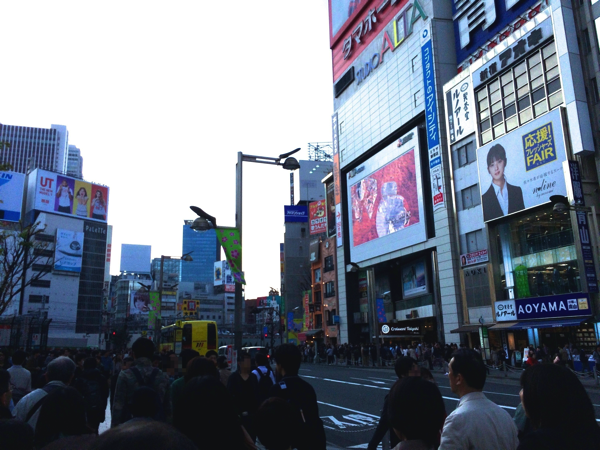

---
categories:
- PIERROT
date: Sat, 12 Apr 2014 09:24:00 +0000
slug: post-4790
title: PIERROTアルタ前発表まとめ！一生ピエラーだぜ！
---

ハローしんぺー(<a href="https://twitter.com/s_s_p_y" target="_blank">@s_s_p_y</a> )です。

ついにまちに待ったその日がやってきました。
今日は何の日かというと8年前にPIERROTが解散した日そして、沈黙を破りPIERROTが発表を行うとした日です。

<a style="color:#0070C5;" href="https://www.warawareotoko.com/2014/04/09/post-4772/" target="_blank">PIERROT•••再始動か解散LIVEか | Gadget Zombie Parasite</a>  

<h2>発表時間までの荒ぶるタイムライン</h2>

午前中にタイムラインを検索すると11時よりも前にアルタ前に集結している人たちもいるとのこと。さすがピエラーや！

そう我々は8年も待たされた。数時間待つことなんてそれに比べれば！！

さて、ぼくも当然の如くアルタ前に向かいます。
初めてPIERROTのLIVEに参加した1999年9月9日に買った腕章をもってきました。

現地に到着すると黒い黒い、文字通りの黒い人だかり。
そしてカオス。黒い人たちと大学の新歓の待ち合わせの人、そして通りすがりの人。

警備員の方も数名いて、状況がつかめない一般の方が「これはなんですか？」ときいていました。きかれた警備員の方も「いや、我々も知らないんですよ。よく。（←おいw）なんでもビジュアル系のバンドが発表を行うということで•••」

そして、なぜかアルタ前でこんな日にブースを出す企業様www

30分前を過ぎるとどんどん人が増えてきました。警備員の方もここに並ばないで！と焦っております。

さっきのシャンプーの企業ブースも、もはや配ってたお姉さんたちが見えなくなりましたwこのプロモーション失敗ですねw週明けに社内で何て弁明するのかな？www「目の前に突然黒い集団が現れて！！」←

そして、ついに時間に！

<h2>PIERROT　DICTATORS CIRCUS FINAL@さいたまスーパーアリーナ</h2>

HELLOのMVが終わりキリトがマイクスタンドを蹴倒し、時の経過を暗示する映像が流れます。

そして、歩く人影•••

キリトのようです。そして倒れるマイクスタンドに手を延ばします。

DICTATORS CIRCUS FINAL
@さいたまスーパーアリーナ
10月24日　I said HELLO
10月25日  Birthday

それでも彼らは常に誰１人として立ち止まることなく今日を迎えました。
そして、このLIVEは復活か解散かは不明です。でも、「今」を見に来い。
そう彼らは公式サイトで声明文を発表しています。

公式の映像はこちらで全部見られます。
<iframe width="560" height="315" src="//www.youtube.com/embed/RNA9MGphT-M?rel=0" frameborder="0" allowfullscreen></iframe>

そして、ファンクラブを1年限定で募集。入会するとLIVEのチケットを最速申込可能とのこと。

PIERROT  

なお発表時の現地の様子です。
<iframe width="420" height="315" src="//www.youtube.com/embed/Dvs7hjIV4KY?rel=0" frameborder="0" allowfullscreen></iframe>

最後、ステッカーを配布していました。

<h2>しんぺーはこう思った。</h2>

今日たどりつくまでにPIERROTをランダムで聴いてました。。。

<blockquote class="twitter-tweet" lang="ja">
僕は今でもあの日の君に問いかけ迷ってる。だけど、そうさ何一つ捨て去る気などないさ。今でも。
&mdash; しんぺー@sukekiyo初日 (@s_s_p_y) <a href="https://twitter.com/s_s_p_y/statuses/454876306917036032">April 12, 2014</a></blockquote>

PIECESの歌詞です。まさに今日を予見していたかのような歌詞です。まさに今のピエラーがPIERROTにかけたい言葉です。

<blockquote class="twitter-tweet" lang="ja">
何処かにきっとおき忘れていた大事な夢のカケラ達を、この手はいつか取り戻せるはずさ、いつの日もそうしてきた
&mdash; しんぺー@sukekiyo初日 (@s_s_p_y) <a href="https://twitter.com/s_s_p_y/statuses/454876773923053568">April 12, 2014</a></blockquote>

8年長かった。今思えば、このバンドの凄さ、破壊力、そして自分がどんなにこのバンドに心酔して、自分を構築するのに重要な要素を担っていたのか。

今日改めて気づかされました。

おそらく、この1年の期間限定の活動でしょう。
けじめです。彼らの。

それでもいい。それでもいい、死ぬ気でついていくから。

一生ピエラーです。