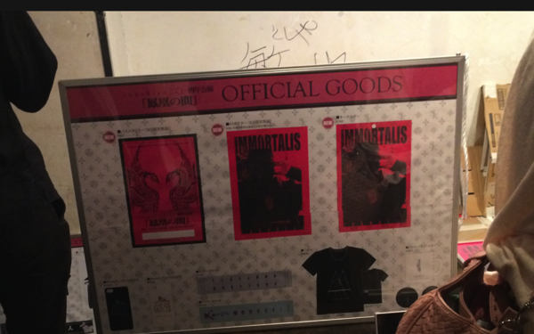
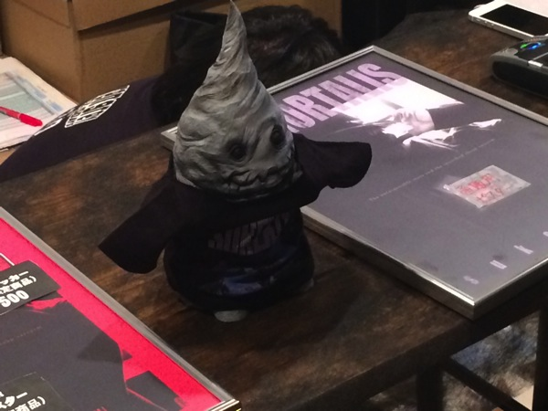
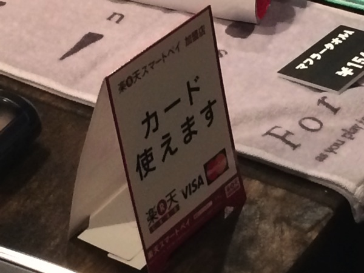

---
categories:
- sukekiyoのLIVEレポ
date: Mon, 28 Apr 2014 14:05:39 +0000
slug: post-5216
tags:
- sukekiyo
title: 【ライブレポ】sukekiyo「鳳凰の間」2014_4_28＠恵比寿LIQUIDROOM
---

ハローしんぺー(<a href="https://twitter.com/s_s_p_y" target="_blank" rel="noopener">@s_s_p_y</a> )です。

本日はsukekiyoの「鳳凰の間」にして、アルバム「IMMORTALIS」のフラゲの日です。

ぼくは先着でメンバーのトークセッションに招待される新宿タワレコにて予約をしましたので、本日購入してきました！

<a href="http://www.amazon.co.jp/exec/obidos/ASIN/B00IMKDX3G/warawareotoko-22/ref=nosim/" target="_blank" rel="nofollow noopener">IMMORTALIS(初回生産限定盤)</a>

posted with <a href="http://kaereba.com" target="_blank" rel="nofollow noopener">カエレバ</a>

sukekiyo SMD itaku (music) 2014-04-30

<a title="アマゾン" href="http://www.amazon.co.jp/gp/search?keywords=IMMORTALIS&amp;__mk_ja_JP=%83J%83%5E%83J%83i&amp;tag=warawareotoko-22" target="_blank" rel="nofollow noopener">Amazonで見る</a>

<a title="楽天市場" href="http://hb.afl.rakuten.co.jp/hgc/1263948e.a4330505.1263948f.788da92c/?pc=http%3A%2F%2Fsearch.rakuten.co.jp%2Fsearch%2Fmall%2FIMMORTALIS%2F-%2Ff.1-p.1-s.1-sf.0-st.A-v.2%3Fx%3D0%26scid%3Daf_ich_link_urltxt%26m%3Dhttp%3A%2F%2Fm.rakuten.co.jp%2F" target="_blank" rel="nofollow noopener">楽天市場で見る</a>

<a title="Yahooショッピング" href="http://ck.jp.ap.valuecommerce.com/servlet/referral?sid=3041033&amp;pid=882528283&amp;vc_url=http%3A%2F%2Fshopping.search.yahoo.co.jp%2Fsearch%3FuIv%3Don%26ei%3DUTF-8%26tab_ex%3Dcommerce%26slider%3D0%26va%3DIMMORTALIS" target="_blank" rel="nofollow noopener">Yahooショッピングで見る</a>

初回生産限定盤を手に入れないとわからない情報については発売日にこちらに掲載します。
ただし、すでにTwitterで出回っていましたが•••
<h2>本日の物販</h2>
バックに謎の敏也の文字•••

悪意ちゃんがお出迎え

そして驚くはなんと！物販がカード決済に対応！！！これはwwwやばいwww

LIVE前に受けると思ったけどそうでもなかったtweetがこちらになります。
<blockquote class="twitter-tweet" lang="ja">【次回予告】 お願い、死なないで虜たち！今ここでリボにしたら、武道館DVDやGAUZEツアーのための貯金はどうなっちゃうの？ GHOULツアーの旅費の支払いはまだ残ってる。これを耐えれば、GAUZEツアーにいけるんだから！ 次回、「虜寡黙に死す」。ツアースタンバイ！

— しんぺー@sukekiyo0501 (@s_s_p_y) <a href="https://twitter.com/s_s_p_y/statuses/460698162353541120">2014, 4月 28</a></blockquote>

<h2>sukekiyo「鳳凰の間」＠恵比寿LIQUIDROOM感想</h2>
最速でもアルバムを入手したのが今日ですので、皆さん棒立ちでした。
無理やり乗ろうとしてもどこかぎこちないw

開演前のSEは昭和歌謡曲みたいな怪しげな雰囲気でした。

そしてステージは映像や演出は一切なし。照明のみというシンプルなものでした。

メンバーの衣装は全員真っ黒。まさに参列、寡黙の儀。
本当にお葬式という感じでした。

虜さんメンバーの名前をちゃんと把握していない方も多いみたいで、とりあえずの拍手がおこりました。
そして最後京の登場ではいつも通りのデスボにて「ギョウ！！」

とりあえず1曲目は「in all weathers」だったと思います。
その後も、皆あんまり知らない曲を演奏して、間にまばらな拍手。
みんなどう乗っていいのか戸惑っているのか。sukekiyoを味わっているのか。

そう言えば、斜め前の子が嗚咽を漏らしながら泣いていました。
ぼくも冒頭、久しぶりに鳥肌がたちました。

その後、少し場内があったまり出して、オーディエンスも乗ってきた頃です。
京に対していつも通りの声援を送っておりました。

「黙れ」

京からの一言に、場内が静まり返ります。
こんなインタビューがありました。
<blockquote>京：5月5日（月・祝）に京都でやる「寡黙の儀」（通販限定初回仕様限定盤購入者対象ライブ）は、ドレスコードが喪服なんですけど、本当はその規定がなくても毎回喪服で、無言で、何もせずに突っ立ってライブを観てもらうのが僕の希望なんです。名前も一切呼ばれたくない。今回、実験的に1日だけやりますけど、本当は「女子のスカートは何センチ」とか「1回入ると終わるまでドアは一切開きません」という規定を設けたいくらい（笑）。sukekiyoのライブに行くことは、ぜひ「参列」と呼んでほしいですね。

<a style="color: #0070c5;" href="http://vif-music.com/pickup/sukekiyo/" target="_blank" rel="noopener">sukekiyo | ROCKの総合情報サイトVif</a>
<strong>引用元</strong></blockquote>
寡黙の儀以外でも寡黙にしたいというのがsukekiyoの演出の一貫のようです。
ということで5月1日日本青年館には喪服で参列しようと思います。

その後、演奏はさらに寡黙に続きます。
下手メンバーであるYUCHIとUTAは思いの外、アクティブな方々でした。

とくにUTAがいちいち動きまくる。ToshiyaというよりもAXで見たSUGIZOに近い感じでした。

そして驚いたのは上手の匠

ぼくはsukekiyoにおいて京と同等かそれ以上に重要な人間ではないかと思っています。
この方が、こんな感じでした。
<blockquote class="twitter-tweet" lang="ja">匠さんな。こんなこんな感じな。とにかく立ったり座ったり、楽器持ち替えまくったりしてた。 <a href="http://t.co/zXdzlbc7lV">pic.twitter.com/zXdzlbc7lV</a>

— しんぺー@sukekiyo0501 (@s_s_p_y) <a href="https://twitter.com/s_s_p_y/statuses/460741112789889026">2014, 4月 28</a></blockquote>

とにかく立ったり座ったり。ギター弾いたり、アコギ弾いたり、ネットゲしたり←
もし給料が5等分ならあの人には2人分あげてあげて！っていうくらい動きまくってました。そういう意味ではこの人もアクティブでした。

ドラムの未架はあまりよく見えませんでしたが、久しぶりにあんなにお皿の少ないドラマーをみました。
そう、いつもお皿が沢山で、高い位置にあったりする人を見ているもので

最後に我らが京氏ですが、アルバムのジャケットと同じ衣装でした。
顔には養蜂家のようなネット、そして黒いハットをかぶっていました。

最初の方でハットをとってからはこんな感じでした。
<blockquote class="twitter-tweet" lang="ja">sukekiyoの京 <a href="http://t.co/umG070pEy1">pic.twitter.com/umG070pEy1</a>

— しんぺー@sukekiyo0501 (@s_s_p_y) <a href="https://twitter.com/s_s_p_y/statuses/460756321092907008">2014, 4月 28</a></blockquote>

これに関しては、皆さん同意されている方が多いみたいです。それでも言っていいのかどうかわからない雰囲気がタイムラインに流れておりましたw
それこそ「黙れ」と言われそう。
<h2>しんぺーはこう思った。</h2>
京が寡黙を求めるからと言って、皆寡黙やで〜って喧伝する必要はないと思います。
そういう雰囲気なら自然とそうなると思うし。
ま、そういう意味では、まだアルバムを手に入れていない人は、LIVEまで聴かないという選択肢もありなんじゃなかろうか！

それと何か今日の参列者はわりと、年齢層が上だった気がする。
そして、いつもと違って皆殺気立ってた。。。なんでだろ。ちょいこわかったな。。。

といった所で本日は以上です！おやすみなさい。
<h3>ちなみに各メンバーのブログも更新さていました。</h3>
<a style="color: #0070c5;" href="http://ameblo.jp/takumixofficial/entry-11836748896.html" target="_blank" rel="noopener">sukekiyo「鳳凰の間」無事終了。｜匠オフィシャルブログ「Takumi's blog」by Ameba</a>
<blockquote class="twitter-tweet" lang="ja">sukekiyo初単独公演『鳳凰の間』@恵比寿リキッドルーム、無事終了です！お越し頂いた皆様、ありがとうございました！個人的な課題はまだまだあるけど楽しかった！次は日本青年館2DAYS！宜しくどうぞ！

— YUCHI (@yuchivalism) <a href="https://twitter.com/yuchivalism/statuses/460755338333925378">2014, 4月 28</a></blockquote>
