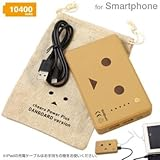
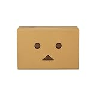
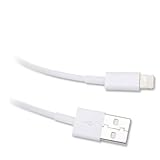
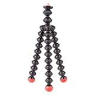
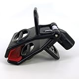
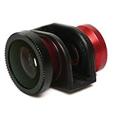
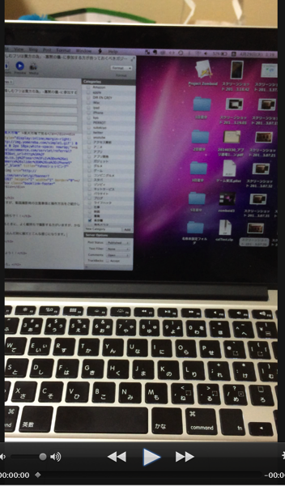
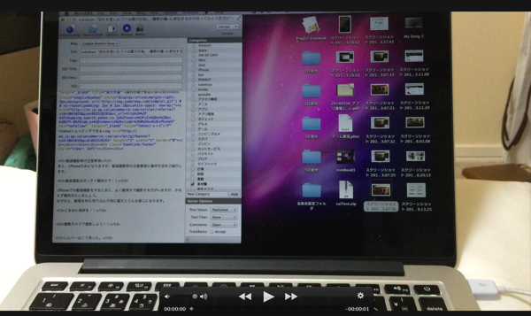

---
categories:
- sukekiyo
date: Mon, 28 Apr 2014 17:41:19 +0000
slug: post-5222
tags:
- sukekiyo
title: sukekiyo「別れを惜しむフリは貴方の為」-寡黙の儀-に参加する方が持っておくべきガジェット
---

ハローしんぺー(<a href="https://twitter.com/s_s_p_y" target="_blank">@s_s_p_y</a> )です。

今夜はLIVE終わりで調子づいておりますので、もう１つ記事を書きたいと思います。もちろんsukekiyoの「IMMORTALIS」を聴きながら。

<a href="http://www.amazon.co.jp/exec/obidos/ASIN/B00IMKDX3G/warawareotoko-22/ref=nosim/" rel="nofollow" target="_blank">IMMORTALIS(初回生産限定盤)</a>
posted with <a href="http://kaereba.com" rel="nofollow" target="_blank">カエレバ</a>

sukekiyo SMD itaku (music) 2014-04-30    

<a href="http://www.amazon.co.jp/gp/search?keywords=IMMORTALIS&__mk_ja_JP=%83J%83%5E%83J%83i&tag=warawareotoko-22" rel="nofollow" target="_blank" title="アマゾン" >Amazonで見る</a>

<a href="http://hb.afl.rakuten.co.jp/hgc/1263948e.a4330505.1263948f.788da92c/?pc=http%3A%2F%2Fsearch.rakuten.co.jp%2Fsearch%2Fmall%2FIMMORTALIS%2F-%2Ff.1-p.1-s.1-sf.0-st.A-v.2%3Fx%3D0%26scid%3Daf_ich_link_urltxt%26m%3Dhttp%3A%2F%2Fm.rakuten.co.jp%2F" rel="nofollow" target="_blank" title="楽天市場" >楽天市場で見る</a>

<a href="http://ck.jp.ap.valuecommerce.com/servlet/referral?sid=3041033&pid=882528283&vc_url=http%3A%2F%2Fshopping.search.yahoo.co.jp%2Fsearch%3FuIv%3Don%26ei%3DUTF-8%26tab_ex%3Dcommerce%26slider%3D0%26va%3DIMMORTALIS" rel="nofollow"  target="_blank" title="Yahooショッピング" >Yahooショッピングで見る</a>

さて本日のLIVEで、寡黙の儀に参加される方が持っていた方がいいんじゃね？って思うものがいくつか思い浮かびましたのでご紹介。

<h2>sukekiyo「別れを惜しむフリは貴方の為」-寡黙の儀-とは</h2>

寡黙の儀とは、今回のツアーの中の京都劇場3daysの真ん中の5月5日に行われる特別公演のことです。

何が特別かっていうと“参列”にあたっていくつか決まり事があるという点です。

<blockquote>
第一項	お客様にとっての「喪服」として、黒を基本とした光沢や装飾の無い服装・髪型でご来場ください。
第二項	演出の都合上、会場内では私語・雑音はお控えいただき、お静かにお願い致します。
第三項	上演中は、携帯電話での動画撮影が可能となります。撮影される際は、周りのお客様の視界の妨げにならないよう、携帯電話は顔よりも高くあげないようにお願い致します。但し、静止画の撮影、フラッシュ光使用、プロ仕様カメラ及び動画の不正使用はお断り致します。
第四項	演出上の都合により、上演中の入退場はご遠慮いただきます。万が一、上演中に体調が悪くなった方はお近くの係員にお申し出ください。
第五項	上演中は、映像収録および写真撮影用のカメラが会場内に入り、ご来場のお客様の様子が媒体・商品映像に映りこむ場合がございます。収録された映像・写真は商品化やプロモーション等に使用される可能性がございます。
引用元：<a href="http://sukekiyo-official.jp/live/index.html">sukekiyo-official</a>
</blockquote>

ドレスコード＝喪服着用、携帯による撮影OK、声出しNG、途中退場禁止とのこと。。。

なんじゃこりゃ。ドレスコードはわかる。ただ、携帯での撮影OKについては、こんなの聞いたことない！
でも、もしこれネットにアップOKってなんなら相当頭のいいマーケティングだと思います。

だって、参加した人がみんなYouTubeにアップしたら、いっきにYouTube上のsukekiyoコンテンツが増えるわけです。しかも違法にアップされたコンテンツを押しのけるくらいの視聴数になるだろうから、違法コンテンツの検索順位も自然と下がるわけで、事実上もうみられなくなる！！なおかつ、キレイな動画が見たかったらDVD買ってねってすればDVDのセールスが落ち込むこともなさそう！！

（それにしてもmamaってめちゃくちゃいい曲やんけ。これはDIRじゃできないなぁきっと）

で、ここで思ったんですわ。あの棒立ちLIVEでずっと携帯を掲げてるのって相当疲れんじゃね？って
しかも電池ゼッタイ持たないよね？

ということで今ならまだ間に合う！このガジェットを揃えておけ！

<h2>対寡黙の儀用おすすめガジェット</h2>

まずは一番心配なのがバッテリーです。ということでぼくも愛用しまくっているモバイルブースターのダンボーをおすすめします！
ミニサイズもありますが、でっかいサイズがおすすめです。なんてったってiPhoneをフル充電で6回程充電できます。
ぼくはAppleStoreに徹夜で並んだ時に、こいつで充電しながら過ごしました！

<a href="http://www.amazon.co.jp/exec/obidos/ASIN/B00CY6P968/warawareotoko-22/ref=nosim/" rel="nofollow" target="_blank">cheero Power Plus 10400mAh DANBOARD Version マルチデバイス対応モバイルバッテリー</a>
posted with <a href="http://kaereba.com" rel="nofollow" target="_blank">カエレバ</a>

 cheero mart     

<a href="http://www.amazon.co.jp/gp/search?keywords=cheero%20Power%20Plus%2010400mAh%20DANBOARD%20Version&__mk_ja_JP=%83J%83%5E%83J%83i&tag=warawareotoko-22" rel="nofollow" target="_blank" title="アマゾン" >Amazonで見る</a>

<a href="http://hb.afl.rakuten.co.jp/hgc/1263948e.a4330505.1263948f.788da92c/?pc=http%3A%2F%2Fsearch.rakuten.co.jp%2Fsearch%2Fmall%2Fcheero%2520Power%2520Plus%252010400mAh%2520DANBOARD%2520Version%2F-%2Ff.1-p.1-s.1-sf.0-st.A-v.2%3Fx%3D0%26scid%3Daf_ich_link_urltxt%26m%3Dhttp%3A%2F%2Fm.rakuten.co.jp%2F" rel="nofollow" target="_blank" title="楽天市場" >楽天市場で見る</a>

<a href="http://ck.jp.ap.valuecommerce.com/servlet/referral?sid=3041033&pid=882528283&vc_url=http%3A%2F%2Fshopping.search.yahoo.co.jp%2Fsearch%3FuIv%3Don%26ei%3DUTF-8%26tab_ex%3Dcommerce%26slider%3D0%26va%3Dcheero%2520Power%2520Plus%252010400mAh%2520DANBOARD%2520Version" rel="nofollow"  target="_blank" title="Yahooショッピング" >Yahooショッピングで見る</a>

こっちがミニ

<a href="http://www.amazon.co.jp/exec/obidos/ASIN/B00G8I2BU0/warawareotoko-22/ref=nosim/" rel="nofollow" target="_blank">cheero Power Plus DANBOARD version -mini- 6000mAh マルチデバイス対応 モバイルバッテリー</a>
posted with <a href="http://kaereba.com" rel="nofollow" target="_blank">カエレバ</a>

 cheero mart     

<a href="http://www.amazon.co.jp/gp/search?keywords=cheero%20Power%20Plus%20DANBOARD%20version&__mk_ja_JP=%83J%83%5E%83J%83i&tag=warawareotoko-22" rel="nofollow" target="_blank" title="アマゾン" >Amazonで見る</a>

<a href="http://hb.afl.rakuten.co.jp/hgc/1263948e.a4330505.1263948f.788da92c/?pc=http%3A%2F%2Fsearch.rakuten.co.jp%2Fsearch%2Fmall%2Fcheero%2520Power%2520Plus%2520DANBOARD%2520version%2F-%2Ff.1-p.1-s.1-sf.0-st.A-v.2%3Fx%3D0%26scid%3Daf_ich_link_urltxt%26m%3Dhttp%3A%2F%2Fm.rakuten.co.jp%2F" rel="nofollow" target="_blank" title="楽天市場" >楽天市場で見る</a>

<a href="http://ck.jp.ap.valuecommerce.com/servlet/referral?sid=3041033&pid=882528283&vc_url=http%3A%2F%2Fshopping.search.yahoo.co.jp%2Fsearch%3FuIv%3Don%26ei%3DUTF-8%26tab_ex%3Dcommerce%26slider%3D0%26va%3Dcheero%2520Power%2520Plus%2520DANBOARD%2520version" rel="nofollow"  target="_blank" title="Yahooショッピング" >Yahooショッピングで見る</a>

で、頭の位置にスマホを掲げる訳ですから、若干長めのケーブルも用意しましょう。

<a href="http://www.amazon.co.jp/exec/obidos/ASIN/B009VDVDO4/warawareotoko-22/ref=nosim/" rel="nofollow" target="_blank">iPhone5/第4世代iPad/iPad min/iPodnano7 USBケーブル 1m 【充電・データ転送に】iPod対応 Lightning ライトニング</a>
posted with <a href="http://kaereba.com" rel="nofollow" target="_blank">カエレバ</a>

 HanyeTech     

<a href="http://www.amazon.co.jp/gp/search?keywords=iPodnano7%20USB%83P%81%5B%83u%83%8B&__mk_ja_JP=%83J%83%5E%83J%83i&tag=warawareotoko-22" rel="nofollow" target="_blank" title="アマゾン" >Amazonで見る</a>

<a href="http://hb.afl.rakuten.co.jp/hgc/1263948e.a4330505.1263948f.788da92c/?pc=http%3A%2F%2Fsearch.rakuten.co.jp%2Fsearch%2Fmall%2FiPodnano7%2520USB%25E3%2582%25B1%25E3%2583%25BC%25E3%2583%2596%25E3%2583%25AB%2F-%2Ff.1-p.1-s.1-sf.0-st.A-v.2%3Fx%3D0%26scid%3Daf_ich_link_urltxt%26m%3Dhttp%3A%2F%2Fm.rakuten.co.jp%2F" rel="nofollow" target="_blank" title="楽天市場" >楽天市場で見る</a>

<a href="http://ck.jp.ap.valuecommerce.com/servlet/referral?sid=3041033&pid=882528283&vc_url=http%3A%2F%2Fshopping.search.yahoo.co.jp%2Fsearch%3FuIv%3Don%26ei%3DUTF-8%26tab_ex%3Dcommerce%26slider%3D0%26va%3DiPodnano7%2520USB%25E3%2582%25B1%25E3%2583%25BC%25E3%2583%2596%25E3%2583%25AB" rel="nofollow"  target="_blank" title="Yahooショッピング" >Yahooショッピングで見る</a>

さらに繰り返しになりますが、頭の位置に固定するわけですから、掲げたままだと腕が死ぬでしょう。
ということでこんなものもあってもいいかなと思います。

<a href="http://www.amazon.co.jp/exec/obidos/ASIN/B0038YWLCA/warawareotoko-22/ref=nosim/" rel="nofollow" target="_blank">JOBY カメラ固定具 ゴリラポッド マグネティック 001513</a>
posted with <a href="http://kaereba.com" rel="nofollow" target="_blank">カエレバ</a>

 ケンコー 2010-06-15    

<a href="http://www.amazon.co.jp/gp/search?keywords=%83S%83%8A%83%89%83%7C%83b%83h%20JOBY&__mk_ja_JP=%83J%83%5E%83J%83i&tag=warawareotoko-22" rel="nofollow" target="_blank" title="アマゾン" >Amazonで見る</a>

<a href="http://hb.afl.rakuten.co.jp/hgc/1263948e.a4330505.1263948f.788da92c/?pc=http%3A%2F%2Fsearch.rakuten.co.jp%2Fsearch%2Fmall%2F%25E3%2582%25B4%25E3%2583%25AA%25E3%2583%25A9%25E3%2583%259D%25E3%2583%2583%25E3%2583%2589%2520JOBY%2F-%2Ff.1-p.1-s.1-sf.0-st.A-v.2%3Fx%3D0%26scid%3Daf_ich_link_urltxt%26m%3Dhttp%3A%2F%2Fm.rakuten.co.jp%2F" rel="nofollow" target="_blank" title="楽天市場" >楽天市場で見る</a>

<a href="http://ck.jp.ap.valuecommerce.com/servlet/referral?sid=3041033&pid=882528283&vc_url=http%3A%2F%2Fshopping.search.yahoo.co.jp%2Fsearch%3FuIv%3Don%26ei%3DUTF-8%26tab_ex%3Dcommerce%26slider%3D0%26va%3D%25E3%2582%25B4%25E3%2583%25AA%25E3%2583%25A9%25E3%2583%259D%25E3%2583%2583%25E3%2583%2589%2520JOBY" rel="nofollow"  target="_blank" title="Yahooショッピング" >Yahooショッピングで見る</a>

<a href="http://www.amazon.co.jp/exec/obidos/ASIN/B004WM07PA/warawareotoko-22/ref=nosim/" rel="nofollow" target="_blank">SP089：Clasp for smartphone（ブラック×レッド） スマートフォン 三脚 三脚固定ホルダー 三脚ネジ穴搭載</a>
posted with <a href="http://kaereba.com" rel="nofollow" target="_blank">カエレバ</a>

 スペックコンピュータ株式会社     

<a href="http://www.amazon.co.jp/gp/search?keywords=%83X%83y%83b%83N%83R%83%93%83s%83%85%81%5B%83%5E&__mk_ja_JP=%83J%83%5E%83J%83i&tag=warawareotoko-22" rel="nofollow" target="_blank" title="アマゾン" >Amazonで見る</a>

<a href="http://hb.afl.rakuten.co.jp/hgc/1263948e.a4330505.1263948f.788da92c/?pc=http%3A%2F%2Fsearch.rakuten.co.jp%2Fsearch%2Fmall%2F%25E3%2582%25B9%25E3%2583%259A%25E3%2583%2583%25E3%2582%25AF%25E3%2582%25B3%25E3%2583%25B3%25E3%2583%2594%25E3%2583%25A5%25E3%2583%25BC%25E3%2582%25BF%2F-%2Ff.1-p.1-s.1-sf.0-st.A-v.2%3Fx%3D0%26scid%3Daf_ich_link_urltxt%26m%3Dhttp%3A%2F%2Fm.rakuten.co.jp%2F" rel="nofollow" target="_blank" title="楽天市場" >楽天市場で見る</a>

<a href="http://ck.jp.ap.valuecommerce.com/servlet/referral?sid=3041033&pid=882528283&vc_url=http%3A%2F%2Fshopping.search.yahoo.co.jp%2Fsearch%3FuIv%3Don%26ei%3DUTF-8%26tab_ex%3Dcommerce%26slider%3D0%26va%3D%25E3%2582%25B9%25E3%2583%259A%25E3%2583%2583%25E3%2582%25AF%25E3%2582%25B3%25E3%2583%25B3%25E3%2583%2594%25E3%2583%25A5%25E3%2583%25BC%25E3%2582%25BF" rel="nofollow"  target="_blank" title="Yahooショッピング" >Yahooショッピングで見る</a>

あとは広角レンズを使ってみてもいいのではないでしょうか。

<a href="http://www.amazon.co.jp/exec/obidos/ASIN/B00CBE9ARW/warawareotoko-22/ref=nosim/" rel="nofollow" target="_blank">iPhone5 専用 広角 ・ マクロ ・ 魚眼 3in1 レンズ 並行輸入品 【レッド】</a>
posted with <a href="http://kaereba.com" rel="nofollow" target="_blank">カエレバ</a>

 テクテック     

<a href="http://www.amazon.co.jp/gp/search?keywords=iPhone5&__mk_ja_JP=%83J%83%5E%83J%83i&tag=warawareotoko-22" rel="nofollow" target="_blank" title="アマゾン" >Amazonで見る</a>

<a href="http://hb.afl.rakuten.co.jp/hgc/1263948e.a4330505.1263948f.788da92c/?pc=http%3A%2F%2Fsearch.rakuten.co.jp%2Fsearch%2Fmall%2FiPhone5%2F-%2Ff.1-p.1-s.1-sf.0-st.A-v.2%3Fx%3D0%26scid%3Daf_ich_link_urltxt%26m%3Dhttp%3A%2F%2Fm.rakuten.co.jp%2F" rel="nofollow" target="_blank" title="楽天市場" >楽天市場で見る</a>

<a href="http://ck.jp.ap.valuecommerce.com/servlet/referral?sid=3041033&pid=882528283&vc_url=http%3A%2F%2Fshopping.search.yahoo.co.jp%2Fsearch%3FuIv%3Don%26ei%3DUTF-8%26tab_ex%3Dcommerce%26slider%3D0%26va%3DiPhone5" rel="nofollow"  target="_blank" title="Yahooショッピング" >Yahooショッピングで見る</a>

<h2>動画撮影時の注意事項</h2>
あと、iPhoneのみになりますが、動画撮影時の注意事項と操作方法をご紹介します。

<h3>動画撮影はゼッタイ横持ちで！！</h3>

iPhoneでの動画撮影は必ず横持ちで行いましょう。
なぜなら！

縦だとこのように横が全部入らな上に、小さな画像になってしまうのです。

横だとこのように大きい画像をとることができます。それにステージが全部入るくらい広角になるのです。

<h3>こまめに保存を！！</h3>
長い動画を撮影すると、保存にそれだけ時間がかかります。
ですから理想は1曲ずつくらいで区切って撮影することをおすすめします。

しかも長時間撮影すると保存時に落ちる可能性が高まります。

そのため、なるべく区切って保存しましょう。
でもそうすると細切れの動画になってしまうので，以下の解決朔を提案します。

<h3>複数カメラで撮影しよう！！</h3>

単独参列の場合は、スマホを複数用意しましょう。
そうすることで交互に撮影と保存ができます。

友達との参列の場合は、1曲ずつ交代で撮影をすればいいでしょう。

<h2>しんぺーはこう思った。</h2>

どうでしょうか？今Amazonで注文すれば、寡黙の儀までに手元に届くはずです。

多少の工夫で良い動画がとれると思います。こんなものを用意してみてもいいのではないでしょうか！

といったところで本日は以上です。おやすみなさい。