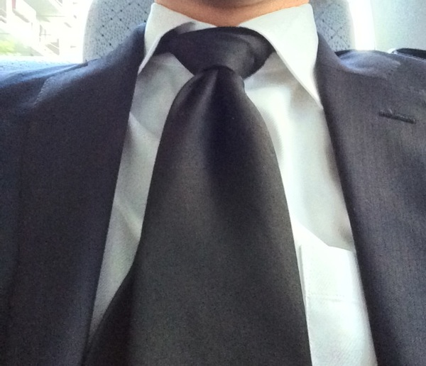
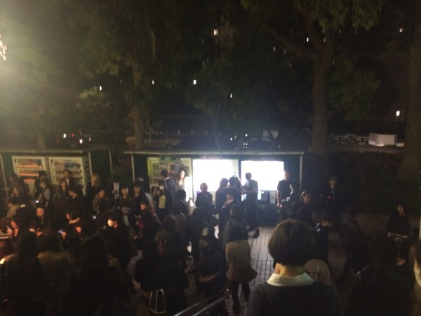
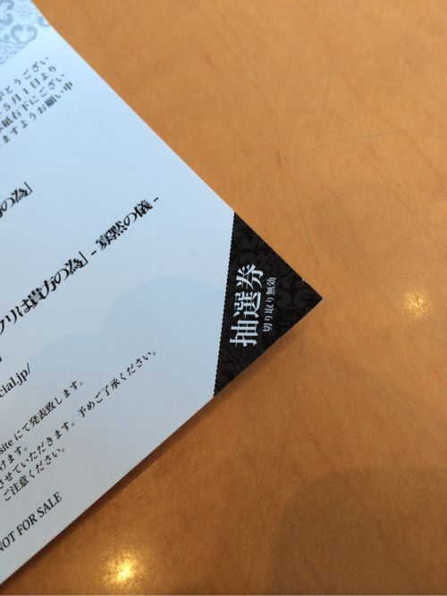
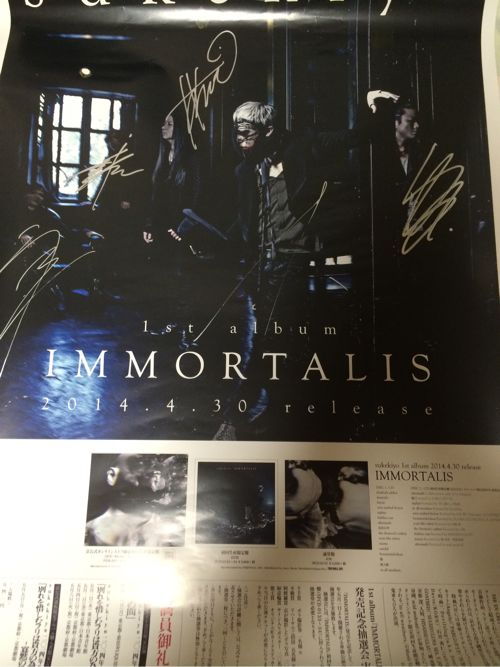
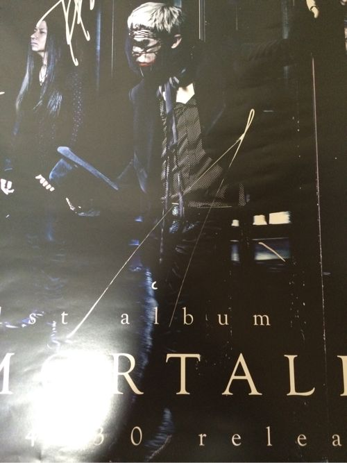

---
categories:
- sukekiyoのLIVEレポ
date: Thu, 01 May 2014 12:07:42 +0000
slug: post-5235
tags:
- LIVEレポ
- sukekiyo
title: 【ライブレポ】sukekiyo 二〇一四年公演「別れを惜しむフリは貴方の為」2014_5_1＠日本青年館
---

ハロー。しんぺー(<a href="https://twitter.com/s_s_p_y" target="_blank">@s<em>s</em>p_y</a> )です。

本日もsukekiyoに参列してきました。
早速LIVEレポートです。

<h2>sukekiyoツアー初日のセトリはこちら</h2>
<ol>
<li>elisabeth addict
SE destrudo</li>
<li>latour</li>
<li>nine melted fiction</li>
<li>zephyr</li>
<li>hidden one</li>
<li>aftermath
SE</li>
<li>烏有の空</li>
<li>the daemon's cutlery</li>
<li>scars like velvet</li>
<li>mama</li>
<li>vandal</li>
<li>hemimetabolism</li>
<li>鵠</li>
<li>斑人間</li>
<li>in all weathers</li>
<li>304号室、舌と夜</li>
</ol>

<h3>LIVEレポ</h3>

場所は日本青年館。歴史のありそうな建物と久々のゆったりふっかりの椅子。
個人的には昔のGACKTの国フォ以来だなぁ。十年以上前のお話w

今日はステージバックドロップに最初からsukekiyoの文字が投影されてた。そして中央には楽器が配置され、朧に照らされてた。

1度目のブザーがなり注意事項が読み上げられた。その後はずっとなんか「ぴちゃぱちゃ」みたいな囁きの音楽が鳴ってた。

追記。どうやらこの曲のようです。「AKIRA」の曲らしい。相変わらず、フォローさせていただいている姐さんの凄さたるや•••！本当に尊敬いたします。
<iframe width="560" height="315" src="//www.youtube.com/embed/02rGVS6xXNg" frameborder="0" allowfullscreen></iframe>

そして2度目のブザーがなるとメンバーが1人ずつ現れた。
前回のリキッドルームと違うのは、誰も拍手をしない。誰も名前を叫ばない。

そして誰も席から立たないこと。

あ、言い忘れましたが、本日ぼくは自主的喪服参列です。

周りの参列者の方も同様に黒い出立でした。

メンバーは登場すると中央で向かい合うように円になって演奏が始めました。

それが終わるとバックドロップが上がり今までと同じ位置に楽器があり各自持ち場につき本編がはじまった。

今回のステージもシンプルではありましたが、照明以外に映像も使われsukekiyoの怪しさを演出していました。それとテトリスな。

曲の合間にも誰1人としてメンバーの名前を叫んだり、拍手をする人はいませんでした。ただただ、映画や演劇を見るように静かに座っていました。でも、ちょっと違うのは映画や演劇は楽しければ笑いがおこります。
でもsukekiyoのステージは、こちらが口を開けない、立てない、そんな重圧感を感じました。

前回京さんが言ってるからっ皆名前呼ぶのやめようやみたいな雰囲気が少しありました。でもその必然は全くなかった。
そんなものはsukekiyoが必然的に空気を作ってた。

あの空気感こそがsukekiyoだと思います。実感しなければ、絶対わからない、あの空気。あれこそがsukekiyoという、事象そのもの。

<h3>京の衣装</h3>

多少遠かったので、詳細までわかりませんがこんな感じ。

スカートというか袴に近いパンツ的なもの
黒いジャケットの襟無しだったか、よく見えなかったけど。

中には多分mottoの時のシャツかな？？

あとメイクはアランカル化した黒崎一護みたいな感じでした。近くで見てた人のTweetを見ると、手のあとのようなメイクだったとのこと。

<h2>しんぺーはこう思った。</h2>

多分今後、sukekiyoファンのことって参列者って呼ばれるんだろうな

https://twitter.com/s_s_p_y/status/461825569366081536

それと座ってたからぼくも含めてみんな「かくっ」ってなってたw

それと終演後に抽選券を持って物販の列に並びました！

注意していただきたいのは今回の会場は、チケット持ってないと物販の列に並べないことです。

で、抽選ボックスの中に手を突っ込みこれだ！！と思って引いたクジ。。。
ハズレとか書いてあるのかなーとか思ってたら「如意輪賞」•••！！！

おめでとうございますの一言と共に手渡されたのがサイン入りポスター！！
そいつがこれです。

生ホ！生ホ！！初めてみた！！！

さぁ明日はどんなLIVEになるのかな。そして匠も書いてたけど明日はhideの命日ですね。

どんなLIVEになって、hideはどうこの現象を見てるんだろ

といった所で本日は以上です。おやすみなさい。