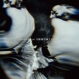

---
categories:
- sukekiyo
date: Sat, 03 May 2014 17:20:16 +0000
slug: post-5309
tags:
- sukekiyoまとめ
title: 今週のsukekiyoまとめ!4月27日〜4月30日(2014)
---

ハローしんぺー(<a href="https://twitter.com/s_s_p_y" target="_blank">@s_s_p_y</a> )です。

今週のsukekiyoは初ワンマンライブがあり、アルバムが発売され、ツアーが始まりといった具合に激動の動きがありました。LIVEの記事も含めて改めてこちらにまとめます。

<h2>sukekiyo初ワンマン「鳳凰の間」@恵比寿リキッドルーム</h2>

この日はちょうどアルバム「IMMORTALIS」のフラゲの日でしたが、手にしてから聴いて、LIVEに参列した方は極めて少なかったのではないでしょうか。そのせいもあってか、皆ほとんどのらなかったLIVEでした。
そしてあったまってきた段階で京からの「黙れ」
それとインタビューでの発言等々があり、その後の日本青年館のようなLIVEを産む結果となりました。

<a style="color:#0070C5;" href="https://www.warawareotoko.com/2014/04/28/post-5216/" target="_blank">sukekiyo「鳳凰の間」＠恵比寿LIQUIDROOM | Gadget Zombie Parasite</a>  

<h2>アルバム「IMMORTALIS」発売、そしてNHK-FM出演</h2>

アルバム購入を見送っていた方は、ぜひ買いましょう。
そしてできればLIVEにいきましょう。あの空気感はLIVEにいかなければ絶対に味わえません。
映像や音源ではない、生のsukekiyoをぜひ感じてください。

<a href="http://www.amazon.co.jp/exec/obidos/ASIN/B00IMKDYMG/warawareotoko-22/ref=nosim/" rel="nofollow" target="_blank">IMMORTALIS</a>
posted with <a href="http://kaereba.com" rel="nofollow" target="_blank">カエレバ</a>

sukekiyo SMD itaku (music) 2014-04-30    

<a href="http://www.amazon.co.jp/gp/search?keywords=IMMORTALIS&__mk_ja_JP=%83J%83%5E%83J%83i&tag=warawareotoko-22" rel="nofollow" target="_blank" title="アマゾン" >Amazon</a>

<a href="http://ck.jp.ap.valuecommerce.com/servlet/referral?sid=3041033&pid=882528283&vc_url=http%3A%2F%2Fshopping.search.yahoo.co.jp%2Fsearch%3FuIv%3Don%26ei%3DUTF-8%26tab_ex%3Dcommerce%26slider%3D0%26va%3DIMMORTALIS" rel="nofollow"  target="_blank" title="Yahooショッピング" >Yahooショッピング</a>

<a href="http://ck.jp.ap.valuecommerce.com/servlet/referral?sid=3041033&pid=882660047&vc_url=http%3A%2F%2Fauctions.search.yahoo.co.jp%2Fsearch%3Fvo%3D%26ve%3D%26auccat%3D0%26aucminprice%3D%26aucmaxprice%3D%26aucmin_bidorbuy_price%3D%26aucmax_bidorbuy_price%3D%26loc_cd%3D0%26abatch%3D0%26istatus%3D0%26filtered%3D1%26ei%3DUTF-8%26tab_ex%3Dcommerce%26va%3DIMMORTALIS" rel="nofollow"  target="_blank" title="ヤフオク!" >ヤフオク!</a>

そしてNHK-FM「ミュージックライン」
まぁ普通のラジオ番組です。内容をざっと箇条書き

<ul>
<li>あのメンバーが水中におっこっている画像は２月の大雪の日に撮影されました</li>
<li>京の誕生日に鬼束ちひと出演の「in all weathers」を撮影。鬼束は遠くからハッピーバースデーを歌いなが、京にCDを手渡す。</li>
<li>ひゃっほい</li>
</ul>

この辺でしょうか。なかなかに普通の番組でした。それとDJの女性がちょっとなんか微妙かなと思いました。
しかしながら京から「ひゃっほい」を引きだす所でいっきに逆転w

<blockquote class="twitter-tweet" lang="ja">
心では「ひゃっほい」。
&mdash; 増田勇一 (@youmasuda) <a href="https://twitter.com/youmasuda/statuses/461489658157744129">2014, 4月 30</a></blockquote>

あとはこちらも増田さんの記事になりますのであわせてどうぞ

<a style="color:#0070C5;" href="http://www.barks.jp/news/?id=1000102964" target="_blank">【インタビュー】sukekiyo、1stアルバム『IMMORTALIS』を最深部まで紐解くメンバー5人の超ロングインタビュー | sukekiyo | BARKS音楽ニュース</a>  

<h2>ツアー初日「別れを惜しむフリは貴方の為」＠日本青年館</h2>

これに関しては記事をどうぞ。
その時に感じたことを込めました。
<a style="color:#0070C5;" href="https://www.warawareotoko.com/2014/05/01/post-5235/" target="_blank">sukekiyoツアー初日「惜しむフリは貴方の為」@日本青年館 | Gadget Zombie Parasite</a>  

参列された方も、これからの方も、今は様子見の方もぜひぜひ読んでいただければと思います。

なお、２日目に関しては参列しておりませんので様子がわかりません。
あしからず。

<h2>追加公演発表。「別れを惜しむフリは貴方の為-漆黒の儀-」</h2>

<a style="color:#0070C5;" href="https://www.warawareotoko.com/2014/05/02/post-5243/" target="_blank">sukekiyoツアー二○一四「別れを惜しむフリは貴方の為」追加公演「漆黒の儀」決定 | Gadget Zombie Parasite</a>  

本日発売でしたが、なんとかとれました。なんとかっていうか簡単にとれましたw
一度目、二度目更新をかけたら、あっさりとれたので逆に心配になります。

それでも今日とれなかった人がいるようなので、また2次以降がんばってみてください！

<h2>京のサイン会＠タワレコ京都</h2>

本日サイン会、感動の様子がツイッターから伝わってきました。
本日の京さんはこちら！

<blockquote class="twitter-tweet" lang="ja">
Dir en greyの京さんのソロプロジェクト、sukekiyoのサイン会終了いたしました！歓喜の声に包まれたファンの皆様感動のイベントとなりました！1stアルバム『IMMORTALIS』も絶賛発売中＆京都店大展開中！ <a href="http://t.co/AbZ4vB3clV">pic.twitter.com/AbZ4vB3clV</a>
&mdash; タワーレコード京都店 (@TOWER_Kyoto) <a href="https://twitter.com/TOWER_Kyoto/statuses/462522088784265216">2014, 5月 3</a></blockquote>

<h2>しんぺーはこう思った。</h2>

さあ、明日からいよいよ京都３daysですね！

ぼくは参列しませんが、京都びいきの京なら、多分東京以上のLIVEを計画しているでしょう！！

楽しみだ！

といったところで本日は以上になります。おやすみなさい。

<h3>参考インタビュー</h3>

どれもいい記事です！

<a style="color:#0070C5;" href="http://www.cinra.net/interview/201404-sukekiyo" target="_blank">破壊と再生を繰り返してきた男 京（DIR EN GREY）インタビュー - 音楽インタビュー : CINRA.NET</a>  

<a style="color:#0070C5;" href="http://www.barks.jp/news/?id=1000102964&page=1" target="_blank">【インタビュー】sukekiyo、1stアルバム『IMMORTALIS』を最深部まで紐解くメンバー5人の超ロングインタビュー | sukekiyo | BARKS音楽ニュース</a>  

<a style="color:#0070C5;" href="http://natalie.mu/music/pp/sukekiyo" target="_blank">ナタリー - [Power Push] sukekiyo「IMMORTALIS」特集 京インタビュー (1/4)</a>  