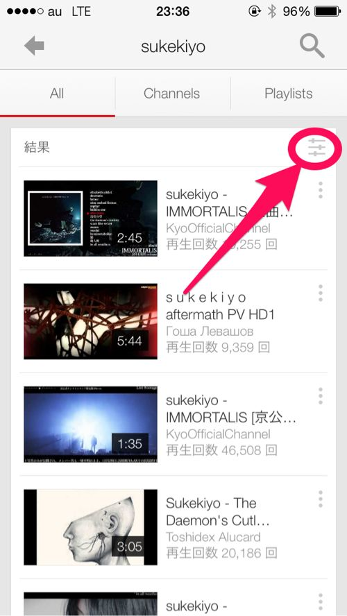
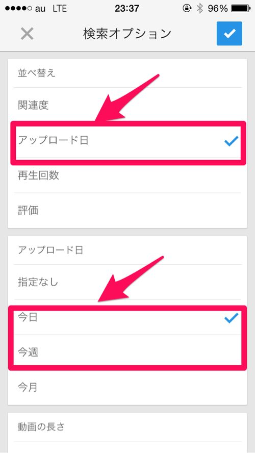

---
categories:
- sukekiyo
date: Tue, 06 May 2014 15:24:03 +0000
slug: post-5324
title: YouTubeでsukekiyo寡黙の儀の動画を効率よく探す方法
---

ハロー。しんぺー(<a href="https://twitter.com/s_s_p_y" target="_blank">@s_s_p_y</a> )です。

もうご存知の方も多く何を今更と思うかもしれませんが、sukekiyoの寡黙の儀の動画を探すのに、この機能使った方がいいよーってのを紹介します。

まずは「sukekiyo」で検索。そのあと、下の矢印の示すマークをタップ！

するとこの画面になるので、並び替えをアップロード日にチェック。
そのあと、アップロード日を今日(もしくは今週とかなるべく近くの日にちで)でチェック

<h2>しんぺーはこう思った。</h2>
これで、sukekiyoの寡黙の儀の動画が探せるはずです。
アップされてる方の動画の名前の付け方によっては寡 「寡黙の儀」で引っかからない場合もあるので、この探し方がいいと思います！

といったところで本日は以上です。おやすみなさい。

Posted from するぷろ for iPhone.nm