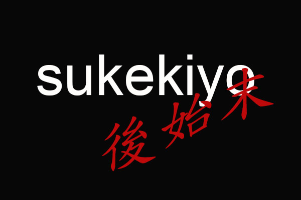
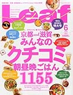

---
categories:
- sukekiyo
date: Wed, 07 May 2014 13:53:45 +0000
slug: post-5329
title: sukekiyo後始末！「別れを惜しむフリは貴方の為」メンバーが訪れたお店
---

ハロー。しんぺー(<a href="https://twitter.com/s_s_p_y" target="_blank">@s_s_p_y</a> )です。

どうでもいいけど、別れを哀しむフリってたまに間違えてまう。今までの記事もどっか間違ってたかもwすんません。

次に表に出るのは今週末のタワレコ新宿でのトークセッションでしょうか？
それに合わせてメンバーもすでに東京に帰ってきているみたいです。

<h2>YUCHI氏新福菜館でラーメン食べる</h2>
https://twitter.com/yuchivalism/status/464014230945935361

ところで、このラーメンの画像見た瞬間にぴーんときました。このつゆの色、ネギの感じ、ここは京都駅近くのあの店だ！！

<strong><a href="http://tabelog.com/kyoto/A2601/A260101/26000791/" target="_blank">新福菜館 本店</a></strong>

<strong>関連ランキング：</strong><a href="http://tabelog.com/rstLst/ramen/">ラーメン</a> | <a href="http://tabelog.com/kyoto/A2601/A260101/R3313/rstLst/">京都駅</a>、七条駅、九条駅

ここです。

ここめちゃくちゃうまくて、数年前の祇園祭の時にいって滞在中に2回いきましたw本当においしい！！がっつり系ですので、頼み過ぎないように！その先にある食べきれない伸びきった麺の山に

誰も救ってなんかくれない

笑い声が叫び声にかわ•••

はい。通販もやってるから！

<a style="color:#0070C5;" href="http://www.shinpuku.net/" target="_blank">新福菜館本店　京都駅前東塩小路 -中華そば専門店-</a>  

と思ったらどうやらメンバーで行ったみたいですね。京さんもいったのかしら？
何やらマネージャーが新幹線の時間迫ってるんで！って言ってるのをきかずにダッシュで食べにきた模様w

<a style="color:#0070C5;" href="http://ameblo.jp/takumixofficial/entry-11844312719.html" target="_blank">sukekiyo 京都劇場3DAYS終了！！！｜匠オフィシャルブログ「Takumi's blog」by Ameba</a>  

<h2>Leafで京が行ったカフェ「遊形サロン・ド・テ」</h2>
Leafは京都以外だとなかなか手に入れづらいですよね。しかも今回アナウンスがあったのかなんなのか、見逃した人結構いたんじゃないでしょうか？

<a href="http://www.amazon.co.jp/exec/obidos/ASIN/B00JLNHHA8/warawareotoko-22/ref=nosim/" rel="nofollow" target="_blank">Leaf (リーフ) 2014年 06月号</a>
posted with <a href="http://kaereba.com" rel="nofollow" target="_blank">カエレバ</a>

 リーフ・パブリケーションズ 2014-04-25    

<a href="http://www.amazon.co.jp/gp/search?keywords=%83%8A%81%5B%83t%20Leaf&__mk_ja_JP=%83J%83%5E%83J%83i&tag=warawareotoko-22" rel="nofollow" target="_blank" title="アマゾン" >Amazon</a>

<a href="http://ck.jp.ap.valuecommerce.com/servlet/referral?sid=3041033&pid=882528283&vc_url=http%3A%2F%2Fshopping.search.yahoo.co.jp%2Fsearch%3FuIv%3Don%26ei%3DUTF-8%26tab_ex%3Dcommerce%26slider%3D0%26va%3D%25E3%2583%25AA%25E3%2583%25BC%25E3%2583%2595%2520Leaf" rel="nofollow"  target="_blank" title="Yahooショッピング" >Yahooショッピング</a>

<a href="http://ck.jp.ap.valuecommerce.com/servlet/referral?sid=3041033&pid=882660047&vc_url=http%3A%2F%2Fauctions.search.yahoo.co.jp%2Fsearch%3Fvo%3D%26ve%3D%26auccat%3D0%26aucminprice%3D%26aucmaxprice%3D%26aucmin_bidorbuy_price%3D%26aucmax_bidorbuy_price%3D%26loc_cd%3D0%26abatch%3D0%26istatus%3D0%26filtered%3D1%26ei%3DUTF-8%26tab_ex%3Dcommerce%26va%3D%25E3%2583%25AA%25E3%2583%25BC%25E3%2583%2595%2520Leaf" rel="nofollow"  target="_blank" title="ヤフオク!" >ヤフオク!</a>

ちなみにこのお店です。

<strong><a href="http://tabelog.com/kyoto/A2602/A260202/26005378/" target="_blank">遊形 サロン・ド・テ</a></strong>

<strong>関連ランキング：</strong><a href="http://tabelog.com/rstLst/cafe/">カフェ</a> | 京都市役所前駅、烏丸御池駅、三条駅

なお、未確定情報ですが、京さんがお召し上がりになられたのはムースショコラ ボルト酒のジュレ、わらび餅？？？かな。さだかではありませんw

<h2>sukekiyo1stアルバム「IMMORTALIS」オリコン週間チャート5位</h2>

別にどうでもいいけどね。順位とか•••

https://twitter.com/v_rockxxx311/status/463595257225936896

https://twitter.com/watanabedeath/status/463882245166469120

<h2>しんぺーはこう思った。</h2>

さて、最後に書きますが、京が着ていたシャツについてです。
どうやらポールスミスのものみたいですよ。腰にかけて赤い花びら？でドットの黒いシャツです。

もう売り切れててオークションとかしかで手に入れるしかないっぽいですが•••

さて！次は新宿タワレコのトークセッションか！

楽しみだん！！！

といったところで本日は以上になります。おやすみなさい。