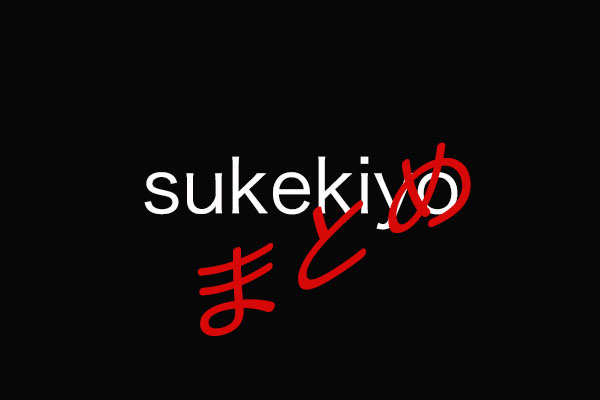
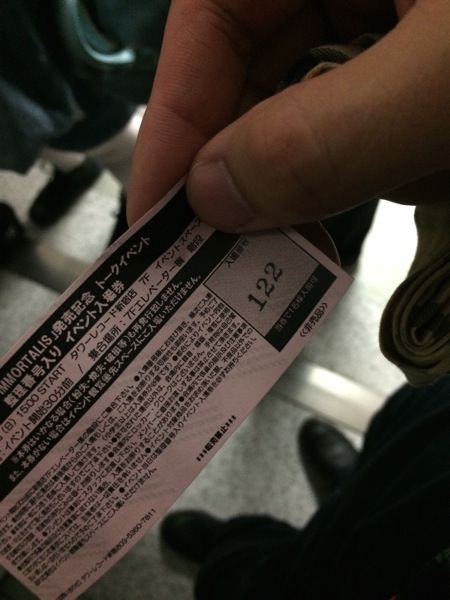

---
categories:
- sukekiyo
date: Sun, 11 May 2014 03:14:10 +0000
slug: post-5343
tags:
- sukekiyoまとめ
title: 今週のsukekiyoまとめ!5月4日〜5月11日(2014)タワレコインストと全曲解説について
---

ハローしんぺー(<a href="https://twitter.com/s_s_p_y" target="_blank">@s_s_p_y</a> )です。

さてツアーが終わってもsukekiyoの活動は休まることを知りません。
昨日と今日とファン感謝的なイベントがありましたのでまとめます！

<h2>「IMMORTALIS」京公式オンラインストア限定初回仕様限定盤購入者特典の全曲解説生放送</h2>

Kyo onlineでTシャツ付きのアルバムを購入した方のみが聴ける生放送がありました。

簡単なまとめです。

どうやら匠と京がもってきた曲が中心ではなく、中にはUTAやYUCHIが持ってきて、そのまま使われている曲なんかもあるようです。
あと、UTA氏がかなりのインスピレーションを持っているようで、相当アレンジをしまくってひっくり返しまくっているみたいですね。

おおむね文字起こししたものから、以下のものだけをご紹介します。

一番予想外のリミックスは
匠：ヒサシさんのヒドゥンワン。モーツァルト先生のフレーズをそのまま使ってて。
YUCHI：人時さんのデーモンズ。
みか：妖精帝国さん。もともとバンドさんの曲はいろいろと聴いてたんで、そのテイストのアプローツが新鮮だった。
UTA：TKさん、自分もいろいろと話してみたいな。
京：全員。ありがとうございます。キリトくんとは初めてあって、しゃべって、好きにしてくださいっていったけど、多分遠慮されたのかな。今後もっと面白いことができるんじゃないかなと思ってる。

ふーむ、キリトをキリトくんって呼んでいるのかw

ぜったい、ぜったいに、Angelo主催のイベントにsukekiyoでるだろ！絶対でるだろな！！！！ぜったい！！！

そしたらすげーよwマジでw

<blockquote class="twitter-tweet" lang="ja">
アルバム『IMMORTALIS』全曲解説、無事に終了です！お聴き頂いた皆様、ありがとうございました！iPhoneだと聴きづらかった方もいたのかな？ごめんなさいー！でも、メンバー全員で楽しく語らせて頂きました！&#10;<a href="https://twitter.com/search?q=%23sukekiyo&amp;src=hash">#sukekiyo</a>
&mdash; YUCHI (@yuchivalism) <a href="https://twitter.com/yuchivalism/statuses/465110701699129344">2014, 5月 10</a></blockquote>

<h2>「IMMORTALIS」タワレコ予約者先着トークセッション</h2>

行ってきましたよ！

ロッキングオンの副編集長？だったかな。
内容はインタビュー形式でアルバムに関して各曲の印象やら制作秘話やらでした。

そこから見た各メンバーの印象ですが、みんなバンドマンって感じがしなかったです。クリエイター集団という感じでした。

みんな着飾らない感じで、それぞれ自分の仕事にプライドと責任を持っているという感じでした。

それをバンドという形式にしているのが京という首謀者なんだろうなと思います。

といっても、ステージにたつと各自やっぱりアーティストである一面がでますがね。

京さんは眠たそうで遠くを見たりして上の空で、質問も途中で忘れちゃいそうな感じでした。
それと椅子がたかかったのか、片足を地面につけて、おしり半分で椅子に座っておりました。

対して匠氏は微動だにしておりませんでした。
途中京さんから匠さんへ「今日緊張してるやろ」とつっこみもありましたw

その他のメンバーはUTAさんが一番変態で、未架さんは出回ってる昔のアー写に比べるとだいぶ太った印象でした。

あとYUCHIさんは一番年下ということもあり、飲みにいっても皆のお酌なんかをしたりして、京さんに「そんなことせんでもえーよ」と言われたりするそうです。どちらもかわいいです。

<blockquote class="twitter-tweet" lang="ja">
【イベント終了！】先程sukekiyoトークイベント終了しました!約40分間に渡るトーク、実に中身の濃い内容にスタッフも含めみんな聞き入ってしまいましたね。貴重なお時間、本当にありがとうございましたっ！ <a href="http://t.co/tE82nXBawt">pic.twitter.com/tE82nXBawt</a>
&mdash; タワーレコード新宿店 (@TOWER_Shinjuku) <a href="https://twitter.com/TOWER_Shinjuku/statuses/465391004049104896">2014, 5月 11</a></blockquote>

<h2>しんぺーはこう思った。</h2>

インストの記憶があまりなく。。。ただ、ただ、、はにかむ京さんがかわいくて。。。

それだけです。今後の予定に関しては、京の頭の中にのみあるそうで、まだ表にはないそうです。

それとsukekiyoとしてのLIVEも6月はなさそうです。ってあれーYUCHIのブログに昨日は6月は久しぶりにゆっくりできる〜的なことが書いてあったのに、今みたら消されてるwww
これは•••まさかw6月もなんかあるんかい！？

と思ったらあったw

<a style="color:#0070C5;" href="http://s.ameblo.jp/yuchi-bassist/entry-11845446407.html" target="_blank">５月、そして６月｜YUCHI OFFICIAL BLOG… ｜Ameba (アメーバ)</a>  

そうそう、DIR EN GREYのアルバムも佳境に入りそうぽいので、そろそろsukekiyoはお休みでしょうか。

どちらのバンドも活動が楽しみでしかたないわけですが。

あーあと京のかっこうは例のジミーチューをはいておりました。

といった所で本日は以上です。おやすみなさい。