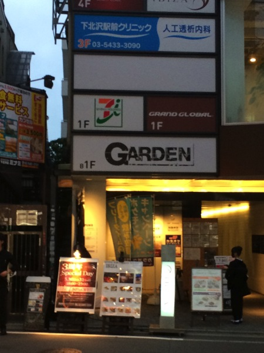
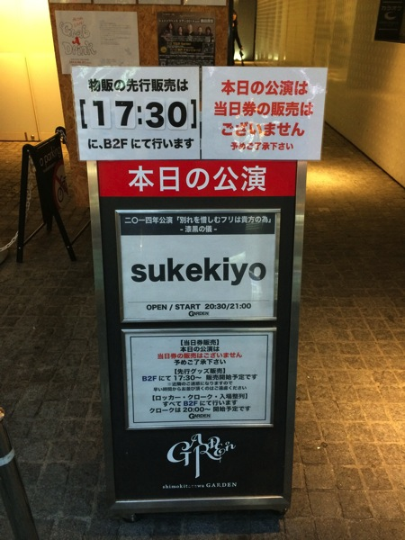
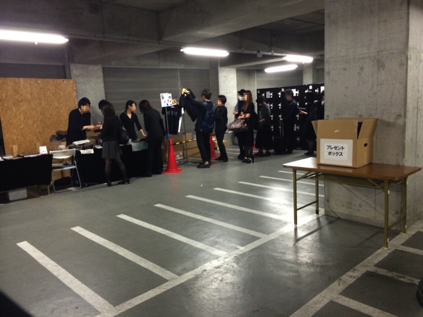
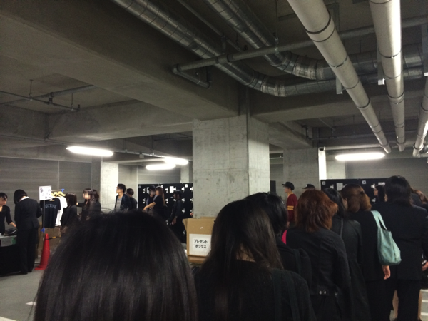
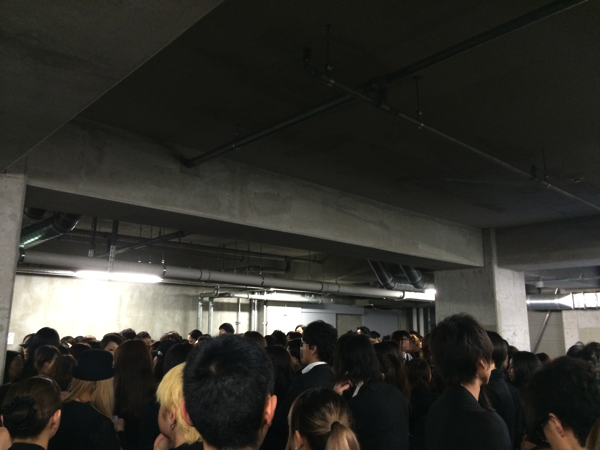

---
categories:
- sukekiyoのLIVEレポ
date: Tue, 20 May 2014 16:27:46 +0000
slug: post-5380
tags:
- LIVEレポ
- sukekiyo
title: 【ライブレポ】sukekiyo 二〇一四年公演「別れを惜しむフリは貴方の為」-漆黒の儀-2014_5_20@下北沢GARDEN
---

ハローしんぺー(<a href="https://twitter.com/s_s_p_y" target="_blank">@s_s_p_y</a> )です。

さて今宵はsukekiyoツアーファイナル「別れを惜しむフリは貴方の為-漆黒の儀-」が下北沢GARDENにて執り行われました。
その様子をお伝えいたします。

<!--more-->

<h2>セトリ</h2>

<ol>
<li>aftermath</li>
<li>elisabeth addict</li>
<li>hemimetabolism</li>
<li>latour</li>
<li>hidden one</li>
<li>nine melted fiction</li>
SE
<li>304号室、舌と夜</li>
<li>烏有の空</li>
<li>scars like velvet</li>
<li>the daemon's cutlery</li>
<li>vandal</li>
<li>斑人間</li>
<li>zephyr</li>
<li>鵠</li>
<li>mama</li>
<li>in all weathers</li>
</ol>

mamaいつやるの！？ねえmamaやらないつもり！？ってなっておりましたが、ちゃんと全曲演奏されました。

さてさて細かい所から今宵のLIVEを振り返ります。

<h2>地下に集いし喪服の集団</h2>

本日のLIVEはここで執り行われました。

<a style="color:#0070C5;" href="http://gar-den.in/" target="_blank">GARDEN | SHIMOKITAZAWA</a>  

<iframe src="https://www.google.com/maps/embed?pb=!1m14!1m8!1m3!1d3241.6691996177005!2d139.668451!3d35.66052099999999!3m2!1i1024!2i768!4f13.1!3m3!1m2!1s0x0%3A0x7105562bffaaa1df!2z5LiL5YyX5rKi77yn77yh77yy77yk77yl77yu!5e0!3m2!1sja!2sjp!4v1400600600319" width="500" height="400" frameborder="0" style="border:0"></iframe>

※近隣の迷惑になる場所なので、たまったりとかはやめたほうがいいみたいです。物販もスペースがなくて開始までは並ばないでってアナウンスでてたみたいです。

会場は地下1階で、物販やクロークはさらにその下の地下2階でした。

物販はこんな感じでした。

すでに皆さん真っ黒くです。

<h2>LIVEレポ</h2>

地下で番号を待つ参列者たち。蒸し風呂状態でした。

そして呼ばれ入った会場はけっこう狭く、番号がぼくは２桁でしたので今までで一番ステージ近くで見ることができました。

<blockquote class="twitter-tweet" lang="ja">
スペース空けたが最後圧のある爆乳が割り込んでくる。このLIVE押しないでと目の前のお姐さんも仰っておった。
&mdash; しんぺー@sukekiyo漆黒の儀 (@s_s_p_y) <a href="https://twitter.com/s_s_p_y/statuses/468717961813839872">2014, 5月 20</a></blockquote>

会場もとにかく暑かったです。
ただ演奏が始まると、それも一瞬で変わりました•••

ステージは最初分厚いカーテンがかかっており、今日も怪しげなSEが鳴り響いていました。

そして開演

現れた京は、ハットに肌の上に黒いチョッキみたなノースリーブのもの、黒いパンツ、首には３つ石のターコイズ？？か何か、それと黒いグローブという格好でした。
会場で一番喪服っぽくない人でした。

ここからは箇条書きっぽくなりますが順番ばらばらです。

まずは匠氏
・匠氏が楽器を持ち替えること14回
ずっと持ち変える回数を数えていたんですがほぼほぼ精緻な回数かと思います。途中、持ち替えずに弾くという場面も多々ありました。
本当にご苦労様です。

・1度だけ匠氏がUTAと目合わせてにやってしてた
多分匠氏からUTAさんって見えないんじゃないかなと思います。
UTAさんの演奏スタイルだいぶ低い感じがしますし。それでも匠氏は全体を流し目で見つつコントロールしている感じでした。あと、演奏中にギターチューニングしたり、スプレーかけて手入れしたりしてました。職人って感じでした。

UTAさん
今日はあまりフィーチャーして見られませんでした。けどいつもよりは少し大人しめな印象でした。でもYUCHI氏との掛け合いが激しかったなあ。

YUCHI氏
暴れてました。京さんがハットをかけてるものに、ぶつかるんじゃないかとヒヤヒヤしました。
あとぼくはいつも意識しないのですが、今日はウッドベース？の音がはっきりと聴けました。この会場は凄く音が良い気がします。普段音とかよくわからないのですが、そんなぼくでもこの会場はいい！と思いました。

未架さん
この人は匠氏とのアイコンタクトがめちゃくちゃ多いっすね！いつも見てる、というかテレパシーというか感じ合ってる気がします。付き合いが長いだけあります。
最後、in all weathersの前の京さんが再登場するまでの間はじゃれ合いつつ、お互いのスキを探りあうみたいな。そんな感じでした。
それにしてもこの人のドラムはなんかスキがないって感じがします。剣豪みたいなイメージ。

<h3>京</h3>
とにかく感情が入りまくってるLIVEでした。今までの雰囲気を作っていくsukekiyoのLIVEというよりもDIRに近い感じでしょうか。

なんか後半の後半、感情こもり過ぎてて悲し過ぎて歌えないって感じだった。とくに、zephyr

<blockquote class="twitter-tweet" lang="ja">
なんだろかゼファーでの京の涙が忘れられないんだけど、その後くらいから急に鬱ぽく暗くなった印象なんだよな。伝わらないみたいな感じで首傾げて、それがまた悲しいみたいなスパイラルなってた感じする。
&mdash; しんぺー@sukekiyo漆黒の儀 (@s_s_p_y) <a href="https://twitter.com/s_s_p_y/statuses/468753081434243073">2014, 5月 20</a></blockquote>

zephyrでは、鼻を赤らめてなきじゃくってる感じで歌ってるのが辛そうでした。

DIR EN GREYでの、例えばthe finalの時のような鋭利な悲しみ、それとはまた違った種類の痛みで自身の胸を抉るかのような痛みって•••ていうよりも悲しみって感じでした。

そのあとくらいからでしょうか、急に鬱っぽく暗くなった感じで
“伝わらない悲しみ”という表情でスパイラルに入って深く落ちていった印象でした。

<h2>しんぺーはこう思った。</h2>

<blockquote class="twitter-tweet" lang="ja">
Dirは痛み、怒り。sukekiyoは悲しみと哀しみと少しばかりの純真。
&mdash; しんぺー@sukekiyo漆黒の儀 (@s_s_p_y) <a href="https://twitter.com/s_s_p_y/statuses/468760308698206211">2014, 5月 20</a></blockquote>

それと、今夜の京の出で立ちをみて、今回のツアーのコンセプトに対して個人的にこんな風に思いました。

<blockquote class="twitter-tweet" lang="ja">
今までのツアーは京自身が未亡人で夫の葬式をしてるって感じ。でも今日は京もその参列者。つまりこのツアー自体は今日で幕引きってことをあらわしてるんじゃないかと
&mdash; しんぺー@sukekiyo漆黒の儀 (@s_s_p_y) <a href="https://twitter.com/s_s_p_y/statuses/468747674267549696">2014, 5月 20</a></blockquote>

なぜなら青年館や京都では女装にも見える衣装で、今日はスッピンで普通の服装だったからです。

これで今回のツアーは終わり。そう強く感じました。

7公演しかなかったのに、なんだか凄い長いツアーだったような気がします。
そして今日はとても久しぶりのLIVEのような気がします。

不思議とツアーが終わったあとの焦燥感はありません。
むしろ明日からの生活をがんばろうという気持ちが湧いてきました。

もっと深く「自分を究めたい」そう思いました。

それとどうもしばらくはsukekiyoとしての活動はなさそうです。

まーでも、どーせまた驚かせてくれるんでしょ！？sukekiyoさんよ！

待ってます。

さて、次はGAUZEです。貯金に体力作り、休みの調整などなど。遠征する人は宿と交通手段の手配など大忙しかと思います。

いやいやまてまて、それ以前に今回チケットの手配がけっこう難航しているんじゃないでしょうか•••
かくいうぼくもファイナルがまだ取れていません。どうにかせねば！

といったところで本日は以上です。おやすみなさい。