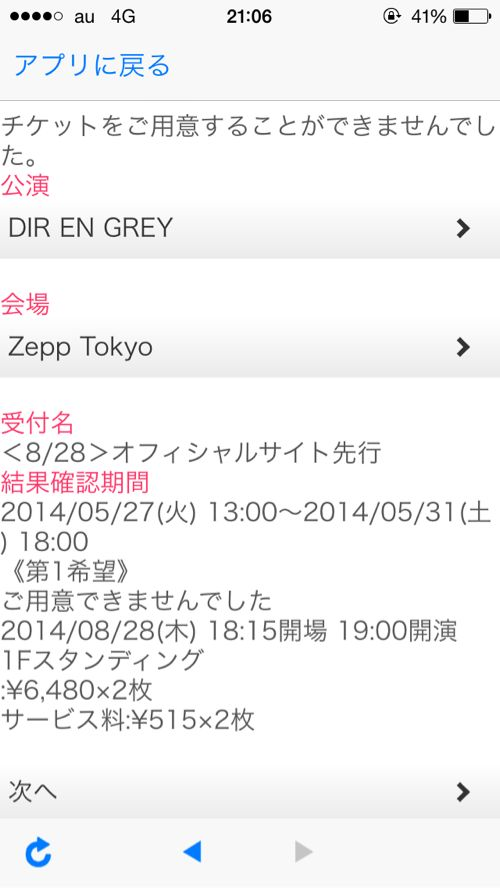

---
categories:
- DIR EN GREY
date: Tue, 27 May 2014 13:20:44 +0000
slug: post-5390
tags:
- DIR EN GREY
title: DIR EN GREY夏のGAUZEツアーのチケットが全く取れない件について
---

ハローしんぺー(<a href="https://twitter.com/s_s_p_y" target="_blank">@s_s_p_y</a> )です。

本日DIR EN GREYの夏のツアーである「TOUR14 PSYCHONNECT -mode of"GAUZE"?-」のオフィシャルサイト先行だったわけですけど、見事に落選しました。いままで本当にありがとうございました。

タイムラインには同じく、落選した虜の悲嘆のツイートがあふれかえっておりました。
むしろ今回の先行でチケット取れた人いるの？？ってくらいです。

<h2>今回のチケットが全く取れない！</h2>

全く取れないとかいっておきながら、関東4公演のうち、ノ限含む3公演はすでに押さえております。ツアーファイナル（のはず）のゼップのみ取れていない状況です。

ただ、このファイナルで今回の先行含め3回落選となっております。

そもそも今回のツアーの先行は現在までで4回ありました。
ファンクラブ先行が２回、スマホサイト会員先行が1回、そして今回のオフィシャルサイト先行です。（普通、オフィシャルサイト上で先行販売などはしませんが、今回は特別に先行枠が出たのです。※非虜用説明文）

ぼくは、スマホサイト以外でファイナル公演に申し込んでおりますが全く取れませんでした！

ぼくはまだ運がいい方で、そもそもノ限公演が全く取れないという声も多々聞きます。これはちょっといつもよりも倍率が高いんじゃないかと沸々と感じておる次第です。

<h2>チケット入手困難な理由の予想</h2>

<h3>今回のチケット争奪戦は普段のファンに加えて昔ファンだった人たちが参戦するためチケットの倍率が上がっているのではないかと思われます。
</h3>

そもそも今回のツアーはメジャーデビューアルバムである「GAUZE」のツアーの続きという、15年の時を超えたなんともレアなツアーなのです。

15年前と言えば、ヴィジュアル系ブームも末期でビジュアル系と聞くと偏見と差別の対象になりかねないような時代でした。
そんな中、デビューシングル3枚同時リリース、そしてビジュアル系の開祖とも言えるYOSHIKIのプロデュースという、この怪物バンドが発表したのがGAUZEというアルバムです。

当時のDIR EN GREYは今の外見とは全く異なっていました。今と変わらず過激な表現や外見、楽曲だったのは言うまでもありませんが、「衣装」を着て演奏をしておりました。

DIR EN GREYは非常に変化のスピードが速いバンドです。シングルごと、下手したら数ヶ月ごとに外見や楽曲の印象を変えてきました。そのスピードについて行けないファンや、「前の方がよかった」「坊主は許せない」「半分はげってどういうこと」「キリストか！」「武田真ryo)」などなど様々な理由で離れていったファンもいました。

しかし、当時GAUZEというのは始まりのアルバムです。当時熱狂的なファンだった方々の胸が熱くならないわけがない！

当時真っ黒な四角いバッグを持って厚底でLIVEに行ってたあの子も、目の下に安全ピンをはっつけてたあの子も、雑誌の白黒のページで文通相手を募集してたあの子も、赤鰤で初参戦したぼくの横におっこってきたから膝を貸してあげたら一礼して空に消えていったあの子も•••

彼女たちの青春はそこにある！

ということで、今回のチケット争奪戦は普段のファンに加えて昔ファンだった人たちが参戦するためチケットの倍率が上がっているのではないかと思われます。

<h3>ファン数拡大のチャンスということで運営側が先行チケットの枚数を絞っている</h3>

上記以外にもチケット入手を困難にしていると、ぼくが勝手に予想しているのは運営側の思惑です。

<blockquote class="twitter-tweet" lang="ja">
GAUZEツアーやっぱりファンクラブに入ってない上がってる人たちを呼び込むために先行の枚数少ないんじゃないかしら。。。で上がった人たちが沢山LIVE来て、また虜になるようにっていう思惑があるのでは•••！！！
&mdash; しんぺー@GAUZEノ限 (@s_s_p_y) <a href="https://twitter.com/s_s_p_y/statuses/471228335394013184">2014, 5月 27</a></blockquote>

どの業界も1度離れたファンを呼び戻すのは大変困難です。
そんな中今回のツアーはファン拡大の千載一遇のチャンスなわけです。（と勝手に思ってます）

当然、一度ファンをあがってしまっている方々はファンクラブにも入っていません。だからこそ、一般発売でより多くのチケットを販売するために先行チケットを絞っているというわけです。

そしてLIVEに来て、再び火がついた人たちがファンクラブに入る導線もきっとしっかりとひかれているんでしょう。
おそらくツアーのフライヤーには、今ファンクラブに入ると過去の会報誌が手に入ります！とか限定アイテム販売決定！とかという文字が踊っているでしょう。

なんかiPhone販売決定したdocomoみたいな

<h3>古いファンが戻ってくるということ</h3>

いまの若い人たちには思いもつかないでしょうが、世紀末から2000年代初頭というのは、平穏な時代ではありませんでした。

LIVE中に安全ピンを使って人を刺す人やLIVE中に荷物盗む人や、ファン同士の抗争なんかもあったとかなかったとか。

とにかくこの頃はこうした武闘派が多数存在しておりました。
そういった人たちが戻ってくる•••

まぁさすがにもう大人になっただろうからそういうのはないと思いますが、今も虜のぼくとしては、戻ってきた人たちに「は？何？今の虜はこんなにぬるいの？」とかって思われたくないと思います。
むしろ自分たちがいない間にシーンを支えていた同士たちとかって思われたいし、少なくとも「おぉ、今のDIRってこんなにハードなの！？」とかって思われたい。

<h2>ごめん、今って何年代？懐古厨大量発生中。マーケティング的な理由？</h2>

今回のツアー含め、DIR EN GREYが懐古厨なのは周知の事実ですが周りを見渡せば死人の行進が〜じゃなくて周りを見渡せば、世の中復刻復活ブームのようです。

X、LUNA SEA、黒夢はおいておいて
PIERROT復活
あとはハンターハンターのテレビ版（これは違う意味合いかな）
セーラームーンも新アニメがでるときくし、聖闘士星矢もそういえばどっかでみたしジョジョも今更テレビばんばんやってるし。

と思ったらこんなツイート流れてきた。

<blockquote class="twitter-tweet" lang="ja">
2014年のアニメ・特撮情勢&#10;&#10;セーラームーン新作アニメ&#10;ヤマト新作劇場版&#10;キカイダー新作&#10;藤岡弘、の仮面ライダー1号&#10;聖闘士星矢新作劇場版&#10;パトレイバー新作&#10;のたり松太郎テレビアニメ化&#10;ジョジョ三部テレビアニメ化&#10;テレビでパーフェクトガンダム登場&#10;天地無用新作アニメ←new!
&mdash; 兄貴軍曹 (@aniki_sergeant) <a href="https://twitter.com/aniki_sergeant/statuses/471129875936317440">2014, 5月 27</a></blockquote>

今の若者は消費行動がきわめて消極的と言われます。そういった層ではなく、少し余裕がありつつ、ノスタルジックを求め、たたけば落とす（金を）世代に対して集中的にアタックされている気がしてなりません。

そういった明確な理由がなくとも、このスタンドアローンコンプレックス感が気になります。

ってか、いま気がついたけど攻殻機動隊もそうだよな！

<h2>しんぺーはこう思った。</h2>

チケットはとりあえず一般にかけるしかないですね。

もし、ファイナル譲ってくれる方いらっしゃいましたらお声掛けください。
GHOULの特別席のカップあげます。

あ、あとPIERROTの先行も申し込みました。こっちは落選ないと思うんだけどなぁ。

と言ったところで本日は以上です。おやすみなさい。