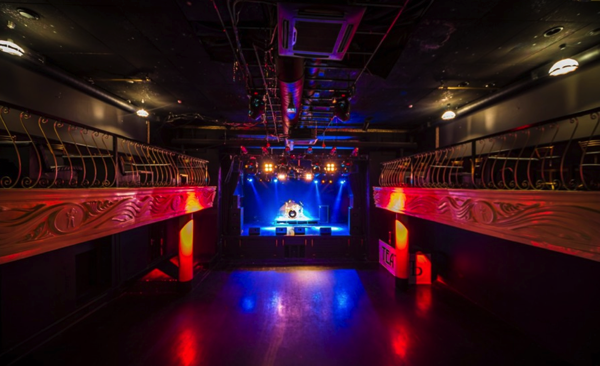
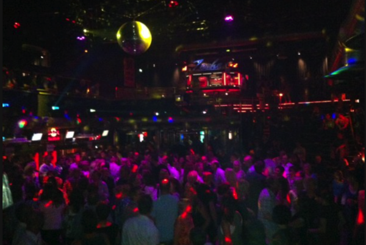

---
categories:
- sukekiyo
date: Sat, 31 May 2014 18:00:08 +0000
slug: post-5435
tags:
- sukekiyo
- まとめ
title: sukekiyo海外公演「雨上がりの優詩」各会場まとめ
---

ハローしんぺー(<a href="https://twitter.com/s_s_p_y" target="_blank">@s_s_p_y</a> )です。
オフィより詳しくてwikiよりも有益なsukekiyo情報サイト「Gadget Zombie Parasite」へようこそ。

さて先週はお休みしましたsukekiyoまとめですが、今週は大きな動きがあったのでまとめることにいたしやす！

<h2>sukekiyo海外ツアーやるってよ「雨上がりの優詩」</h2>

<a style="color:#0070C5;" href="https://www.warawareotoko.com/2014/05/29/post-5420/" target="_blank">sukekiyoもう海外公演やるってよ。欧州公演「sukekiyo 二〇一四年公演「雨上がりの優詩」」決定 | Gadget Zombie Parasite</a>  

安定の海外嫌い•••
<blockquote>
移動が嫌です
食い物が嫌です
何しゃべってるのか全くわからないのが嫌です

ほぼ嫌です

引用元：TOUR12-13 IN SITU-TABULA RASA[DVD]

<a href="http://www.amazon.co.jp/exec/obidos/ASIN/B00E7FSNBW/warawareotoko-22/ref=nosim/" rel="nofollow" target="_blank">TOUR12-13 IN SITU-TABULA RASA [DVD]</a>
posted with <a href="http://kaereba.com" rel="nofollow" target="_blank">カエレバ</a>

DIR EN GREY SMD jutaku(SME)(D) 2013-09-25    

<a href="http://www.amazon.co.jp/gp/search?keywords=in%20situ&__mk_ja_JP=%83J%83%5E%83J%83i&tag=warawareotoko-22" rel="nofollow" target="_blank" title="アマゾン" >Amazon</a>

<a href="http://ck.jp.ap.valuecommerce.com/servlet/referral?sid=3041033&pid=882528283&vc_url=http%3A%2F%2Fshopping.search.yahoo.co.jp%2Fsearch%3FuIv%3Don%26ei%3DUTF-8%26tab_ex%3Dcommerce%26slider%3D0%26va%3Din%2520situ" rel="nofollow"  target="_blank" title="Yahooショッピング" >Yahooショッピング</a>

<a href="http://ck.jp.ap.valuecommerce.com/servlet/referral?sid=3041033&pid=882660047&vc_url=http%3A%2F%2Fauctions.search.yahoo.co.jp%2Fsearch%3Fvo%3D%26ve%3D%26auccat%3D0%26aucminprice%3D%26aucmaxprice%3D%26aucmin_bidorbuy_price%3D%26aucmax_bidorbuy_price%3D%26loc_cd%3D0%26abatch%3D0%26istatus%3D0%26filtered%3D1%26ei%3DUTF-8%26tab_ex%3Dcommerce%26va%3Din%2520situ" rel="nofollow"  target="_blank" title="ヤフオク!" >ヤフオク!</a>

</blockquote>

そんな京がまさかの海外公演！！あの空気感を海外でどのように再現するのかが気になります！

<h3>雨上がりの優詩はどんな会場で行われるのか</h3>

<blockquote>
◆公演概要
sukekiyo 二〇一四年公演「雨上がりの優詩」

2014年9月13日(土)　モスクワ(ロシア) P!PL CLUB
2014年9月15日(月)　ヘルシンキ(フィンランド) Nosturi
2014年9月17日(水)　パリ(フランス) Divan du Monde
2014年9月18日(木)　ロンドン(イギリス) O2 Academy Islington
2014年9月20日(土)　ベルリン(ドイツ) C-Club
2014年9月21日(日)　ボーフム(ドイツ) Zeche Bochum

引用元：<a href="http://sukekiyo-official.jp">sukekiyo official</a>

</blockquote>

<h4>2014年9月13日(土)　モスクワ(ロシア) TEATR CLUB</h4>

<a href="http://teatrclub.com">モスクワ(ロシア) TEATR CLUB</a>

P!PL CLUBから会場変更されました。何か予期せぬことがおこったみたいです。
とりあえず次の会場もそこそこ雰囲気があるような所です。

<iframe src="https://www.google.com/maps/embed?pb=!1m14!1m8!1m3!1d2244.5299644085703!2d37.66392499999999!3d55.766667!3m2!1i1024!2i768!4f13.1!3m3!1m2!1s0x0%3A0x9f551c740ce97b72!2sKlub+Teatr!5e0!3m2!1sja!2sjp!4v1403320968837" width="400" height="400" frameborder="0" style="border:0"></iframe>

<h4>2014年9月15日(月)　ヘルシンキ(フィンランド) Nosturi</h4>

ここ写真がよくわからないのですが、おそらくこれです。

<a href="http://www.elmu.fi">Nosturi</a>

なんかLIVEハウスの横にでっかいクレーンがある。これはなんぞ？
どうも貨物などを持ち上げたり持ち上げなかったりするためのもののようですが•••よくわかりませんな。

場所はこちら
<iframe src="https://www.google.com/maps/embed?pb=!1m14!1m8!1m3!1d1985.2550184491197!2d24.931051!3d60.15995699999999!3m2!1i1024!2i768!4f13.1!3m3!1m2!1s0x0%3A0xa02c702340433d25!2sEl%C3%A4v%C3%A4n+musiikin+yhdistys+ELMU+ry!5e0!3m2!1sja!2sjp!4v1401556791052" width="400" height="400" frameborder="0" style="border:0"></iframe>

<h4>2014年9月17日(水)　パリ(フランス) Divan du Monde</h4>

<a href="http://www.divandumonde.com">Divan du Monde</a>

ここはなんだか、sukeiyoに似合いそうな怪しい雰囲気がしますね。
パリっていう点もなんだか未亡人ぽいしw

あ、でも今回のツアーは未亡人関連じゃないと踏んでいるので、どうなるやら。
それにしても雨上がりの〜ってのもパリは似合う気がします。

<iframe src="https://www.google.com/maps/embed?pb=!1m14!1m8!1m3!1d2623.7283453065!2d2.339585!3d48.882455!3m2!1i1024!2i768!4f13.1!3m3!1m2!1s0x0%3A0x2b851b157938cd19!2sLe+Divan+du+Monde!5e0!3m2!1sja!2sjp!4v1401556066829" width="400" height="400" frameborder="0" style="border:0"></iframe>

<h4>2014年9月18日(木)　ロンドン(イギリス) O2 Academy Islington</h4>

<a href="http://www.o2academyislington.co.uk">O2 Academy Islington</a>

ちょっと現代的な雰囲気です。
機材系も良さげな印象です。

おそらくですが、今回のツアーも日本同様、sukekiyoの印象にあう会場を吟味したのかなと思います。
どれもこれもsukekiyoに似合わない会場がない印象。もしかしたら海外の方が“お酒を飲みながら見るLIVE”ができるかもしれません。

<iframe src="https://www.google.com/maps/embed?pb=!1m14!1m8!1m3!1d2481.8419309533897!2d-0.106601!3d51.534459!3m2!1i1024!2i768!4f13.1!3m3!1m2!1s0x0%3A0xa174cb671dbaa0d0!2sO2+Academy+Islington!5e0!3m2!1sja!2sjp!4v1401557459115" width="400" height="400" frameborder="0" style="border:0"></iframe>

<h4>2014年9月20日(土)　ベルリン(ドイツ) C-Club</h4>

<a href="http://c-club-berlin.de">C-Club</a>

外見はなんか大丈夫か？って感じの荒れぐあいです。バイオハザードとかにでてきそうなイメージ

中身もこれまた体育館みたいな床です。この前の下北ガーデンくらいの広さかな？

どうでもいいけど、サイトが一番見やすいサイトでした。

<iframe src="https://www.google.com/maps/embed?pb=!1m14!1m8!1m3!1d2429.6872592184745!2d13.391232999999998!3d52.484798!3m2!1i1024!2i768!4f13.1!3m3!1m2!1s0x47a84fdf33f3e9f7%3A0xf4125695f37c582a!2sC-Club!5e0!3m2!1sja!2s!4v1401557855866" width="400" height="400" frameborder="0" style="border:0"></iframe>

<h4>2014年9月21日(日)　ボーフム(ドイツ) Zeche Bochum</h4>

<a href="http://www.zeche.com">Zeche Bochum<</a>

多分この画像だと思いますが。。。なにやらクラブのような雰囲気です。

<iframe src="https://www.google.com/maps/embed?pb=!1m14!1m8!1m3!1d2486.3918297307855!2d7.217867!3d51.450962!3m2!1i1024!2i768!4f13.1!3m3!1m2!1s0x0%3A0xb281a629ca66f014!2sZeche+Bochum!5e0!3m2!1sja!2sjp!4v1401558262136" width="400" height="400" frameborder="0" style="border:0"></iframe>

<h2>今週のsukekiyo掲載雑誌情報</h2>

<a href="http://www.amazon.co.jp/exec/obidos/ASIN/B00KAGHI0O/warawareotoko-22/ref=nosim/" rel="nofollow" target="_blank">GiGS (ギグス) 2014年 07月号 [雑誌]</a>
posted with <a href="http://kaereba.com" rel="nofollow" target="_blank">カエレバ</a>

 シンコーミュージック・エンタテイメント 2014-05-27    

<a href="http://www.amazon.co.jp/gp/search?keywords=GIGS&__mk_ja_JP=%83J%83%5E%83J%83i&tag=warawareotoko-22" rel="nofollow" target="_blank" title="アマゾン" >Amazon</a>

<a href="http://ck.jp.ap.valuecommerce.com/servlet/referral?sid=3041033&pid=882528283&vc_url=http%3A%2F%2Fshopping.search.yahoo.co.jp%2Fsearch%3FuIv%3Don%26ei%3DUTF-8%26tab_ex%3Dcommerce%26slider%3D0%26va%3DGIGS" rel="nofollow"  target="_blank" title="Yahooショッピング" >Yahooショッピング</a>

<a href="http://ck.jp.ap.valuecommerce.com/servlet/referral?sid=3041033&pid=882660047&vc_url=http%3A%2F%2Fauctions.search.yahoo.co.jp%2Fsearch%3Fvo%3D%26ve%3D%26auccat%3D0%26aucminprice%3D%26aucmaxprice%3D%26aucmin_bidorbuy_price%3D%26aucmax_bidorbuy_price%3D%26loc_cd%3D0%26abatch%3D0%26istatus%3D0%26filtered%3D1%26ei%3DUTF-8%26tab_ex%3Dcommerce%26va%3DGIGS" rel="nofollow"  target="_blank" title="ヤフオク!" >ヤフオク!</a>

<a href="http://www.amazon.co.jp/exec/obidos/ASIN/B007TSA19G/warawareotoko-22/ref=nosim/" rel="nofollow" target="_blank">ROCKIN'ON JAPAN (ロッキング・オン・ジャパン) 2014年 07月号 [雑誌]</a>
posted with <a href="http://kaereba.com" rel="nofollow" target="_blank">カエレバ</a>

株式会社ロッキング・オン ロッキング・オン 2014-05-30    

<a href="http://www.amazon.co.jp/gp/search?keywords=ROCKIN%20on&__mk_ja_JP=%83J%83%5E%83J%83i&tag=warawareotoko-22" rel="nofollow" target="_blank" title="アマゾン" >Amazon</a>

<a href="http://ck.jp.ap.valuecommerce.com/servlet/referral?sid=3041033&pid=882528283&vc_url=http%3A%2F%2Fshopping.search.yahoo.co.jp%2Fsearch%3FuIv%3Don%26ei%3DUTF-8%26tab_ex%3Dcommerce%26slider%3D0%26va%3DROCKIN%2520on" rel="nofollow"  target="_blank" title="Yahooショッピング" >Yahooショッピング</a>

<a href="http://ck.jp.ap.valuecommerce.com/servlet/referral?sid=3041033&pid=882660047&vc_url=http%3A%2F%2Fauctions.search.yahoo.co.jp%2Fsearch%3Fvo%3D%26ve%3D%26auccat%3D0%26aucminprice%3D%26aucmaxprice%3D%26aucmin_bidorbuy_price%3D%26aucmax_bidorbuy_price%3D%26loc_cd%3D0%26abatch%3D0%26istatus%3D0%26filtered%3D1%26ei%3DUTF-8%26tab_ex%3Dcommerce%26va%3DROCKIN%2520on" rel="nofollow"  target="_blank" title="ヤフオク!" >ヤフオク!</a>

どちらもLIVEレポートです。ただし、ページ半分くらいで探すのに困るくらいの記事でした。
でも内容は的確でした。GIGSの方は良いこと書いてありました。

<h2>しんぺーはこう思った。</h2>

さすがにこのタイミングで海外遠征はできないので、Twitter全裸待機なんですが、日本から行く人いるのかしら？
この情報が解禁された直後は、タイムラインが騒がしかったですが、皆さん割と同意見で遠いwとかGAUZEあるし、とかでした。

それと、情報解禁直後にメンバーの知り合いの方が画像をツイートして、虜はそっちに食いついてしまいました。

<blockquote class="twitter-tweet" lang="ja">
イベントの後、武道館。 <a href="http://t.co/l5lZ9gUN8B">pic.twitter.com/l5lZ9gUN8B</a>
&mdash; Atelier Shima (@ateliershima) <a href="https://twitter.com/ateliershima/statuses/471605015983833088">2014, 5月 28</a></blockquote>

やはり、抑圧された虜は行けない海外よりも、過去画像でもいいからメンバーの姿を拝みたいのですな。

わかります。

さて、でもこの調子だとやっぱろ年末フェスにsukekiyoとDIRが両方とも出演とか、別日で出演とか、そういうサディスティックな可能性も見えてきました。

こわやこわや

と言ったところ本日は以上になります。おやすみなさい。

<a href="http://www.amazon.co.jp/exec/obidos/ASIN/B00IMKDX3G/warawareotoko-22/ref=nosim/" rel="nofollow" target="_blank">IMMORTALIS(初回生産限定盤)</a>
posted with <a href="http://kaereba.com" rel="nofollow" target="_blank">カエレバ</a>

sukekiyo SMD itaku (music) 2014-04-30    

<a href="http://www.amazon.co.jp/gp/search?keywords=sukekiyo&__mk_ja_JP=%83J%83%5E%83J%83i&tag=warawareotoko-22" rel="nofollow" target="_blank" title="アマゾン" >Amazon</a>

<a href="http://ck.jp.ap.valuecommerce.com/servlet/referral?sid=3041033&pid=882528283&vc_url=http%3A%2F%2Fshopping.search.yahoo.co.jp%2Fsearch%3FuIv%3Don%26ei%3DUTF-8%26tab_ex%3Dcommerce%26slider%3D0%26va%3Dsukekiyo" rel="nofollow"  target="_blank" title="Yahooショッピング" >Yahooショッピング</a>

<a href="http://ck.jp.ap.valuecommerce.com/servlet/referral?sid=3041033&pid=882660047&vc_url=http%3A%2F%2Fauctions.search.yahoo.co.jp%2Fsearch%3Fvo%3D%26ve%3D%26auccat%3D0%26aucminprice%3D%26aucmaxprice%3D%26aucmin_bidorbuy_price%3D%26aucmax_bidorbuy_price%3D%26loc_cd%3D0%26abatch%3D0%26istatus%3D0%26filtered%3D1%26ei%3DUTF-8%26tab_ex%3Dcommerce%26va%3Dsukekiyo" rel="nofollow"  target="_blank" title="ヤフオク!" >ヤフオク!</a>

