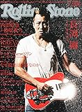
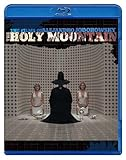
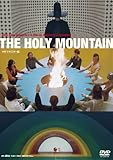

---
categories:
- sukekiyo
date: Sun, 08 Jun 2014 11:37:28 +0000
slug: post-5605
tags:
- sukekiyo
title: 京とホドロフスキー監督対談！ホドロフスキー監督作品を見たことなければAmazonインスタトビデオが超絶おすすめ！
---

ハローしんぺー(<a href="https://twitter.com/s_s_p_y" target="_blank">@s_s_p_y</a> )です。
オフィより詳しくて、wikiよりも有用なsukekiyo情報サイト「Gadget Zombie Parasite」へようこそ。
ついに•••！ついに•••！
ぼくらのカリスマ京が尊敬してやまないと公言する映画監督のアレハンドロ・ホドロフスキー氏と対談が実現！！
その様子のさわりを読んだんですが、なんか、こう胸が熱くなりました。

<a style="color:#0070C5;" href="http://www.barks.jp/news/?id=1000104225" target="_blank">京（DIR EN GREY／sukekiyo）と鬼才アレハンドロ・ホドロフスキー監督の対談が実現 | DIR EN GREY | BARKS音楽ニュース</a>  

<blockquote>
期待すら失礼なので、自由なホドロフスキーを感じさせてください
</blockquote>

これが本当のファンの姿勢だよな•••
凄いなあ、これどういう心境だったんだろう。ぼくたちが仮に京と対面してお話してるってくらいだったんだろうか。凄いなあ。
って勝手に胸と目頭が熱くなりましたよ。

そして、そんな対談の詳細はこちらに収録されております。
もちろん即買いして、熟読したわけでございます。
（記事を先行投稿した時先走って買いましたとかいってまいたけど、本日買いましたw）

<a href="http://www.amazon.co.jp/exec/obidos/ASIN/B00KLIH8LK/warawareotoko-22/ref=nosim/" rel="nofollow" target="_blank">Rolling Stone (ローリング・ストーン) 日本版 2014年 07月号 [雑誌]</a>
posted with <a href="http://kaereba.com" rel="nofollow" target="_blank">カエレバ</a>

 セブン&アイ出版 2014-06-10    

ホドロフスキー監督に関してのwikiはこちら
<a style="color:#0070C5;" href="http://ja.wikipedia.org/wiki/%E3%82%A2%E3%83%AC%E3%83%8F%E3%83%B3%E3%83%89%E3%83%AD%E3%83%BB%E3%83%9B%E3%83%89%E3%83%AD%E3%83%95%E3%82%B9%E3%82%AD%E3%83%BC" target="_blank">アレハンドロ・ホドロフスキー - Wikipedia</a>  

<h2>京、ホドロフスキー対談概要</h2>

買った！読んだ！鳥肌立った！

京がインタビュアーで新鮮でした。京が、他で言ってた言葉がそのまま監督の口からでてきてたりして、京も影響を受けるんだなぁと感じた。

なんていうか、こういうのも新しい取り組みで、なおかつ京自身の弱さを、あえて見せてるのかなと思った。それを弱さっていうのもなんかおかしい。むしろそれことが強さだと思うけど。なんか両方感じた。

<blockquote>
「いちばん大きな戦いは自分自身との戦いだと思います。」
</blockquote>

京自身が感じたことを、監督に確認して、やっぱりそうか！って納得している感じがして、なんていうかそれを弱さっていうか、ぼくたちと同じ人間なんだっていう気がした。

あとは実際買って手にとってそれぞれの人で感じてみればいい。

買う価値があるインタビューです。

<h2>ホドロフスキー監督の作品「ホーリーマウンテン」見た</h2>

全く、意味が解らない。というか不可解。というか、なんとなくわかりそうで、やっぱりわからないわ。って感じ

でも、途中凄い気に入ったというか、何かを感じたところがあった。

まぁでもそれも、虜補正というか、やぱり京が尊敬する監督の映画だからとか、そんな補正は入ってると思うわけです。
でも、それでもいいかなと思う。たとえそれでそう感じていたのだとしても、それでいいやって思った。

<h3>「ホーリーマウンテン」あらすじ</h3>

そんなんもんはねー！wikiにすらほとんど載ってない！
でも、なんとなくでまとめますと、こんなかんじです。

主人公と思われる行き倒れが、子供達と不具の人（以下フリークス）にはりつけにされるところから始まります。
その後、そのフリークスと仲良くなってしばらく行動をともにします。
この辺の下りはいっさい理解不能。

その後、監督自ら扮する錬金術師の弟子となり、不老不死の術を奪うべく、賢者が住むホーリーマウンテンに他の弟子達とともに苦難の末たどり着く。

そして•••

っていうお話です。

<h3>「ホーリーマウンテン」のここがいいかなと思ったシーン</h3>

それぞれの弟子の紹介シーンがあるんですが、その弟子達の仕事がちょっと風刺的

中でも若者のデモ（テロ？）用に武器の製造販売をしているやつがいるんですが、そのシーンが凄いいいなと思ったわけです。あと子供向けにおもちゃ製造しているやつ。

何がいいって、こんな所
<ul>
    <li>武器製造工場員が老人</li>
    <li>若者向け、キリスト教徒向けの専用の銃開発</li>
    <li>政府が要請する子供を開発するためのおもちゃづくり</li>
</ul>

戦争を経験した老人たちが、子供に戦争を教え込むかのごとくおもちゃを作り、政府が要請する大人に成長するように敵国を憎むような漫画を作る。それがなんだ、現実にも起きてるんじゃないかなと考えさせられました。

あと、若者向けにカジュアルでおしゃれな武器を作っている工場シーンで流れていた音楽がよかった。

あとラストのシーンね•••

この映画は金曜の深夜１時くらいからビールを2本くらい飲んでみるのがいいと思う。

まぁ面白かったと思う！

<h3>ホーリーマウンテンを見るならAmazonのインスタントビデオが断然おすすめ！</h3>

はい、前置き長くなりましたが、もしまだホドロフスキー監督の映画を見ていないなら、Amazonのインスタントビデオが超絶おすすめです。

TSUTAYAとかゲオでこのDVDを見つけるのってけっこう難儀な気がする。在庫あっても、借りられてたりね。「どこの虜だ！」とかってなるのでw

<iframe src="http://rcm-fe.amazon-adsystem.com/e/cm?lt1=_blank&bc1=000000&IS2=1&bg1=FFFFFF&fc1=000000&lc1=0000FF&t=warawareotoko-22&o=9&p=8&l=as4&m=amazon&f=ifr&ref=ss_til&asins=B00G9T4AU2" style="width:120px;height:240px;" scrolling="no" marginwidth="0" marginheight="0" frameborder="0"></iframe>

これなら、iPhoneとかスマホでも見れるので電車での移動中とかにも見ることができるのでおすすめです。しかもワンコイン程度で見られるって所が何よりいい！！

使い方は簡単。PCサイトからまず購入手続きをします。iPhoneやiPadからの視聴は専用のビューワーアプリを使って視聴します。

<a href="https://itunes.apple.com/jp/app/amazoninsutanto-bideo/id777564327?mt=8&uo=4&at=11ld5P" target="_blank" >Amazonインスタント・ビデオ</a>

無料

(2014.06.08時点)

<a href="https://itunes.apple.com/jp/artist/amzn-mobile-llc/id297606954?uo=4&at=11ld5P" target="_blank" >AMZN Mobile LLC</a>

posted with <a href="http://pochireba.com" rel="nofollow" target="_blank">ポチレバ</a>

あとDVDやBlu-rayもありますが、GAUZEツアー前で節約している人はぜひインスタントビデオを使ってみてください。

<a href="http://www.amazon.co.jp/exec/obidos/ASIN/B00CWXZ6ZM/warawareotoko-22/ref=nosim/" rel="nofollow" target="_blank">ホーリー・マウンテン HDリマスター版 [Blu-ray]</a>
posted with <a href="http://kaereba.com" rel="nofollow" target="_blank">カエレバ</a>

アレハンドロ・ホドロフスキー Happinet(SB)(D) 2013-09-03    

<a href="http://www.amazon.co.jp/exec/obidos/ASIN/B004AM6Q9S/warawareotoko-22/ref=nosim/" rel="nofollow" target="_blank">ホーリー・マウンテン HDリマスター版 [DVD]</a>
posted with <a href="http://kaereba.com" rel="nofollow" target="_blank">カエレバ</a>

アレハンドロ・ホドロフスキー Happinet(SB)(D) 2011-03-04    

<h2>しんぺーはこう思った。</h2>
映画に関してはとりあえず、京が心酔する理由が垣間見えた気がします。
ホドロフスキー監督は日本からも多大な影響を受けているみたいで、日本のアニメやらなんやらにも精通しているそうです。

AKIRAの大友克洋とも個人的な交友があるそうな。

どちらにしろ初見のみではなんとも判別しかねる映画でした。それにしてもやっぱり閲覧注意な感じはしたので、一人で見ることをおすすめしますw

そして、対談に関してですが•••（こちらも6月10日以降追記します）
と言ったところ本日は以上になります。おやすみなさい。