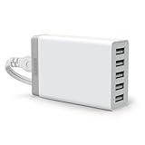
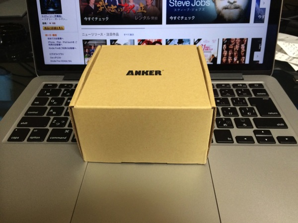
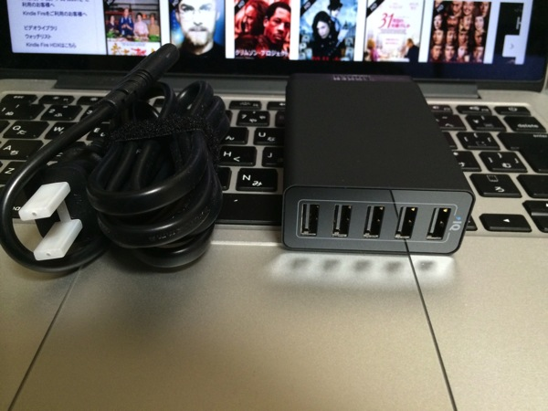
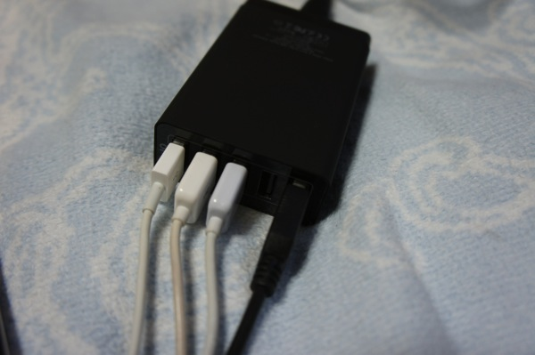
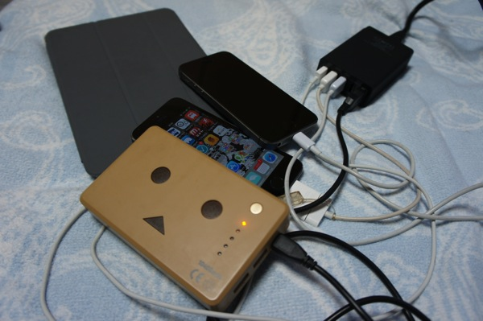

---
categories:
- レビュー
date: Sun, 08 Jun 2014 13:42:03 +0000
slug: post-5613
tags:
- おすすめガジェット
title: 遠征ギャに超絶おすすめ！手持ちのガジェット全部まとめて充電できるAnkerの急速充電器のご紹介
---

ハローしんぺー(<a href="https://twitter.com/s_s_p_y" target="_blank" rel="noopener">@s_s_p_y</a> )です。
オフィより詳しくて、wikiよりも有用なsukekiyo情報サイト「Gadget Zombie Parasite」へようこそ。
ネット上で超話題になっていたので遂にポチってしまいました。

<a href="http://www.amazon.co.jp/exec/obidos/ASIN/B00IDTILEW/warawareotoko-22/ref=nosim/" target="_blank" rel="nofollow noopener">Anker 40W 5ポート USB急速充電器 ACアダプタ PowerIQ搭載 iPhone5C/5S/5/4S/4/iPod/iPad/Xperia/GALAXY/ウォークマン等対応</a>

posted with <a href="http://kaereba.com" target="_blank" rel="nofollow noopener">カエレバ</a>

Anker

<h2>Anker急速充電器のここが凄い！</h2>
<ul>
 	<li>持ってるガジェット全部充電できちゃう</li>
 	<li>PoweIQで最適な電圧で充電してくれちゃう</li>
 	<li>最短で充電できちゃう</li>
</ul>
こいつは凄い！何が凄いって手持ちのUSB搭載ガジェットが全部一気に充電できちゃう！

しかも接続するガジェットに最適な電圧で充電してくれるからバッテリーへのダメージが少ない！

さらにさらに、充電が終わったガジェットが接続されているポートの電流を他のポートに切り替えて流すことで、最短で全てのガジェットを充電してくれるんです！
<h2>使用感はこんな感じ</h2>
外装からしてコンパクト

大きさはiPhoneと同じくらい

接続部はこんな感じ

じゃーん全具接続したらこんな感じ
iphone、iPhone、iPad、ダンボー全て接続して、全て充電しております。

<h2>どういうシーンで利用するのがいいのか！？</h2>
これは正に遠征するバンギャのためのガジェットです。
行き帰りのバスなか、ついついツイートしまくってバッテリー切れってことになっていませんか？
予備のバッテリーもってきているけど、ホテルまで心もとない。
もしくは、ホテルのコンセントで手持ちのガジェット全部を充電するなんて無理！スマホも充電したいけどバッテリーにも充電しておきたい！

そんな悩みを一気に解決してくれるのがこいつです。

バスの中でも、ホテルでも。コンセント穴が一個しかなくても全てを充電できる！
<h2>しんぺーはこう思った。</h2>
話題になっていたのでいつかは買おうと思っていました。

楽天のポイントがたまっていたのでポチりました。いやー買ってマジでよかったw

過充電のせいかiPhoneのバッテリーもけっこうやばめになってきました。
このPowerIQって機能はかなり助かります。
なんでもGoogle出身の人たちが作った会社みたいで、なるほど！って感じです。

上にも書きましたが、とくに移動が多い人にはおすすめです。GAUZEツアーに向けて一つ買ってみてもいいんではないでしょうか！

あ、旧モデル買わないように気をつけてね！そっちは使い勝手が少し違うので。
と言ったところ本日は以上になります。おやすみなさい。

<a href="http://www.amazon.co.jp/exec/obidos/ASIN/B00IDTILEW/warawareotoko-22/ref=nosim/" target="_blank" rel="nofollow noopener">Anker 40W 5ポート USB急速充電器 ACアダプタ PowerIQ搭載 iPhone5C/5S/5/4S/4/iPod/iPad/Xperia/GALAXY/ウォークマン等対応</a>

posted with <a href="http://kaereba.com" target="_blank" rel="nofollow noopener">カエレバ</a>

Anker

