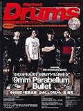

---
categories:
- sukekiyo
date: Sun, 15 Jun 2014 02:32:08 +0000
slug: post-5642
tags:
- sukekiyoまとめ
title: 今週のsukekiyoまとめ!5月31日〜6月13日（2014）
---

ハローしんぺー(<a href="https://twitter.com/s_s_p_y" target="_blank">@s_s_p_y</a> )です。

オフィより詳しくて、wikiよりも有用なsukekiyo情報サイト「Gadget Zombie Parasite」へようこそ。<!--more-->さて今週はとくに大きな動き自体はありませんでしたが、すげー！て言う外せない出来事がありました。

それがこちら

<h2>京あこがれのホドロフスキー監督と対談！ゆち氏も反応</h2>
<a style="color:#0070C5;" href="https://www.warawareotoko.com/2014/06/08/post-5605/" target="_blank">京とホドロフスキー監督対談！| Gadget Zombie Parasite</a>  

この記事に対してゆち氏からもこんなコメントが

<blockquote class="twitter-tweet" lang="ja">
これはマジですごいで凄いですね！<a href="https://twitter.com/watanabedeath">@watanabedeath</a>: 【拡散希望】京(DIR EN GREY / sukekiyo)とカルト映画界の巨匠アレハンドロ・ホドロフスキー監督(@alejodorowsky)の対談が遂に実現！ 6月10日(火)発売「Rolling Stone
&mdash; YUCHI (@yuchivalism) <a href="https://twitter.com/yuchivalism/statuses/474420460961005570">2014, 6月 5</a></blockquote>

ふむふむ、近しい人ですらこの反応だから、やっぱり凄いことなんだと改めて実感。

まだ購入されていない方はぜひ手にとるべし！

<a href="http://www.amazon.co.jp/exec/obidos/ASIN/B00KLIH8LK/warawareotoko-22/ref=nosim/" rel="nofollow" target="_blank">Rolling Stone (ローリング・ストーン) 日本版 2014年 07月号 [雑誌]</a>
posted with <a href="http://kaereba.com" rel="nofollow" target="_blank">カエレバ</a>

 セブン&アイ出版 2014-06-10    

<a href="http://www.amazon.co.jp/gp/search?keywords=%83%8D%81%5B%83%8A%83%93%83O%83X%83g%81%5B%83%93&__mk_ja_JP=%83J%83%5E%83J%83i&tag=warawareotoko-22" rel="nofollow" target="_blank" title="アマゾン" >Amazonで購入</a>

<a href="http://ck.jp.ap.valuecommerce.com/servlet/referral?sid=3041033&pid=882528283&vc_url=http%3A%2F%2Fshopping.search.yahoo.co.jp%2Fsearch%3FuIv%3Don%26ei%3DUTF-8%26tab_ex%3Dcommerce%26slider%3D0%26va%3D%25E3%2583%25AD%25E3%2583%25BC%25E3%2583%25AA%25E3%2583%25B3%25E3%2582%25B0%25E3%2582%25B9%25E3%2583%2588%25E3%2583%25BC%25E3%2583%25B3" rel="nofollow"  target="_blank" title="Yahooショッピング" >Yahooショッピングで購入</a>

<a href="http://ck.jp.ap.valuecommerce.com/servlet/referral?sid=3041033&pid=882660047&vc_url=http%3A%2F%2Fauctions.search.yahoo.co.jp%2Fsearch%3Fvo%3D%26ve%3D%26auccat%3D0%26aucminprice%3D%26aucmaxprice%3D%26aucmin_bidorbuy_price%3D%26aucmax_bidorbuy_price%3D%26loc_cd%3D0%26abatch%3D0%26istatus%3D0%26filtered%3D1%26ei%3DUTF-8%26tab_ex%3Dcommerce%26va%3D%25E3%2583%25AD%25E3%2583%25BC%25E3%2583%25AA%25E3%2583%25B3%25E3%2582%25B0%25E3%2582%25B9%25E3%2583%2588%25E3%2583%25BC%25E3%2583%25B3" rel="nofollow"  target="_blank" title="ヤフオク!" >ヤフオク!で購入</a>

<h2>逮捕されていたaftermathの縄演出担当の一鬼のこ氏釈放される</h2>

<blockquote class="twitter-tweet" lang="ja">
【お詫び】&#10;昨日、拘束がとけ社会復帰致しました。&#10;皆様に大変ご心配とご迷惑をおかけ致しました。&#10;ツイッターやフェイスブック、メールなどで皆様から暖かいお言葉をいただき、一鬼のこの活動は、また再開したいと考えております。&#10;この度は、大変申し訳ありませんでした。&#10;一鬼のこ
&mdash; 一鬼のこ (@hajimekinoko) <a href="https://twitter.com/hajimekinoko/statuses/476655111746232320">2014, 6月 11</a></blockquote>

なんで逮捕されたかはこちら。割と詳しくのってます。
都内最大級のハプニングバー（SMバー）KUNKUN摘発！？一 鬼のこ氏等７名逮捕

あとぜひ動画で「一鬼のこ」検索してみてくだされ。閲覧注意なんですが、さすがに「縄師」とか「緊縛師」なんていう肩書きをもってるだけあって、はっきり言って芸術です。こういうアンダーグラウンドな日本カルチャーが海外にはうけてる（うけてた）のに、政府主導のくだらない「商品」を輸出するクールジャパン（笑）なんてのは絶対成功しないわけです。

話がそれました。

<h2>sukekiyoのDrums.未架氏誕生日迎える</h2>

<blockquote class="twitter-tweet" lang="ja">
本日6/12はsukekiyo未架の誕生日です！ 明日6/13(金)発売の「Rhythm &amp; Drums magazine」7月号に未架のインタビューが掲載されます。なかなかブログを更新してくれない寡黙な未架さんですが(笑)、ドラマガではたっぷりと語っていますので是非チェックを！
&mdash; 渡部です。 (@watanabedeath) 2014, 6月 11</blockquote>

<h3>未架さんのインタビュー</h3>

sukekiyoとしての単独インタビューは初めてだと思います。数ページに渡るインタビューのため実際に手に取って読んでいただくことをお勧めします！

要約すると、ドラム初めてバンドやるようになってからゲームのサントラをコピーしたりしてた。(この辺が変態ぽい)

あと、映像の仕事が結構前からかなり忙しいみたい。それでもsukekiyoのオファーがきた時に断るという選択肢はなかったって。
そして随所から湧き出る京虜感。
あと、おそらく映像という表現方法が別にあるからこその、余裕を感じました。大人の余裕を

<a href="http://www.amazon.co.jp/exec/obidos/ASIN/B00KLIHC3Y/warawareotoko-22/ref=nosim/" rel="nofollow" target="_blank">Rhythm & Drums magazine (リズム アンド ドラムマガジン) 2014年 07月号 (CD付) [雑誌]</a>
posted with <a href="http://kaereba.com" rel="nofollow" target="_blank">カエレバ</a>

リズム&ドラム・マガジン編集部 リットーミュージック 2014-06-13    

<a href="http://www.amazon.co.jp/gp/search?keywords=%83%8A%83Y%83%80%83A%83%93%83h%83h%83%89%83%80&__mk_ja_JP=%83J%83%5E%83J%83i&tag=warawareotoko-22" rel="nofollow" target="_blank" title="アマゾン" >Amazonで購入</a>

<a href="http://ck.jp.ap.valuecommerce.com/servlet/referral?sid=3041033&pid=882528283&vc_url=http%3A%2F%2Fshopping.search.yahoo.co.jp%2Fsearch%3FuIv%3Don%26ei%3DUTF-8%26tab_ex%3Dcommerce%26slider%3D0%26va%3D%25E3%2583%25AA%25E3%2582%25BA%25E3%2583%25A0%25E3%2582%25A2%25E3%2583%25B3%25E3%2583%2589%25E3%2583%2589%25E3%2583%25A9%25E3%2583%25A0" rel="nofollow"  target="_blank" title="Yahooショッピング" >Yahooショッピングで購入</a>

<a href="http://ck.jp.ap.valuecommerce.com/servlet/referral?sid=3041033&pid=882660047&vc_url=http%3A%2F%2Fauctions.search.yahoo.co.jp%2Fsearch%3Fvo%3D%26ve%3D%26auccat%3D0%26aucminprice%3D%26aucmaxprice%3D%26aucmin_bidorbuy_price%3D%26aucmax_bidorbuy_price%3D%26loc_cd%3D0%26abatch%3D0%26istatus%3D0%26filtered%3D1%26ei%3DUTF-8%26tab_ex%3Dcommerce%26va%3D%25E3%2583%25AA%25E3%2582%25BA%25E3%2583%25A0%25E3%2582%25A2%25E3%2583%25B3%25E3%2583%2589%25E3%2583%2589%25E3%2583%25A9%25E3%2583%25A0" rel="nofollow"  target="_blank" title="ヤフオク!" >ヤフオク!で購入</a>

<h2>しんぺーはこう思った。</h2>
大きな動きがなくとも日々何かしらの情報がでてきますな。

これからも目が離せない。これからもゆち氏と渡部さんのツイートから目が離せないぜ！
それにしても渡部さんも言ってますが、他のメンバーからも情報発信してほしいものですw

と言ったところ本日は以上になります。おやすみなさい。