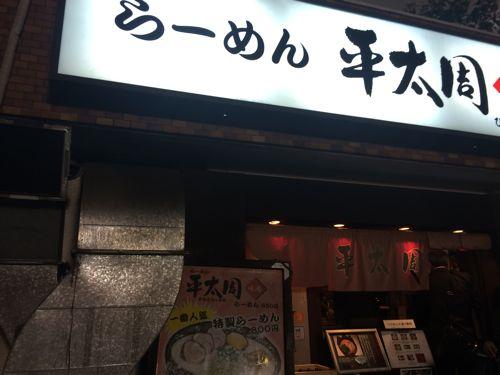
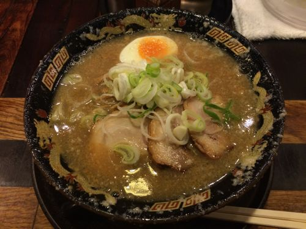
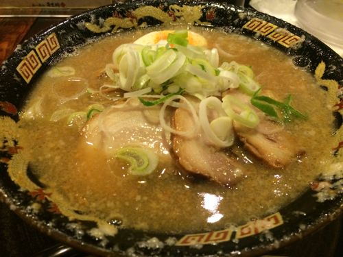

---
categories:
- グルメ
date: Wed, 18 Jun 2014 13:18:24 +0000
slug: post-5728
tags:
- sukekiyo
- ラーメン
title: sukekiyoベースYuchi氏御用達の五反田ラーメン屋「平太周」行ってきた！チャーシューうんまー！
---

ハロー。しんぺー(<a href="https://twitter.com/s_s_p_y" target="_blank">@s_s_p_y</a> )です。

オフィより詳しくて、wikiよりも有用なsukekiyo情報サイト「Gadget Zombie Parasite」へようこそ。

<!--more-->

以前ゆち氏がブログにアップしてたラーメン屋に行ってきた！ついに。

<a style="color:#0070C5;" href="http://s.ameblo.jp/yuchi-bassist/entry-11857783548.html" target="_blank">買い物♪ ｜YUCHI OFFICIAL BLOG 「discharge!」Powered by Ameba｜Ameba (アメーバ)</a>  

フォロワーさんに教えていただきました。お店はここです。

<strong><a href="http://tabelog.com/tokyo/A1316/A131603/13002046/" target="_blank">平太周 味庵</a></strong>

<strong>関連ランキング：</strong><a href="http://tabelog.com/rstLst/ramen/">ラーメン</a> | <a href="http://tabelog.com/tokyo/A1316/A131603/R1721/rstLst/">大崎広小路駅</a>、<a href="http://tabelog.com/tokyo/A1316/A131603/R4018/rstLst/">五反田駅</a>、<a href="http://tabelog.com/tokyo/A1316/A131604/R1718/rstLst/">大崎駅</a>

まぁ五反田というよりも大崎広小路です。
五反田の喧騒からちょこっと外れた場所にあります。

ネットで見る限りでは、とてつもなくジャンクなラーメンで、絶対次の日お腹痛くなると思ってました。
恐る恐る注文したのは、スタンダードなその名も「ラーメン」

これです。

アップでもう一枚

味や麺の硬さなどが選べます。
もちろん"普通"にしましたw

さて、お味の方は•••

意外とあっさり。麺もぱさっとしてて、しつこくない。
そして何よりチャーシューが美味しかった。噛むと味がしっかりと滲み出てきて、チャーシュー！って感じがしました。

<h2>しんぺーはこう思った。</h2>

今のところ、お腹痛くなったり、胃がもたれたりはしてません。

コッテリとか上位メニューを食べなければ大丈夫そですw

確かゆち氏も昼ご飯として食べたようですので、夜遅い時間はちょっときついかもしれません。

お近くにお立ち寄りの際は、訪ねてみてもいいのではないでしょうか！

といったところで、本日は以上です。おやすみなさい。