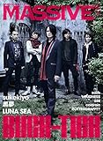

---
categories:
- sukekiyo
date: Thu, 19 Jun 2014 22:47:08 +0000
slug: post-5730
tags:
- sukekiyoまとめ
title: 今週のsukekiyoまとめ!6月16日〜6月20日（2014）
---

ハロー。しんぺー(<a href="https://twitter.com/s_s_p_y" target="_blank">@s_s_p_y</a> )です。

オフィより詳しくて、wikiよりも有用なsukekiyo情報サイト「Gadget Zombie Parasite」へようこそ。<!--more-->今週のsukekiyoまとめは、主に雑誌掲載情報です。

まずは虜なら絶対外せないこちらから

<h2>MASSIVE Vol.14 ぼくらがsukekiyoLIVEでうとうとしてるのばれてました。すいませんでした。</h2>

メニューツアー後から漆黒の儀の間くらいにされたインタビューかな？増田さんは東京青年館の2公演を見に行ったそうです。

インタビュー内容は、バンドとしての方向性が見えた。これこそ誰もやってない、sukekiyoにしかできない世界観、表現だと確信したー！って内容です。

で、問題は京の口からこんなことが出てきた所です。

<blockquote>
まあ、寝てる人もちらほらいましたけど（笑）
</blockquote>

増田さんも必死のフォロー。きっと読んだ人たちは罪悪感で一杯のはず。。。

<h3>大きな音の中で眠くなるのはなぜ？</h3>

ぼくだけじゃないと思います。大きな音が鳴ってると、なんか眠くなりませんか？？

ちょっと気になったので調べてみました。

で、どうも胎児の時と状況が似てるせいなんじゃねぇかという結論に至りました。

胎児ってかなり聴覚の発達が早いみたい、なおかつ子宮の中ってすげーうるさいらしいw
特に母親の鼓動。さらに数ヶ月たつと母親の声も外の音とかも場合によってはきこえるらしい。

これなんじゃないかと思います。LIVEハウスやコンサート会場の暗転した中で、一定のリズムで刻まれるドラムとベースが正に母親の鼓動なんじゃないかと。

だから眠くなる。多分、暗くなくても眠くなると思う。それは耳というよりからだ全体がビートを感じてるからなんでしょうね。

<a href="http://www.amazon.co.jp/exec/obidos/ASIN/4401640209/warawareotoko-22/ref=nosim/" rel="nofollow" target="_blank">MASSIVE (マッシヴ) Vol.15 (シンコー・ミュージックMOOK)</a>
posted with <a href="http://kaereba.com" rel="nofollow" target="_blank">カエレバ</a>

 シンコーミュージック 2014-06-17    

<a href="http://www.amazon.co.jp/gp/search?keywords=massive&__mk_ja_JP=%83J%83%5E%83J%83i&tag=warawareotoko-22" rel="nofollow" target="_blank" title="アマゾン" >Amazon</a>

<a href="http://ck.jp.ap.valuecommerce.com/servlet/referral?sid=3041033&pid=882528283&vc_url=http%3A%2F%2Fshopping.search.yahoo.co.jp%2Fsearch%3FuIv%3Don%26ei%3DUTF-8%26tab_ex%3Dcommerce%26slider%3D0%26va%3Dmassive" rel="nofollow"  target="_blank" title="Yahooショッピング" >Yahooショッピング</a>

<a href="http://ck.jp.ap.valuecommerce.com/servlet/referral?sid=3041033&pid=882660047&vc_url=http%3A%2F%2Fauctions.search.yahoo.co.jp%2Fsearch%3Fvo%3D%26ve%3D%26auccat%3D0%26aucminprice%3D%26aucmaxprice%3D%26aucmin_bidorbuy_price%3D%26aucmax_bidorbuy_price%3D%26loc_cd%3D0%26abatch%3D0%26istatus%3D0%26filtered%3D1%26ei%3DUTF-8%26tab_ex%3Dcommerce%26va%3Dmassive" rel="nofollow"  target="_blank" title="ヤフオク!" >ヤフオク!</a>

<h2>KERA 8月号</h2>

今のKERAの読者層ってどこなわけ？？
ひっさしぶりに名前を聞きましたわ。行動範囲でおいてある本屋さんほとんどない•••
今年中に廃刊しそうな気が•••

内容はLIVEレポ

わりと華やかなページにいきなり白眼むいた京さんが現れてビビる。

<a href="http://www.amazon.co.jp/exec/obidos/ASIN/B00KD3GN5K/warawareotoko-22/ref=nosim/" rel="nofollow" target="_blank">KERA 2014年 08月号</a>
posted with <a href="http://kaereba.com" rel="nofollow" target="_blank">カエレバ</a>

 ジャック・メディア 2014-06-16    

<a href="http://www.amazon.co.jp/gp/search?keywords=kera&__mk_ja_JP=%83J%83%5E%83J%83i&tag=warawareotoko-22" rel="nofollow" target="_blank" title="アマゾン" >Amazon</a>

<a href="http://ck.jp.ap.valuecommerce.com/servlet/referral?sid=3041033&pid=882528283&vc_url=http%3A%2F%2Fshopping.search.yahoo.co.jp%2Fsearch%3FuIv%3Don%26ei%3DUTF-8%26tab_ex%3Dcommerce%26slider%3D0%26va%3Dkera" rel="nofollow"  target="_blank" title="Yahooショッピング" >Yahooショッピング</a>

<a href="http://ck.jp.ap.valuecommerce.com/servlet/referral?sid=3041033&pid=882660047&vc_url=http%3A%2F%2Fauctions.search.yahoo.co.jp%2Fsearch%3Fvo%3D%26ve%3D%26auccat%3D0%26aucminprice%3D%26aucmaxprice%3D%26aucmin_bidorbuy_price%3D%26aucmax_bidorbuy_price%3D%26loc_cd%3D0%26abatch%3D0%26istatus%3D0%26filtered%3D1%26ei%3DUTF-8%26tab_ex%3Dcommerce%26va%3Dkera" rel="nofollow"  target="_blank" title="ヤフオク!" >ヤフオク!</a>

<h2>しんぺーはこう思った。</h2>

今週は動きがあんまりありませんでした。むしろそろそろDIR EN GREYの方が動き始めたみたいです。

来月は武道館の映像も発売されます！併せてこんな企画も募集中。

っつても間離れ過ぎて覚えてないわ。思い出せるのは、あれ、一つになれんのかー！？のくだりとTHE FINALあたりのみ。

あ、それとノットから送られてきたハガキは何に使うんでしょ？

あと会報誌まだー？？？

っつても動き出したらきっと凄まじいんだろうな。どうせGAUZEツアー初日にノットフェスト参加とカウントダウンジャパン参加が発表されるんでしょ！？(そしてsukekiyo海外公演中にsukekiyo単体でのカウントダウンジャパン参戦発表wしかも別日•••)

まぁそれまでは、とりあえず夏を乗り切れるように体力作りしなきゃ。皆さんも雪崩を起こさないように足腰鍛えておきましょう。

といったところで、本日は以上です。おやすみなさい。