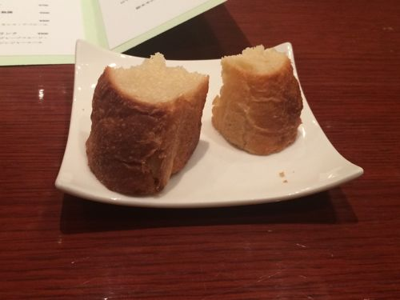

---
categories:
- グルメ
date: Fri, 20 Jun 2014 15:00:34 +0000
slug: post-5739
title: 夏前に夏バテ気味でGAUZEツアーまで生きる自信ないから炉窯ステーキ煉瓦で半日かけて焼かれた肉喰らってきた！うんまー！
---

ハロー。しんぺー(<a href="https://twitter.com/s_s_p_y" target="_blank">@s_s_p_y</a> )です。

オフィより詳しくて、wikiよりも有用なsukekiyo情報サイト「Gadget Zombie Parasite」へようこそ。

<!--more-->

梅雨はどこに行ったの！？ってくらいに雨が降らない一週間でした。そして割と暑く、寝る時はクーラーが欠かせなくなってきました。

そのせいかは、わかりませんが今週はとにかく怠く、そして眠い日々が続きました。スタバのコーヒーを2杯、セブンイレブンのコーヒー1杯、エナジードリンク1本、お紅茶数杯で、やっと目が覚めたの17時！なんて日もありましたとさ。

今からこんなんじゃ、絶対夏を越せない！越せないどころかツアー初日の新木場あたりで死んでしまうのではないかと

そんな不安が頭をよぎります。だからこそ、ここらでガッツリパワーのつく飯を喰らってやろう！そう思ってたら、こんな美味しそうなお店を見つけました。

<strong><a href="http://tabelog.com/tokyo/A1303/A130301/13168095/" target="_blank">炉窯ステーキ煉瓦</a></strong>

<strong>関連ランキング：</strong><a href="http://tabelog.com/rstLst/steak/">ステーキ</a> | <a href="http://tabelog.com/tokyo/A1303/A130301/R4698/rstLst/">渋谷駅</a>、<a href="http://tabelog.com/tokyo/A1306/A130602/R2153/rstLst/">表参道駅</a>、<a href="http://tabelog.com/tokyo/A1306/A130601/R9951/rstLst/">明治神宮前駅</a>

<h2>炉窯ステーキ煉瓦はこんな店！！</h2>

<blockquote>
瓦作りの特注の炉窯で『6kg程の肉』を時間をかけて丁寧に焼き上げます。 肉を塊で焼くからこそ引き出される特別な美味しさを定刻にお客様全員でシェアさせていただきます。
引用元:食べログ
</blockquote>

それではごたごた言わずに、お写真をどうぞ。

厳かな佇まい

中はいかにも高級という感じ。コースのお値段は8000円！

メニューはこちら

メインディッシュ

<h2>煉瓦は予約してゆけ！</h2>

どーん！上のメインディッシュが切り分けられる前の姿
6kgの牛肉がこちらになります。

こいつを半日かけてじっくり焼くため、この店は予約を推奨しております。さらに焼きあがるのが19:40くらいのため、予約は18:30に入れるのがベストとのこと。

<h2>しんぺーはこう思った。</h2>

たまたまネットで見かけて、うまそー！と思ったらオープンしたて。こりゃもういくしかないと、ソッコー予約したわけですが美味しかったです！

給料日後の贅沢にいかがでしょうか？

おすすめです。あとは、しっかりと筋トレしてランニングしてGAUZEツアーに備えるのみ。

といったところで、本日は以上です。おやすみなさい。