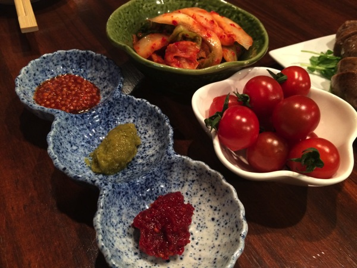
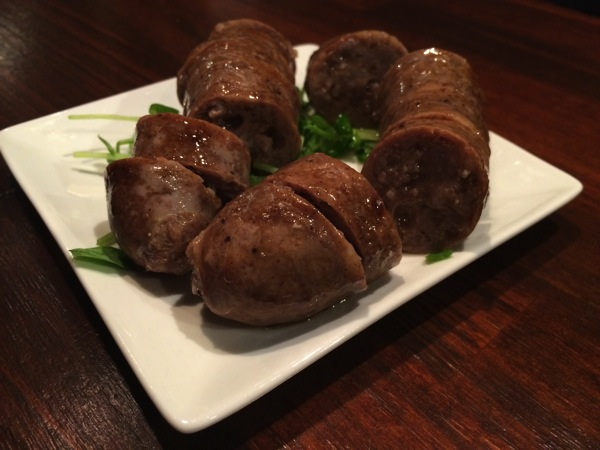
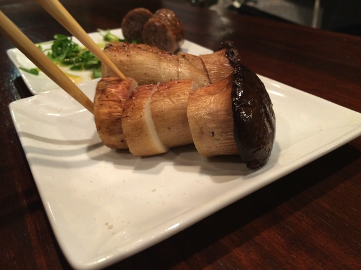
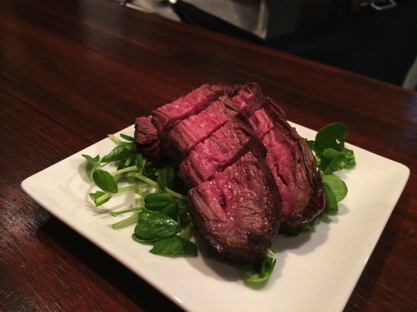
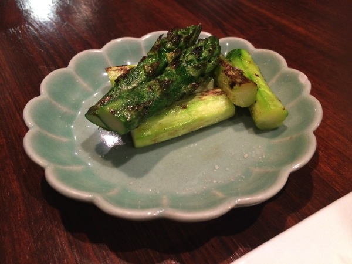
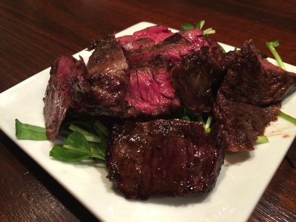
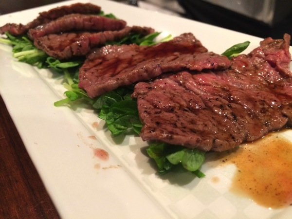
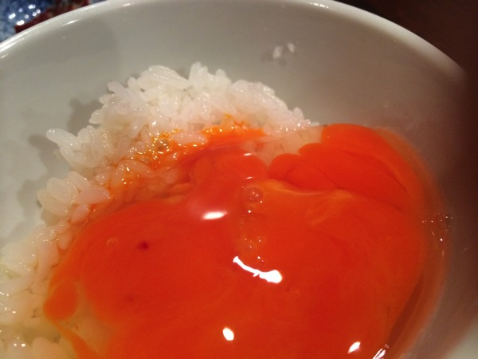

---
categories:
- グルメ
date: Wed, 25 Jun 2014 14:25:06 +0000
slug: post-5779
tags:
- グルメ
title: 完全予約制の高級焼肉屋吉祥寺「肉山」サッパリとしたお肉がこれからの季節にピッタリ
---

ハロー。しんぺー(<a href="https://twitter.com/s_s_p_y" target="_blank">@s_s_p_y</a> )です。

オフィより詳しくて、wikiよりも有用なsukekiyo情報サイト「Gadget Zombie Parasite」へようこそ。<!--more-->本日は以前行った吉祥寺の肉山をご紹介します。確か行ったのはsukekiyoの「別れを惜しむフリは貴方の為」ツアー中でした。

今よりも暑かった気がする。

<h2>「肉山」は予約限定のお店</h2>

お店情報はこちら

<strong><a href="http://tabelog.com/tokyo/A1320/A132001/13155313/" target="_blank">肉山</a></strong>

<strong>関連ランキング：</strong><a href="http://tabelog.com/rstLst/RC999912/">その他肉料理</a> | <a href="http://tabelog.com/tokyo/A1320/A132001/R3232/rstLst/">吉祥寺駅</a>

最初なにも知らずに予約の電話をした時、ぶったまげました。

「3ヶ月先まで予約一般です。次の募集は何月何日からです。」

マジかよ！こういうのって王様のブランチだけの謳い文句かと思ってたYO！

で、次の予約開始日に電話をしたんですけど、その時の心境はまるでチケット一般発売日みたいな感じでしたw

数ヶ月先の予約が取れたら後はその日まで待つのみ。

<h2>「肉山」のメニューはこんなの！</h2>

全てコースででてきます。価格はだいたいのLIVEチケットの相場くらいの5000円です！1人5000円です！

そうそう、肉だけじゃなくてお野菜もおいしいのよ。これがまた。

これな。ソーセージ？腸詰め？忘れたけど、こんがりやいてあるんだけど、やわらかくておいしいんだこれが！油っぽくない

繰り返しますが、お野菜もおいしい。こんな上品なこれ、このキノコね。これなんていうんだっけ？エリンギ？しいたけ？忘れたってか知らないけど、すげーおいしかった。肉みたいにジューシー

ここからはメインのお肉だ続きます。これね、全然油っぽくないのよ。さっぱりしてるの

で、最後ぱんぱんのおなかに締めの卵かけ御飯！！もう無理って思ったんだけど、この卵も美味しくてなんと完食！！

美味しかった！

<h2>しんぺーはこう思った。</h2>
本当にdir en greyの夏のGAUZEツアー並みに予約がとれません。
で、予約とってその場で美味しいって少しでも思ったら、その場で次回の予約をとることをおすすめします！

ってか常連の人はこの技を全員使ってたわw

で、あとけっこう有名人も来ているみたいで、店中にサインが書きまくってた！残念ながら、DIR EN GREYのサインはありませんでしたw

漫画家の人のサインが多かった。多分カイジの作者だったかな、サインありました。イラストと添えて書かれているものが多かったので、多分一つは知っている人がいると思います。

そんなわけで、吉祥寺の肉山おすすめです。
と言ったところ本日は以上になります。おやすみなさい。