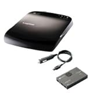
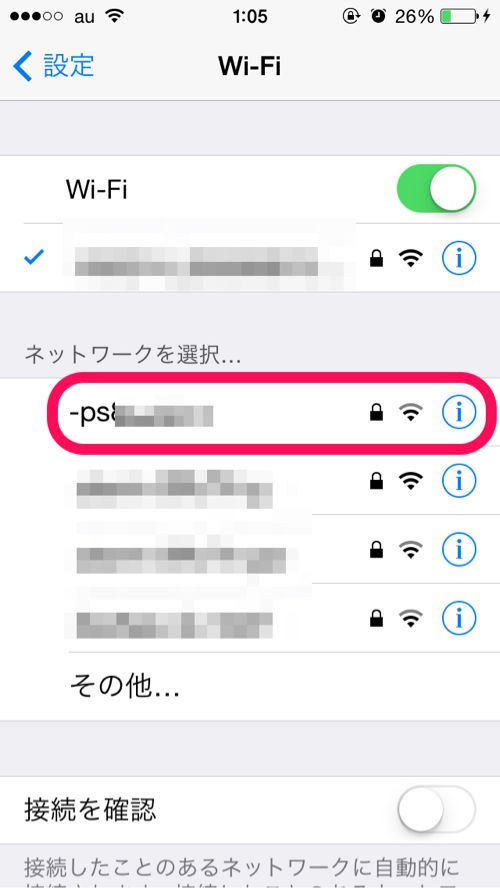
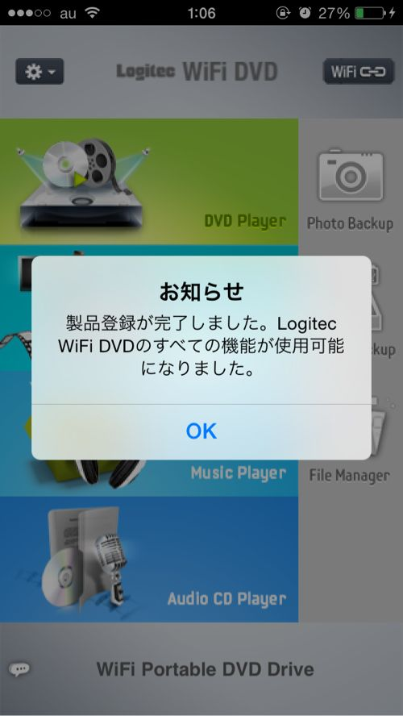

---
categories:
- レビュー
date: Tue, 08 Jul 2014 14:41:30 +0000
slug: post-5837
tags:
- ガジェット
title: WiFi接続して無線でiPhoneやiPadでDVDを再生できるLogitecのWiFi DVDドライブでお風呂でもDVDが見られる！
---

ハロー。しんぺー(<a href="https://twitter.com/s_s_p_y" target="_blank" rel="noopener">@s_s_p_y</a> )です。

オフィより詳しくて、wikiよりも有用なsukekiyo情報サイト「Gadget Zombie Parasite」へようこそ。
<!--more-->
<!--more-->
本日は商品紹介記事です。借りてきたシャーロックのシーズン3を風呂の中で見たい！iPhoneやiPad miniで見られたらいいんだけど！ってことで数年前に見かけた記事を元に今回ようやく手に入れました。

こちらです。

<a href="http://www.amazon.co.jp/exec/obidos/ASIN/B00ATJBEKC/warawareotoko-22/ref=nosim/" target="_blank" rel="nofollow noopener">WiFi対応 ポータブルDVDドライブ (シガーチャージャー同梱モデル(ブラック))</a>

posted with <a href="http://kaereba.com" target="_blank" rel="nofollow noopener">カエレバ</a>

Logitec

<a title="アマゾン" href="http://www.amazon.co.jp/gp/search?keywords=DVD%20wifi&amp;__mk_ja_JP=%83J%83%5E%83J%83i&amp;tag=warawareotoko-22" target="_blank" rel="nofollow noopener">Amazon</a>

<a title="Yahooショッピング" href="http://ck.jp.ap.valuecommerce.com/servlet/referral?sid=3041033&amp;pid=882528283&amp;vc_url=http%3A%2F%2Fshopping.search.yahoo.co.jp%2Fsearch%3FuIv%3Don%26ei%3DUTF-8%26tab_ex%3Dcommerce%26slider%3D0%26va%3DDVD%2520wifi" target="_blank" rel="nofollow noopener">Yahooショッピング</a>

<a title="ヤフオク!" href="http://ck.jp.ap.valuecommerce.com/servlet/referral?sid=3041033&amp;pid=882660047&amp;vc_url=http%3A%2F%2Fauctions.search.yahoo.co.jp%2Fsearch%3Fvo%3D%26ve%3D%26auccat%3D0%26aucminprice%3D%26aucmaxprice%3D%26aucmin_bidorbuy_price%3D%26aucmax_bidorbuy_price%3D%26loc_cd%3D0%26abatch%3D0%26istatus%3D0%26filtered%3D1%26ei%3DUTF-8%26tab_ex%3Dcommerce%26va%3DDVD%2520wifi" target="_blank" rel="nofollow noopener">ヤフオク!</a>

これなんとWiFiを通してタブレットやスマホでDVDが再生できるというものです。
PCに繋げれば通常のDVDプレーヤーとしても使えます。
<h2>まずは設定方法</h2>
ぼくは普段説明書とか見ないタイプなんです。でそのままやったら苦戦しまくりで思わず返品してやろうかと思いました。

ただ、説明書読んだらすぐわかりました。

まずは専用のアプリをダウンロードしてください。

そのあと、スマホ側のWiFi設定でこの端末を選択します。(ここでつまずいてた)パスワードを入力。端末の番号とパスワードは本体裏側に記載されてます。

次にアプリを立ち上げてDVDプレーヤーというとこをタップすると自動で端末が登録されます。

ほらできた！

<h2>こんなシーンで使いたい！</h2>
<ul>
 	<li>見てたDVDの続きをお風呂でみたい！</li>
</ul>
むしろトイレでも見たい！家中どこでもみたい！
<ul>
 	<li>寝っ転がりながらDVDを見たい！</li>
</ul>
PCとかだと見づらかったりするし、スマホで見れたら楽ですよね〜
<ul>
 	<li>iPhone、iPadのカーオーディオ化へまた一歩近づいた！</li>
</ul>
まだ試してませんが、これを使えば何十万もするカーナビ買わなくて済むし、なおかつDVDも見れる。
<h2>少し心配なところ</h2>
とてもいいガジェットなんですが少し心配な所があります。

それはこのアプリが今後ちゃんと最新OS対応をし続けていくのかどうかという点です。

その辺が不透明なので多少ギャンブルかもしれません。とはいえ、USB接続すれば普通のPC用外付けDVDプレーヤーとして機能もしますので。最悪これで
<h2>しんぺーはこう思った。</h2>
ぼくはMacBook ProのRetinaを使っていてDVDプレーヤーに接続すると寝っ転がりながらの閲覧が大変しずらいんですわ。

でもこれで解決です。今のところ回線も安定していて、画質も普通に綺麗です。

ちなみにBlu-rayバージョンはないみたいです。

これはマジでおすすめなガジェットです。
武道館のDVDと併せて是非検討を

<a href="http://www.amazon.co.jp/exec/obidos/ASIN/B00JVX7EHY/warawareotoko-22/ref=nosim/" target="_blank" rel="nofollow noopener">DUM SPIRO SPERO AT NIPPON BUDOKAN(初回生産限定盤) [DVD]</a>

posted with <a href="http://kaereba.com" target="_blank" rel="nofollow noopener">カエレバ</a>

DIR EN GREY SMD jutaku(SME)(D) 2014-07-16

<a title="アマゾン" href="http://www.amazon.co.jp/gp/search?keywords=DIR%20EN%20GREY&amp;__mk_ja_JP=%83J%83%5E%83J%83i&amp;tag=warawareotoko-22" target="_blank" rel="nofollow noopener">Amazon</a>

<a title="Yahooショッピング" href="http://ck.jp.ap.valuecommerce.com/servlet/referral?sid=3041033&amp;pid=882528283&amp;vc_url=http%3A%2F%2Fshopping.search.yahoo.co.jp%2Fsearch%3FuIv%3Don%26ei%3DUTF-8%26tab_ex%3Dcommerce%26slider%3D0%26va%3DDIR%2520EN%2520GREY" target="_blank" rel="nofollow noopener">Yahooショッピング</a>

<a title="ヤフオク!" href="http://ck.jp.ap.valuecommerce.com/servlet/referral?sid=3041033&amp;pid=882660047&amp;vc_url=http%3A%2F%2Fauctions.search.yahoo.co.jp%2Fsearch%3Fvo%3D%26ve%3D%26auccat%3D0%26aucminprice%3D%26aucmaxprice%3D%26aucmin_bidorbuy_price%3D%26aucmax_bidorbuy_price%3D%26loc_cd%3D0%26abatch%3D0%26istatus%3D0%26filtered%3D1%26ei%3DUTF-8%26tab_ex%3Dcommerce%26va%3DDIR%2520EN%2520GREY" target="_blank" rel="nofollow noopener">ヤフオク!</a>

といったところで、本日は以上です。おやすみなさい。