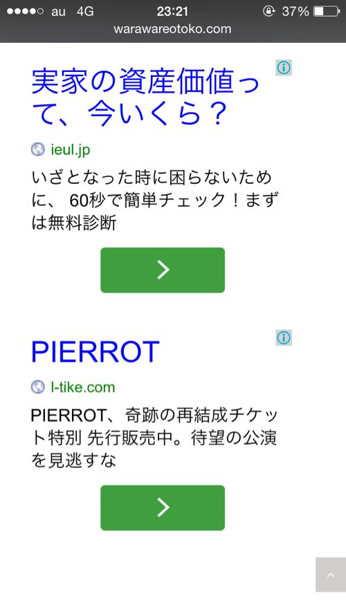
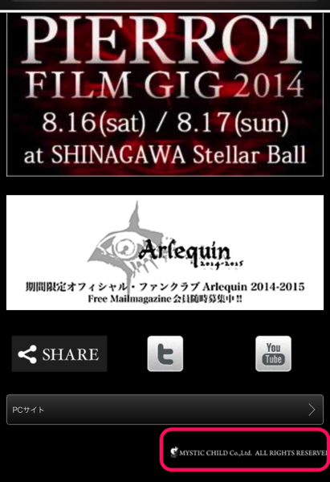
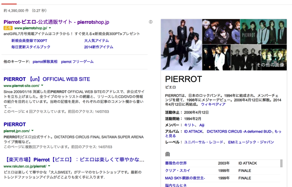
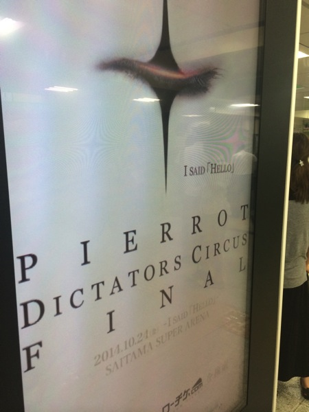
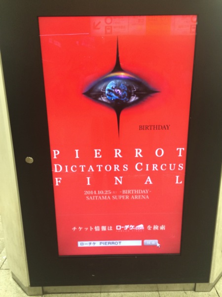
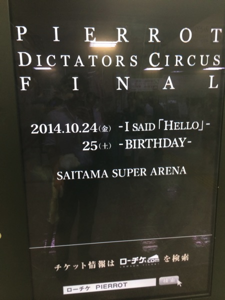
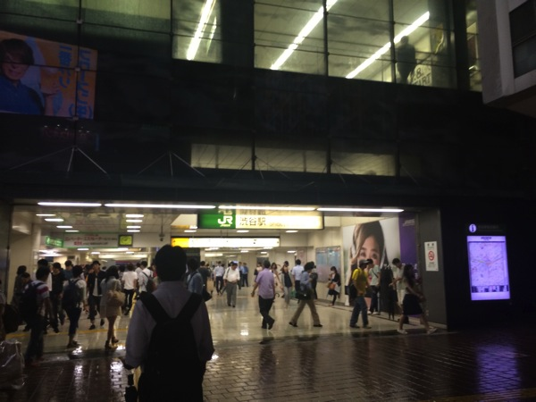

---
categories:
- PIERROT
date: Wed, 09 Jul 2014 16:31:43 +0000
slug: post-5842
tags:
- pierrot
title: おーいPIERROT公式が仕事しだしたぞーでも甘いぞーもしかしたらキリト破産かもねー
---

ハロー。しんぺー(<a href="https://twitter.com/s_s_p_y" target="_blank">@s_s_p_y</a> )です。

オフィより詳しくて、wikiよりも有用なsukekiyo情報サイト「Gadget Zombie Parasite」へようこそ。<!--more--><!--more-->
<h2>まずは！こいつをご覧いただこうか！</h2>

これはよくあるインターネットの広告です。下の方を見てください。我らが復活のPIERROTちゃんの広告です。

いや、正直今回の玉アリ(埼玉スーパーアリーナ)での復活ライブは正直キツイんじゃね？と思ってました。だって何にもメリットのないファンクラブ、高すぎるチケット、平日のLIVE。なぜこの三拍子を揃えた？

<h3>何にもメリットがないファンクラブ</h3>
疑問なのは、これはどこが運営しているのかってこと。
コピーライトにはミスティックチャイルドの文字があるけど、それってまだ存在しているの？

いろいろ調べたけど肝心のミスティックチャイルドに関しての記述が出てこない。これってなんでしたっけ？どなたか明確なソースお持ちの方教えてください〜

事務所であるスイートトランスの子会社かな？DIR EN GREYでいうところのフリーウィル内のsun-krad的な。多分そうだと思うんだけど

さらにググったらスイートチャイルド自体がすでにないっぽいんだよね。PIERROTとともに所属してたLUNA SEAも復活後は株式会社LUNA SEAが運営母体ぽいし、もうスイートチャイルドはないのだろう。ではなんで記載しているの？大人の事情？それとも過去との邂逅へのニクい演出ですか？なんとなくぼくは後者だと勝手に思います。

<h2>やっぱりPIERROT公式の仕事あめーわ</h2>
って思った記事に対して、割と賛同いただく声が多かったので、なんとなく安心したんですが。

過去の記事　→　<a href="https://www.warawareotoko.com/2014/06/26/post-5793/" target=”_blank”>復活のPIERROT非公開映像含むフィルムギグやるってよ！でもさPIERROTってさ活動の外枠がいつもイマイチだったよね！</a>

で、今回もまたあめーわって思いました。だって、こんなweb広告だしてチケット売れるとでも思ってますか？それなら武道館2daysとかさ。チケット高騰したとしても1日とかにすればよかったのに。だいたい、ファンクラブ急募した際の集まりを見ろよ。そんなに沢山集まってなかったやん。大規模に2日間でしかも高額なチケットでやらなければいけない理由があるんだろうけどさ。
おそらく収益的に黒字にならないんだと思うんすよ。それぐらいの規模でやらないと。でも、席が埋まるか微妙っていうこのPARADOX
だからあめーわって思った。

そして、この記事を書きだした際にオフィシャルサイトを見てかきかきしようとしてたんですけどね。PIERROTでググってトップにこないのよ。
くるのはこちら、PIERROTの<a href="http://www.pierrot-site.com" target=”_blank”>アンオフィシャルサイト</a>

で広告枠にくるのがPierrotっていう女性用のアパレル通販サイト(Pierrot)

おいおいおいおい、せっかく搾り取ってるんだからもっとちゃんと効果的に使ってくださいよ。SEO対策してちゃんとトップ表示されるようにしてよ。広告費かけるんならちゃんとPIERROTで検索したらでてくるように費用かけてくださいよ。マジで。いや、本当に。じゃないと売れるもんも売れないぜ？

無理矢理大きい会場でコンサートやろうとして失敗して、その結果解散したバンドが過去どんくらいいたよ？
このままじゃキリトが破産とかっていうことにもなっちゃうよ？

マジたのんます。

<h2>と、思ったら渋谷駅の電子広告（デジタルサイネージ）にPIERROTの広告</h2>
夕方ツイートを見て、帰りに探して撮影してきた。

場所はここ。JR渋谷駅のハチ公口

5分に1回切り替わるみたい。
ヘッドホン→なんか忘れた→なんか忘れた→サッカー→うる星やつら→ヤクルト→パルコ→ハーレー→SKⅡ→PIERROT
こんな感じのローテみたいです。

べったり改札前の柱と柱の間にたって待つのがおすすめです。けっこうカップルとかいて邪魔だから
<blockquote class="twitter-tweet" lang="ja">
とりあえずPIERROTの広告の邪魔なカップルに命ずる。滅せよ
&mdash; しんぺー@mode of GAUZE (@s_s_p_y) <a href="https://twitter.com/s_s_p_y/statuses/486846894476238849">2014, 7月 9</a></blockquote>

<h3>やっぱりPIERROT公式の仕事あめくねーかも</h3>

あめーとか言ってたけど、こんな興奮するような真似をしてくれるんだったら期待してもいいかも。

<h2>しんぺーはこう思った。</h2>
期待はしない。ただ、待つのみ。
たまに批判もするけれど。

けど、その指し示す方向に歩いて行きますわ。

やっぱりPIERROTの魅力って、きちが●っぷりを公然と衆目の中やってのけることだし、それによって自己肯定感を感じられるっていうこのグルーヴ感なんだと思う。

と言ったところで本日は以上になります。おやすみなさい。