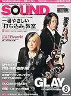

---
categories:
- sukekiyo
date: Fri, 11 Jul 2014 14:59:39 +0000
slug: post-5856
tags:
- sukekiyoまとめ
title: 今週のsukekiyoまとめ!7月6日〜11日（2014）
---

ハローしんぺー(<a href="https://twitter.com/s_s_p_y" target="_blank">@s_s_p_y</a> )です。
オフィより詳しくて、wikiよりも有用なsukekiyo情報サイト「Gadget Zombie Parasite」へようこそ。<!--more-->今週もほとんど動きなしのsukekiyoさんですが、一冊メンバー関連の雑誌がでましたのでご紹介。

<a href="http://www.amazon.co.jp/exec/obidos/ASIN/B00L87IUQ0/warawareotoko-22/ref=nosim/" rel="nofollow" target="_blank">SOUND DESIGNER (サウンドデザイナー) 2014年 08月号</a>
posted with <a href="http://kaereba.com" rel="nofollow" target="_blank">カエレバ</a>

 サウンド・デザイナー 2014-07-09    

<a href="http://www.amazon.co.jp/gp/search?keywords=SOUND%20DESIGNER&__mk_ja_JP=%83J%83%5E%83J%83i&tag=warawareotoko-22" rel="nofollow" target="_blank" title="アマゾン" >Amazon</a>

<a href="http://ck.jp.ap.valuecommerce.com/servlet/referral?sid=3041033&pid=882528283&vc_url=http%3A%2F%2Fshopping.search.yahoo.co.jp%2Fsearch%3FuIv%3Don%26ei%3DUTF-8%26tab_ex%3Dcommerce%26slider%3D0%26va%3DSOUND%2520DESIGNER" rel="nofollow"  target="_blank" title="Yahooショッピング" >Yahooショッピング</a>

<a href="http://ck.jp.ap.valuecommerce.com/servlet/referral?sid=3041033&pid=882660047&vc_url=http%3A%2F%2Fauctions.search.yahoo.co.jp%2Fsearch%3Fvo%3D%26ve%3D%26auccat%3D0%26aucminprice%3D%26aucmaxprice%3D%26aucmin_bidorbuy_price%3D%26aucmax_bidorbuy_price%3D%26loc_cd%3D0%26abatch%3D0%26istatus%3D0%26filtered%3D1%26ei%3DUTF-8%26tab_ex%3Dcommerce%26va%3DSOUND%2520DESIGNER" rel="nofollow"  target="_blank" title="ヤフオク!" >ヤフオク!</a>

今回はDIR EN GREYのマニピュレーターにしてsukekiyoのキーマンである匠の自前スタジオが写真付きで掲載されておりました。

以前匠自身の<a href="http://ameblo.jp/takumixofficial/image-11891711192-12998621730.html">ブログ</a>でも紹介されてましたのが、この雑誌です。

この部屋に京さんが来て、あれやこれやってしてたんのか〜www←
むっふふふ〜

ってことで撮影が入るからってこともあるとは思うけどめっさ整頓されていてきれいです。気になる人はぜひ雑誌を手にとってください。
ただ、どうもここは居住スペースというわけではなく、自宅と仕事場以外での仕事する場所みたいですね

まーそれにしても整理整頓されていて、無駄なものがなく、配置全てに意味がある！！みたいな部屋です。飾りはほとんどなく、実用性しかありませんwwwみたいな。

凄いです。

<h2>しんぺーはこう思った。</h2>
匠の財布も見てみたいわ。多分ピン札しか入ってなくて、1000円札数枚と5000円札みたいな構成で、10000円札は小銭がでるからもたない的な。そんな感じなんだろうなぁ。あとレシートも撮ってあって…

いや、んなわきゃないっか

くだらないこと言ってないで、寝ますね。
と言ったところで本日は以上になります。おやすみなさい。