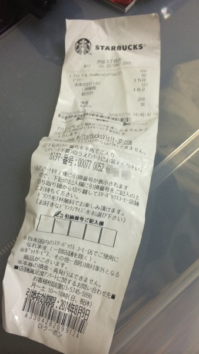
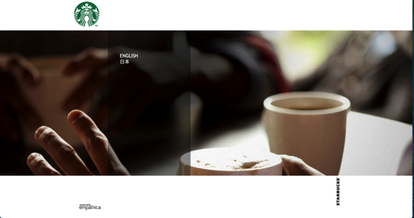
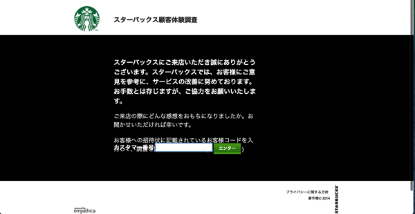
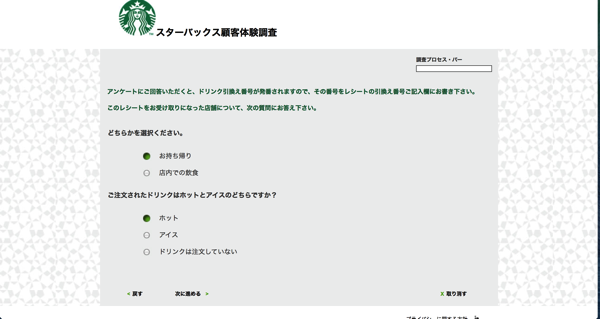
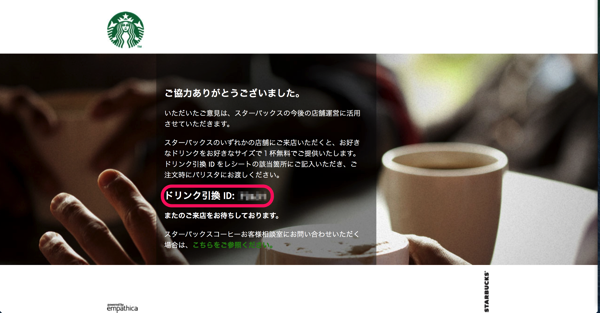
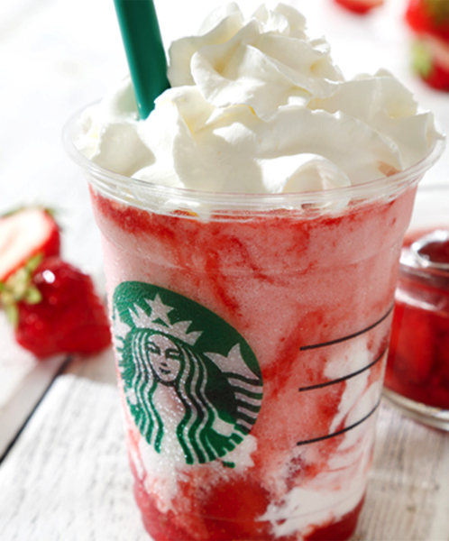

---
categories:
- グルメ
date: Thu, 10 Jul 2014 14:51:35 +0000
slug: post-5864
tags:
- スタバ
title: スタバのドリンクをただで飲める4つの方法
---

ハローしんぺー(<a href="https://twitter.com/s_s_p_y" target="_blank">@s_s_p_y</a> )です。
オフィより詳しくて、wikiよりも有用なsukekiyo情報サイト「Gadget Zombie Parasite」へようこそ。<!--more--><!--more-->スタバのドリンクってどんどん高くなってますよね〜
昔と比べるとフラペチーノなんて100円くらいかそれ以上は高くなってるんじゃないでしょうか。
にも関わらず人気は衰えない！という。ぼくも自主規制しなければ毎日行ってしまうので、ある程度今日は仕事がんばろうとかって気合いを入れる必要があるときのみ、行っていいというルールを敷いております。

さてさて、そんなスタバのドリンクをただで飲む方法があるのはご存知でしょうか？

ざっと次にあげる方法があるでしょう。

<ul>
	<li>タンブラー購入時についてくる無料券</li>
	<li>株主優待券</li>
	<li>e-Gift</li>
</ul>

こんなのがあげられるでしょう

<h2>スタバのドリンクをただで飲む方法</h2>

<h3>タンブラーについてくる無料券</h3>

スタバ好きなら必ず1つは持っているであろうタンブラー。これを購入した際に最初の1杯が無料になるクーポンがついてきます。

どんなカスタマイズもOK。ただし、タンブラーのサイズまでというルールがあります。グランデのタンブラーであれば、ベンティサイズのドリンクを注文することはできません。

<h3>株主優待券</h3>

スタバの株を持っていると好きなドリンクを無料で飲める券が優待としてもらえます。詳細は<a href="http://www.starbucks.co.jp/ir/yuutai.html">こちら</a>

カスタマイズもサイズもとくにルールはありません。ベンティで色々なカスタマイズが可能です。

ただし•••所有株式数に応じて、もらえる枚数が変わります。これがかなりの枚数をもっていないと有効ではないという。。。

株式数100枚〜499枚　ドリンク券2枚
500枚〜999枚　ドリンク券4枚
1000枚〜9999枚　ドリンク券10枚
10000枚以上　ドリンク券20枚

スタバの株は100枚単位での購入で、11万円です。（2014年7月11月<a href="http://stocks.finance.yahoo.co.jp/stocks/detail/?code=2712.t">終値</a>）
11万で1杯無料とかコスパが悪すぎますね。

<h3>e-Gift</h3>

これは電子クーポンです。人からプレゼントされるしかありませんw。
詳細はこちらの記事をどうぞ。

<a style="color:#0070C5;" href="https://www.warawareotoko.com/2014/06/17/post-5713/" target="_blank">お世話になってるフォロワーや離れた所にいるLIVE友達にちょっとした感謝を送るならスターバックスのe-Giftがオススメ | Gadget Zombie Parasite</a>  

e-Giftは500円までのドリンクしか飲めません。だいたいグランデサイズのドリンクをカスタマイズなしくらいでしょうか。

ざっとこんなもんでしょう。普通に無料で飲むにはこの３通りがあります。しかしながらたまにこんなレシートがでてくることがあります。

これに記載されているURLにアクセスして、アンケートに答えると4桁のコードが発行されます。それをレシートに記載して、店舗に持っていく<strong>どんなドリンクでも無料で</strong>注文することができます。もちろんメニューの範囲内ですけど。

<h2>スターバックスの顧客調査に協力してドリンク無料クーポンを手に入れよう</h2>

レシートに記載のURLにアクセスします。

こちらもレシートに記載されている番号を入力します。

いくつかの質問に回答していきます。けっこう項目が多くて10分くらいかかるかもしれません。またスマホサイトではなくPCサイトなので、スマホからだと回答しずらいです。

さて回答が終わるとコードが発行されます。これをレシートに記載して店舗に持って行きます。

<h2>しんぺーはこう思った。</h2>
どうでしょう！けっこうこれがでてくるのはレアです。ぼくも久しぶりにあたりました。1年以上ぶりくらいかな。

これを使って来週発売のストロベリーディライトフラペチーノを頼もうと思います！

と言ったところで本日は以上になります。おやすみなさい。