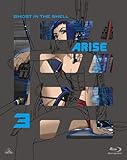
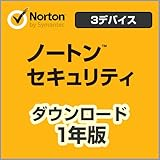
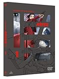
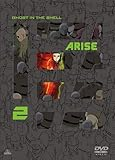
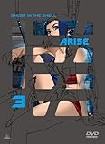

---
categories:
- アニメ
date: Sat, 12 Jul 2014 18:44:55 +0000
slug: post-5872
tags:
- 攻殻機動隊
title: 攻殻機動隊 ARISE boader3:「Ghost Tear」今回も発端はウィルス！次回もきっとウィルスだから少佐はそろそろノートンでも入れとけ
---

ハロー。しんぺー(<a href="https://twitter.com/s_s_p_y" target="_blank">@s_s_p_y</a> )です。

オフィより詳しくて、wikiよりも有用なsukekiyo情報サイト「Gadget Zombie Parasite」へようこそ。<!--more--><!--more-->
攻殻機動隊ファンとして、色々な感情がありつつもやっぱり見てきました。攻殻機動隊ARISE。

<h2>今回のあらすじ</h2>

はい、そんな攻殻機動隊ですが劇場公開はなんともう終わってます！

「え？まだ見てない！」とか思った方、ご安心召されよ。DVD、Blu-rayが今月発売いたします！ってめっちゃはえーんだな。

<a href="http://www.amazon.co.jp/exec/obidos/ASIN/B00GU51IYG/warawareotoko-22/ref=nosim/" rel="nofollow" target="_blank">攻殻機動隊ARISE (GHOST IN THE SHELL ARISE) 3 [Blu-ray]</a>
posted with <a href="http://kaereba.com" rel="nofollow" target="_blank">カエレバ</a>

坂本真綾 バンダイビジュアル 2014-07-25    

<a href="http://www.amazon.co.jp/gp/search?keywords=%8DU%8Ak%8B%40%93%AE%91%E0ARISE&__mk_ja_JP=%83J%83%5E%83J%83i&tag=warawareotoko-22" rel="nofollow" target="_blank" title="アマゾン" >Amazon</a>

<a href="http://ck.jp.ap.valuecommerce.com/servlet/referral?sid=3041033&pid=882528283&vc_url=http%3A%2F%2Fshopping.search.yahoo.co.jp%2Fsearch%3FuIv%3Don%26ei%3DUTF-8%26tab_ex%3Dcommerce%26slider%3D0%26va%3D%25E6%2594%25BB%25E6%25AE%25BB%25E6%25A9%259F%25E5%258B%2595%25E9%259A%258AARISE" rel="nofollow"  target="_blank" title="Yahooショッピング" >Yahooショッピング</a>

<a href="http://ck.jp.ap.valuecommerce.com/servlet/referral?sid=3041033&pid=882660047&vc_url=http%3A%2F%2Fauctions.search.yahoo.co.jp%2Fsearch%3Fvo%3D%26ve%3D%26auccat%3D0%26aucminprice%3D%26aucmaxprice%3D%26aucmin_bidorbuy_price%3D%26aucmax_bidorbuy_price%3D%26loc_cd%3D0%26abatch%3D0%26istatus%3D0%26filtered%3D1%26ei%3DUTF-8%26tab_ex%3Dcommerce%26va%3D%25E6%2594%25BB%25E6%25AE%25BB%25E6%25A9%259F%25E5%258B%2595%25E9%259A%258AARISE" rel="nofollow"  target="_blank" title="ヤフオク!" >ヤフオク!</a>

<h2>【ネタバレなし】あらすじ</h2>

今回は、前回からの続き
軍から独立して自らの舞台を持った素子であったが、任務の依頼は公安9課の荒巻からが主で、思う様な組織運用ができていなかった。それに対し荒巻は、正式なバックアップが欲しければ構成員を9人集めろとせまる。

そう、この時点ではまだトグサを除くサイボーグ化されたメンバーしかいなかった。なぜなら素子自身、最高スペックで構成された組織が最強と信じていたから。

そんな9課に舞い込んだ依頼が今回の主旨になります。

オフィシャルサイトにはこんな感じで書かれています。
<blockquote>

現場に急行し制圧するとテロリストたちはファイア・スターターと噂される超ウィザード級ハッカーにより偽の記憶が植え付けられ、更に主犯のカルディス人の胸にはかつてクザン共和国で起きたカルディス人独立戦争の英雄“スクラサス”のシンボルマークであるティアドロップ・ダガーの刺青が刻まれていた。それを見た素子は「スクラサスは戦争中に死んだはず」と断言する。

同じ頃、山の手のダムで起きた爆発でひとりの刑事が殺されていた。
その所持品には“人魚の脚（MERMAID’S LEGS）”という店名の名刺と、“エアリアル”というタグのついた義体の脚部が遺されていた。事件を捜査する新浜県警の刑事トグサは、クザン共和国水企業の代表者サイードにたどり着く。

引用元:攻殻機動隊ARISEオフィシャルサイト
</blockquote>

今回の話が特異な点としてあげられるには、素子の恋愛模様が中心にあるという所でしょうか。神山攻殻に関しては、すこーしだけ明示しない感じであったり、バトーとそうなのかしら〜？って感じなのはあったりしたし、原作は言うに及ばずですが、こんなフツーの恋愛シーンが描かれたのは初めてです。

<h2>【ネタバレ】以下ネタバレです。</h2>

<a href="http://www.amazon.co.jp/exec/obidos/ASIN/B00F5Q5XHO/warawareotoko-22/ref=nosim/" rel="nofollow" target="_blank">ノートン セキュリティ(Windows/Mac/Android/iOS対応) [ダウンロード]</a>
posted with <a href="http://kaereba.com" rel="nofollow" target="_blank">カエレバ</a>

 シマンテック 2013-09-20    

っつーか今回もウィルスだったわ〜まじで、前回も前々回もウィルスだったらから多分次回もウィルスでしょう？

いいかげん最後ウィルスに原因を押し付けるの勘弁して〜や。まじで、少佐ノートンでもいれとけや！

まじで。ネタバレのあらすじですが、戦時中少佐はスクラサスという架空の人物になって敵国の民衆を煽動して政府にゲリラ戦をしかけてて、それをウィルス化してばらまいてて、最後はそれにかかった人たちを粛正してたんだけど、恋人がそのウィルスにかかってて、さらにそのウィルスにかかった組織の残党もいて、その人たちと戦うっつー感じ？？先週の記憶なんで忘れてもうたけど、多分こんな感じ。ぶっちゃけARISEノストーリーってめっちゃくちゃ解りづらいんだよね。

でも結局はウィルスなんですよね。

<h2>しんぺーはこう思った。</h2>
とりあえず、攻殻機動隊のこれじゃない感がようやく慣れてきたところです。
今までで一番解りやすかったってか、理解できたわ。

それと全キャラが薄いよね。もっと濃くていいんじゃね？

頼むからこれでOVAとかやめてね。

それなら神山さんで3rdGIGでお願いします。
と言ったところで本日は以上になります。おやすみなさい。

<a href="http://www.amazon.co.jp/exec/obidos/ASIN/B00BB1OBG6/warawareotoko-22/ref=nosim/" rel="nofollow" target="_blank">攻殻機動隊ARISE (GHOST IN THE SHELL ARISE) 1 [DVD]</a>
posted with <a href="http://kaereba.com" rel="nofollow" target="_blank">カエレバ</a>

坂本真綾 バンダイビジュアル 2013-07-26    

<a href="http://www.amazon.co.jp/gp/search?keywords=%8DU%8Ak%8B%40%93%AE%91%E0ARISE&__mk_ja_JP=%83J%83%5E%83J%83i&tag=warawareotoko-22" rel="nofollow" target="_blank" title="アマゾン" >Amazon</a>

<a href="http://ck.jp.ap.valuecommerce.com/servlet/referral?sid=3041033&pid=882528283&vc_url=http%3A%2F%2Fshopping.search.yahoo.co.jp%2Fsearch%3FuIv%3Don%26ei%3DUTF-8%26tab_ex%3Dcommerce%26slider%3D0%26va%3D%25E6%2594%25BB%25E6%25AE%25BB%25E6%25A9%259F%25E5%258B%2595%25E9%259A%258AARISE" rel="nofollow"  target="_blank" title="Yahooショッピング" >Yahooショッピング</a>

<a href="http://ck.jp.ap.valuecommerce.com/servlet/referral?sid=3041033&pid=882660047&vc_url=http%3A%2F%2Fauctions.search.yahoo.co.jp%2Fsearch%3Fvo%3D%26ve%3D%26auccat%3D0%26aucminprice%3D%26aucmaxprice%3D%26aucmin_bidorbuy_price%3D%26aucmax_bidorbuy_price%3D%26loc_cd%3D0%26abatch%3D0%26istatus%3D0%26filtered%3D1%26ei%3DUTF-8%26tab_ex%3Dcommerce%26va%3D%25E6%2594%25BB%25E6%25AE%25BB%25E6%25A9%259F%25E5%258B%2595%25E9%259A%258AARISE" rel="nofollow"  target="_blank" title="ヤフオク!" >ヤフオク!</a>

<a href="http://www.amazon.co.jp/exec/obidos/ASIN/B00DIOMBDO/warawareotoko-22/ref=nosim/" rel="nofollow" target="_blank">攻殻機動隊ARISE (GHOST IN THE SHELL ARISE) 2 [DVD]</a>
posted with <a href="http://kaereba.com" rel="nofollow" target="_blank">カエレバ</a>

坂本真綾 バンダイビジュアル 2013-12-25    

<a href="http://www.amazon.co.jp/gp/search?keywords=%8DU%8Ak%8B%40%93%AE%91%E0ARISE&__mk_ja_JP=%83J%83%5E%83J%83i&tag=warawareotoko-22" rel="nofollow" target="_blank" title="アマゾン" >Amazon</a>

<a href="http://ck.jp.ap.valuecommerce.com/servlet/referral?sid=3041033&pid=882528283&vc_url=http%3A%2F%2Fshopping.search.yahoo.co.jp%2Fsearch%3FuIv%3Don%26ei%3DUTF-8%26tab_ex%3Dcommerce%26slider%3D0%26va%3D%25E6%2594%25BB%25E6%25AE%25BB%25E6%25A9%259F%25E5%258B%2595%25E9%259A%258AARISE" rel="nofollow"  target="_blank" title="Yahooショッピング" >Yahooショッピング</a>

<a href="http://ck.jp.ap.valuecommerce.com/servlet/referral?sid=3041033&pid=882660047&vc_url=http%3A%2F%2Fauctions.search.yahoo.co.jp%2Fsearch%3Fvo%3D%26ve%3D%26auccat%3D0%26aucminprice%3D%26aucmaxprice%3D%26aucmin_bidorbuy_price%3D%26aucmax_bidorbuy_price%3D%26loc_cd%3D0%26abatch%3D0%26istatus%3D0%26filtered%3D1%26ei%3DUTF-8%26tab_ex%3Dcommerce%26va%3D%25E6%2594%25BB%25E6%25AE%25BB%25E6%25A9%259F%25E5%258B%2595%25E9%259A%258AARISE" rel="nofollow"  target="_blank" title="ヤフオク!" >ヤフオク!</a>

<a href="http://www.amazon.co.jp/exec/obidos/ASIN/B00GU51IW8/warawareotoko-22/ref=nosim/" rel="nofollow" target="_blank">攻殻機動隊ARISE (GHOST IN THE SHELL ARISE) 3 [DVD]</a>
posted with <a href="http://kaereba.com" rel="nofollow" target="_blank">カエレバ</a>

坂本真綾 バンダイビジュアル 2014-07-25    

<a href="http://www.amazon.co.jp/gp/search?keywords=%8DU%8Ak%8B%40%93%AE%91%E0ARISE&__mk_ja_JP=%83J%83%5E%83J%83i&tag=warawareotoko-22" rel="nofollow" target="_blank" title="アマゾン" >Amazon</a>

<a href="http://ck.jp.ap.valuecommerce.com/servlet/referral?sid=3041033&pid=882528283&vc_url=http%3A%2F%2Fshopping.search.yahoo.co.jp%2Fsearch%3FuIv%3Don%26ei%3DUTF-8%26tab_ex%3Dcommerce%26slider%3D0%26va%3D%25E6%2594%25BB%25E6%25AE%25BB%25E6%25A9%259F%25E5%258B%2595%25E9%259A%258AARISE" rel="nofollow"  target="_blank" title="Yahooショッピング" >Yahooショッピング</a>

<a href="http://ck.jp.ap.valuecommerce.com/servlet/referral?sid=3041033&pid=882660047&vc_url=http%3A%2F%2Fauctions.search.yahoo.co.jp%2Fsearch%3Fvo%3D%26ve%3D%26auccat%3D0%26aucminprice%3D%26aucmaxprice%3D%26aucmin_bidorbuy_price%3D%26aucmax_bidorbuy_price%3D%26loc_cd%3D0%26abatch%3D0%26istatus%3D0%26filtered%3D1%26ei%3DUTF-8%26tab_ex%3Dcommerce%26va%3D%25E6%2594%25BB%25E6%25AE%25BB%25E6%25A9%259F%25E5%258B%2595%25E9%259A%258AARISE" rel="nofollow"  target="_blank" title="ヤフオク!" >ヤフオク!</a>

