---
categories:
- DIR EN GREY
date: Tue, 15 Jul 2014 16:59:27 +0000
slug: post-5907
tags:
- DIR EN GREY
title: DIR EN GREY LIVE DVD&Blu-ray「DUM SPIRO SPERO AT NIPPON BUDOKAN」ついに発売！新宿YUNIKA
  VISIONとタワレコパネル展行ってきた！あの感動をもう一度【ネタバレなし】
---

ハローしんぺー(<a href="https://twitter.com/s_s_p_y" target="_blank">@s_s_p_y</a> )です。
オフィより詳しくて、wikiよりも有用なsukekiyo情報サイト「Gadget Zombie Parasite」へようこそ。<!--more--><!--more-->日付変わっちゃったけど、今日は何の日？蜉蝣大祐の命日。

そしてDIR EN GREYの映像作品の発売前日。

っつーことで、あの感動の2夜を映像化したDVDがついに発売されます。
ぼくはAmazonでフライングゲットしておりましたので、すでにちょこっと見ておりました。

今回のDVDが単なるLIVE映像の記録ではないことは、周知の事実。
まず初回版に含まれている豪華アーティストによるリメイクバージョンのDUM SPIRO SPERO。むしろDVDが、このCDの付録なんじゃないかという感じすらします。

こちらはシンフォニックやら、ゲストやらなんやらで実はまだ聞いておりません。明日以降レビューしたいと思います。。。ま、今日はフラゲだしね。

ってことで事前情報というかキャンペーン的な動きが東京オンリーだったので、地方勢のために書いておきます。

<h2>新宿YUNIKA VISON</h2>

これ、初めて知ったけど新宿のヤマダ電機の所の街頭ビジョンのことなのね。

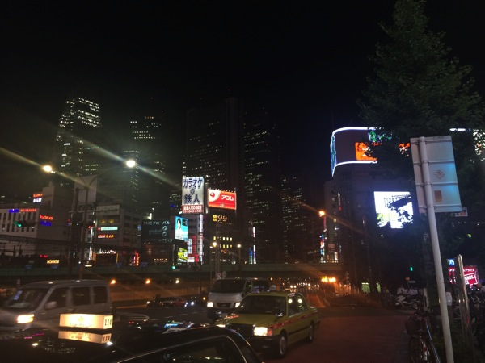

<iframe width="425" height="350" frameborder="0" scrolling="no" marginheight="0" marginwidth="0" src="https://maps.google.co.jp/maps?f=q&amp;source=s_q&amp;hl=ja&amp;geocode=&amp;q=%E6%9D%B1%E4%BA%AC%E9%83%BD%E6%96%B0%E5%AE%BF+%E3%83%A4%E3%83%9E+%E3%83%80+%E9%9B%BB%E6%A9%9F&amp;aq=0&amp;oq=%E6%96%B0%E5%AE%BF%E3%80%80%E3%83%A4%E3%83%9E%E3%83%80&amp;sll=35.693544,139.700679&amp;sspn=0.002684,0.004801&amp;brcurrent=3,0x60188cdc1d00b42d:0x2b06aa45928dbab5,0&amp;ie=UTF8&amp;hq=%E6%9D%B1%E4%BA%AC%E9%83%BD%E6%96%B0%E5%AE%BF+%E3%83%A4%E3%83%9E+%E3%83%80+%E9%9B%BB%E6%A9%9F&amp;hnear=&amp;radius=15000&amp;ll=35.693316,139.700744&amp;spn=0.010735,0.019205&amp;t=m&amp;z=14&amp;iwloc=A&amp;cid=12235949137163136523&amp;output=embed"></iframe> <small>より大きな地図で <a href="https://maps.google.co.jp/maps?f=q&amp;source=embed&amp;hl=ja&amp;geocode=&amp;q=%E6%9D%B1%E4%BA%AC%E9%83%BD%E6%96%B0%E5%AE%BF+%E3%83%A4%E3%83%9E+%E3%83%80+%E9%9B%BB%E6%A9%9F&amp;aq=0&amp;oq=%E6%96%B0%E5%AE%BF%E3%80%80%E3%83%A4%E3%83%9E%E3%83%80&amp;sll=35.693544,139.700679&amp;sspn=0.002684,0.004801&amp;brcurrent=3,0x60188cdc1d00b42d:0x2b06aa45928dbab5,0&amp;ie=UTF8&amp;hq=%E6%9D%B1%E4%BA%AC%E9%83%BD%E6%96%B0%E5%AE%BF+%E3%83%A4%E3%83%9E+%E3%83%80+%E9%9B%BB%E6%A9%9F&amp;hnear=&amp;radius=15000&amp;ll=35.693316,139.700744&amp;spn=0.010735,0.019205&amp;t=m&amp;z=14&amp;iwloc=A&amp;cid=12235949137163136523" style="color:#0000FF;text-align:left">新宿駅</a> を表示</small>

それでは撮影してきた写真をどうぞ。

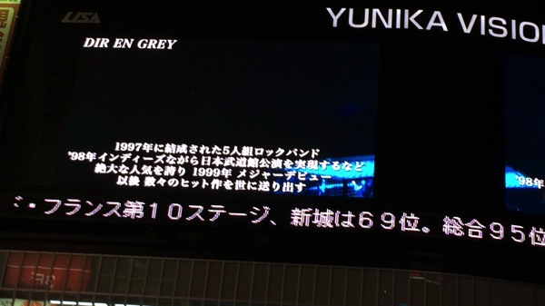

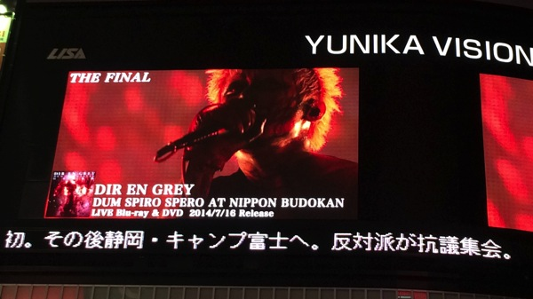

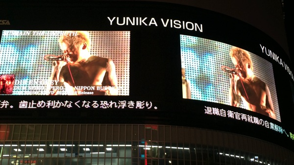

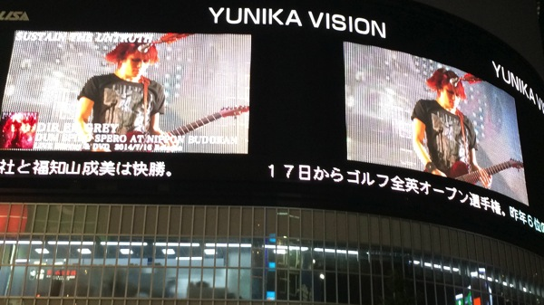

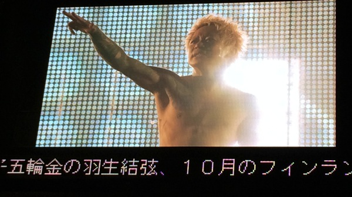

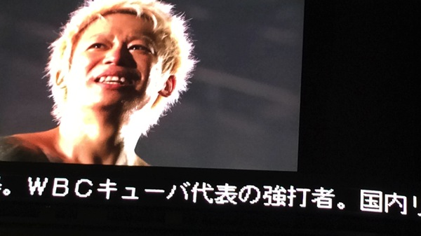

<h3>YUNIKA撮影時の注意事項</h3>

ぼくは重大なミスをおかしました。YUNIKAビジョンは3面スクリーンで、それぞれ映し出す映像がことなります。というか横長の画像は3面を使って映し出されるため、1面しか見えない要は恥じっこだと向こう側が見えないことになります。

ということで、くれぐれもポジションに注意してください。
ヤマダ電機がこういう風に見える位置だとベストかと思います。

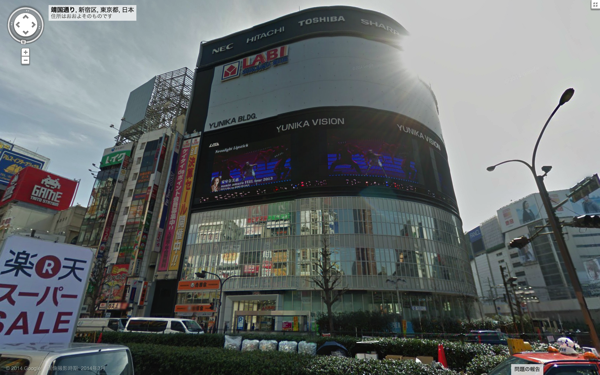

<h2>タワレコのDIR EN GREYパネル展も行ってきたぜ</h2>

<h3>まずは渋谷タワレコ</h3>

解りにくかったー3階の壁の上でした。エスカレーター上ったら、そのまま壁にそっていけば左手にあります。

こちらは初日の方の写真です。京のメイク画像はこちらです。
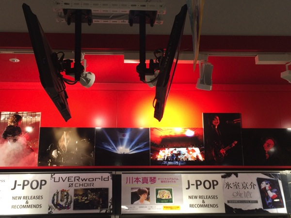

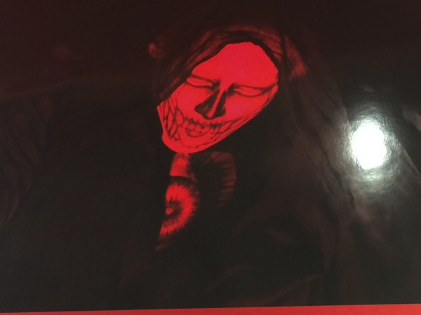

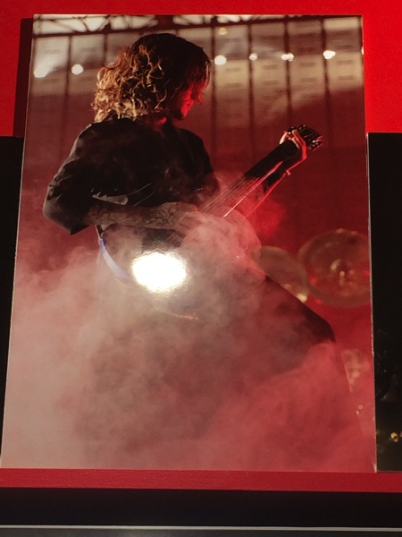

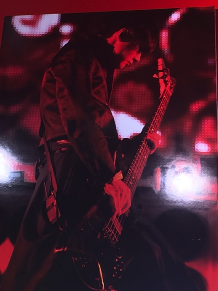

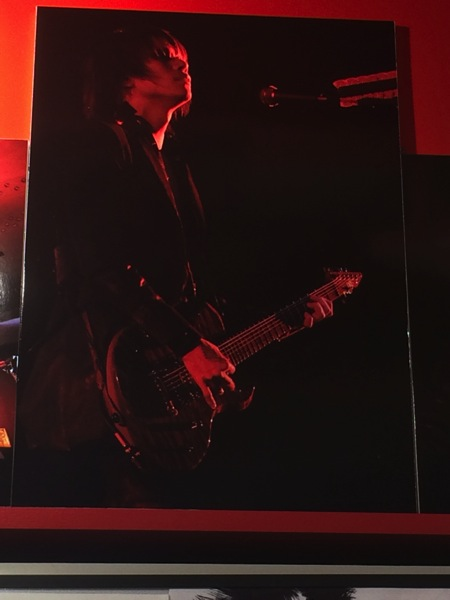

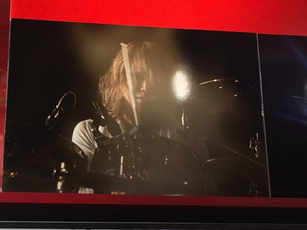

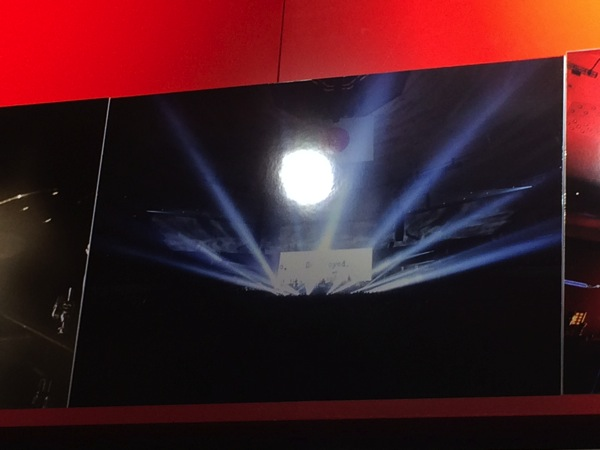

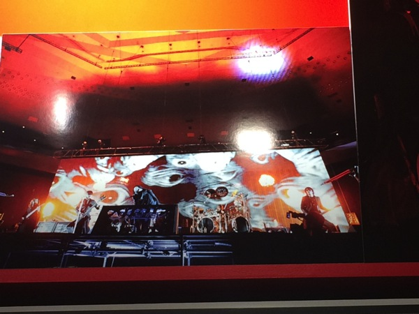

<h3>次に新宿タワレコ</h3>

こっちはインストイベントやるときの仕切り付近にありました。
割とでかでかと看板があったので解りやすい
ちなみに新宿の方は3月9日の方の写真です。

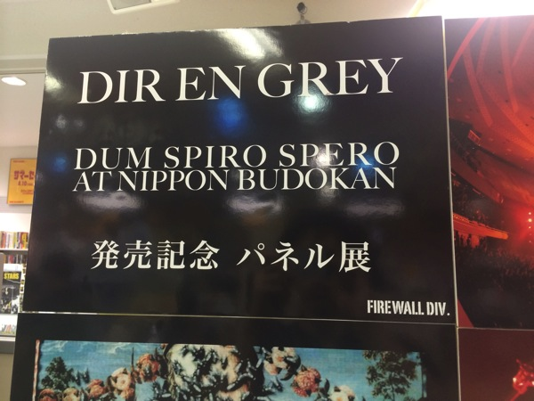

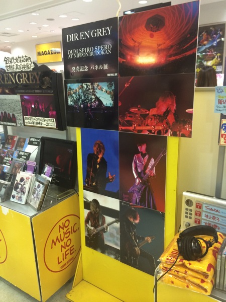

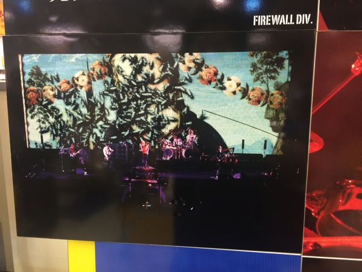

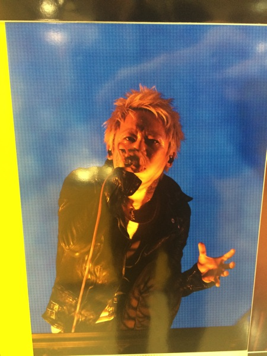

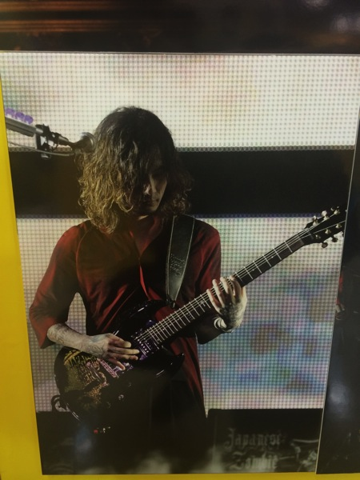

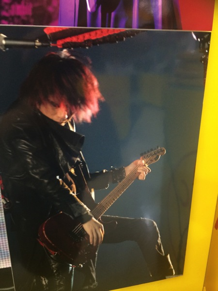

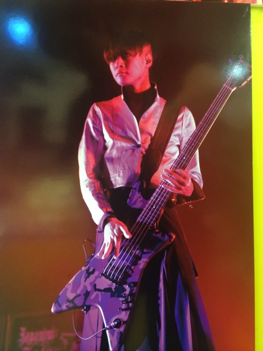

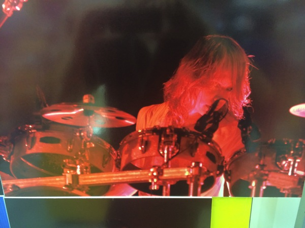

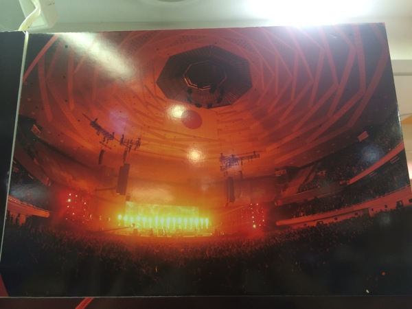

<h2>しんぺーはこう思った。</h2>
はい、ざっと画像だけですけどこんな所です。

思えば、全部東京のみでの展開だったんですね。関西のタワレコでもやってるかと思いました。

明日以降で、YUNIKA VISIONの動画もあげるつもりです。チャンスがあれば正式アングルで一眼レフで動画撮ってきたいなぁ。

それと今日は時間がなくてボーナスディスクしか見られませんでした。
というかLIVE DVDは必ずボーナスから見るのがぼくの流儀w

井上さんの苦闘が描かれています。（テスラコイル）会報誌と合わせて見ると、目頭が熱くなります。彼もまたDIR EN GREYなのです。

そして、コマが変わるたびに太って行く姿が心配です。
と言ったところで本日は以上になります。おやすみなさい。

<a href="http://www.amazon.co.jp/exec/obidos/ASIN/B00JVX7EHY/warawareotoko-22/ref=nosim/" rel="nofollow" target="_blank">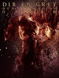</a>

<a href="http://www.amazon.co.jp/exec/obidos/ASIN/B00JVX7EHY/warawareotoko-22/ref=nosim/" rel="nofollow" target="_blank">DUM SPIRO SPERO AT NIPPON BUDOKAN(初回生産限定盤) [DVD]</a>
posted with <a href="http://kaereba.com" rel="nofollow" target="_blank">カエレバ</a>

DIR EN GREY SMD jutaku(SME)(D) 2014-07-16    

<a href="http://www.amazon.co.jp/exec/obidos/ASIN/B00JVX7EBA/warawareotoko-22/ref=nosim/" rel="nofollow" target="_blank">DUM SPIRO SPERO AT NIPPON BUDOKAN(初回生産限定盤) [Blu-ray]</a>
posted with <a href="http://kaereba.com" rel="nofollow" target="_blank">カエレバ</a>

DIR EN GREY SMD jutaku(SME)(D) 2014-07-16    

