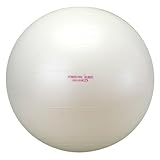

---
categories:
- ライフハック
date: Wed, 16 Jul 2014 13:59:56 +0000
slug: post-5911
tags:
- ダイエット
title: 会社のイスをバランスボールに変えて1ヶ月経って気がついたメリットデメリット
---

ハロー。しんぺー(<a href="https://twitter.com/s_s_p_y" target="_blank">@s_s_p_y</a> )です。

オフィより詳しくて、wikiよりも有用なsukekiyo情報サイト「Gadget Zombie Parasite」へようこそ。<!--more--><!--more-->
夏に向けてダイエットをしなければと思っております。週3回はランニングして、寝る前には腹筋背筋腕立てをして、今は割としまった体になってる•••予定でした。しかしながら、何かに理由つけてはいつの間にか筋トレを怠る日々。。。

そこで、体幹を鍛えられるってことで会社の椅子をバランスボールにしてみました。

<a href="http://www.amazon.co.jp/exec/obidos/ASIN/B00188ZIR8/warawareotoko-22/ref=nosim/" rel="nofollow" target="_blank">ALINCO(アルインコ) エクササイズボール 65cm EXG025</a>
posted with <a href="http://kaereba.com" rel="nofollow" target="_blank">カエレバ</a>

 ALINCO(アルインコ) 2012-04-05    

今回は、その1ヶ月経過レポートだす。

<h2>バランスボールのメリット</h2>
<ul>
<li>腰痛がなくなった！</li>

<li>眠くなくなった！</li>
</ul>

<h3>腰痛がなくなった！</h3>

今までのぼくの椅子への座り方が悪かったんだと思うんですが、普通の椅子だと体をねじって座っていたため、腰痛に悩まされておりました。

しかしながら、バランスボールに座ることで姿勢が正しくなり、重心が保たれ、その結果体の歪みが軽減して腰痛も解消されました。

社内のマッサージ室の先生にも歪みが治ってきたと言われました。

効果ありです。

<h3>眠くなくなった！</h3>

これは思わぬ効果でした。今まではお昼を食べた後もれなく眠くなって、ひどい時には痙攣するほど眠くて眠くて•••
その結果、エナジードリンク飲みまくりコーヒー飲みまくりで胃腸もやられていました。

ところがバランスボールに座るようになってからというもの、それまでの様な深刻な眠気がほぼなくなりました。

そして、エナジードリンク系をがぶ飲みすることも少なくなり、胃腸が大変穏やかです。

<h2>バランスボールのデメリット</h2>

<ul>
<li>ボールを固定しておかないと席を立った時迷惑</li>
<li>膝への激痛</li>
</ul>

<h3>ボールを固定しておかないと席を立った時迷惑</h3>

ボールが転がりますので、目を離すと通路まで転がってたりします。
それと今までは使っていた椅子をどうするかとか主にスペース的な問題が生じています。

とりあえずの解決策として、席を立つ時は何か物で固定するようにしています。それでもコロコロと転がり出すことがあって、通る人があからさまに迷惑そうな顔をしています。

<h3>膝への激痛</h3>

バランスボールのせいかは定かではありませんが、膝に激痛が走り歩くのも痛いくらいな時がありました。

恐らく普段しない様な動作で、バランスボールに座っているためでしょう•••わかりませんが

痛いなー痛いなーと思ってたら歩くのもやっとでした。もう治りましたけどね。

<h2>しんぺーはこう思った。</h2>

あ、そうそう肝心のダイエット的な要素ですが体重変動は一切ありませんでした。ウェストも細くなったとか腹筋が付いたきがするとかの変化もありません。

はっきり言って、眠気がなくなった以上のメリットは感じられません。

ただし、眠気がなくなったために、糖分たっぷりのエナジードリンクを摂取しなくなり、結果的にダイエットになってという可能性があるかもしれませんが

どちらにしろ、もうしばらく経過を見たいと思います。

といったところで、本日は以上です。おやすみなさい。

<a href="http://www.amazon.co.jp/exec/obidos/ASIN/B00188ZIR8/warawareotoko-22/ref=nosim/" rel="nofollow" target="_blank">ALINCO(アルインコ) エクササイズボール 65cm EXG025</a>
posted with <a href="http://kaereba.com" rel="nofollow" target="_blank">カエレバ</a>

 ALINCO(アルインコ) 2012-04-05    

