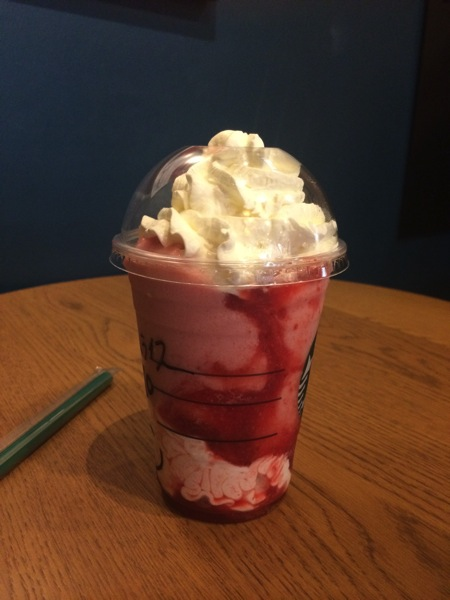
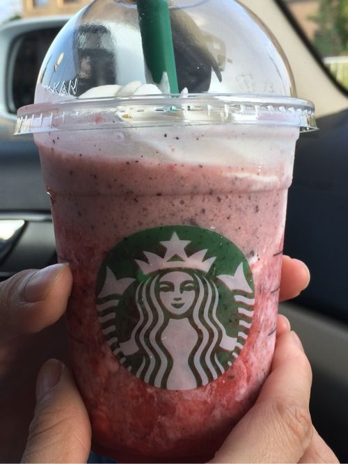
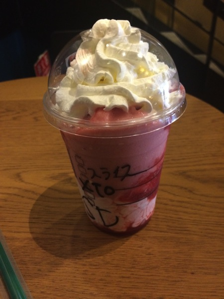

---
categories:
- グルメ
date: Thu, 17 Jul 2014 15:38:38 +0000
slug: post-5920
tags:
- スタバ
title: スタバ夏の新作「ストロベリーディライトフラペチーノ」は甘過ぎずほのかな酸味でおいしい
---

ハローしんぺー(<a href="https://twitter.com/s_s_p_y" target="_blank">@s_s_p_y</a> )です。
オフィより詳しくて、wikiよりも有用なsukekiyo情報サイト「Gadget Zombie Parasite」へようこそ。<!--more--><!--more-->昨日、スタバの新作ドリンクの販売がスタートしました。
先日ご紹介した<a href="https://www.warawareotoko.com/2014/07/10/post-5864/">スタバのドリンクをただで飲む方法</a>を使って、さっそく飲んできました。

<a style="color:#0070C5;" href="https://www.warawareotoko.com/2014/07/30/post-5990/" target="_blank">スタバ新作のストロベリーディライトフラペチーノやっぱり売り切れ！再販は8月2日から！ | Gadget Zombie Parasite</a> <strong>さっそく売り切れてたけど、再販決定</strong>  

<h2>ストロベリーディライトフラペチーノはそんなに甘くない！</h2>

ストロベリーフラペチーノの値段
<ul>
	<li>トール　590円</li>
	<li>グランデ　630円</li>
	<li>ベンティ　670円</li>
</ul>

記載はないですけど、ショートも注文することができます。

例年であればストロベリークリームフラペチーノという名称で、少しクリーミーなイチゴ牛乳ちっくな味でした。しかしながら、今年はイチゴの果肉とストロベリーホイップクリームで酸っぱさを加えて全く新しいドリンクに生まれ変わっています。
甘くてフラペチーノは、いつも一口でごちそうさまという人にもお勧めできます。しかも、熱い中甘ったるいものは勘弁という人にも、ぴったりなほのかな酸っぱさです。

それと気になるカロリーは<a href="http://www.starbucks.co.jp/assets/images/web2/images/allergy/pdf/allergen-beverage.pdf">こちら</a>

<ul>
	<li>ショート　345Kcal</li>
	<li>トール　417Kcal</li>
	<li>グランデ　535Kcal</li>
	<li>ベンティ　591Kcal</li>
</ul>

まぁこんなもんでしょう！飲んだら動け！

<h3>カスタマイズ情報</h3>

ちなみにストロベリー多めというカスタマイズはOKでした。
中のストロベリーホイップの増量はだめでした。

そこまで甘くない、というか甘さが割と弱めなのでストロベリーは増量した方がいいかもしれません。

<blockquote class="twitter-tweet" lang="ja">
スタバのストロベリーディライトフラペチーノ今日カスタマイズでオーダーしようとしたら、材料に限りがあるので不可と言われたー。。。
&mdash; しんぺー@mode of GAUZE (@s_s_p_y) <a href="https://twitter.com/s_s_p_y/statuses/490544717868711937">2014, 7月 19</a></blockquote>

もしかしたら店舗によっては対応違うかもしれない。。。

なお、チョコチップ入れてアポロチョコみたいにしても美味しかった。プラス50円

<h3>バナナの時みたいに売り切れない？</h3>

バナナが人気すぎたのか、そこから勉強して在庫豊富にしたのかはわかりませんが、パートナー（店員）さんに聞いたら「ちゃんと夜まで提供できるくらいの量を用意しているので大乗です。」とのことです。

【追記】7/21 17:00 ドライブスルーの店舗に行ったけど売り切れてなかった

<h2>しんぺーはこう思った。</h2>

前回のクッキーフラペチーノがただの毒ガスなみに咳き込ませられるドリンクだったんで、それに比べるとすげー美味しいです。

酸っぱさと甘さがほどよく、、といいつつイチゴ増量したんですけど、多分それくらいがちょうどいいと思います。

とにかく一度飲んでみることをおすすめしますぜ。だんな。

なんか似ている。。。

と言ったところで本日は以上になります。おやすみなさい。