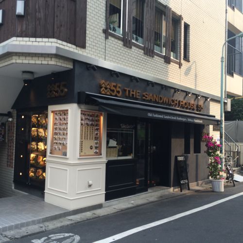
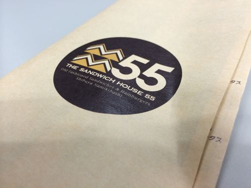
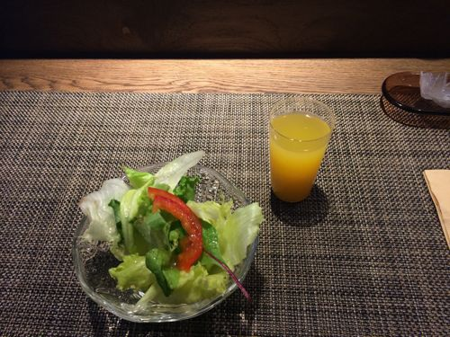
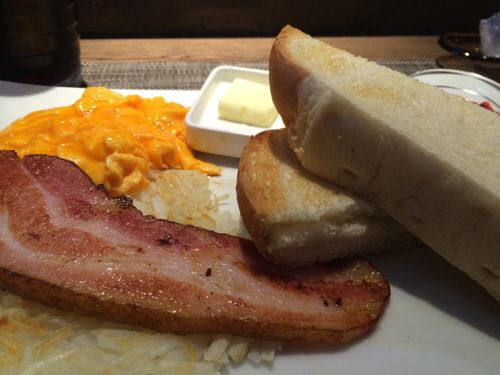
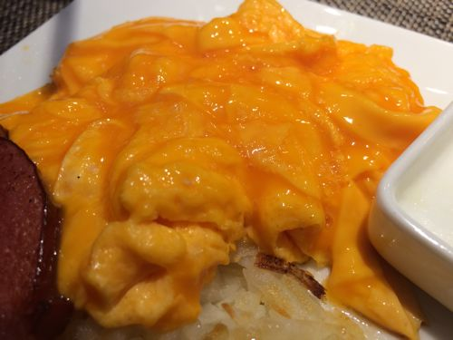

---
categories:
- グルメ
date: Wed, 23 Jul 2014 00:10:53 +0000
slug: post-5966
tags:
- 渋谷新南口グルメ
title: 【渋谷新南口グルメ】オープンしたての「THE SANDWICH HOUSE 55」で880円のモーニングで心穏やかな朝食
---

ハロー。しんぺー(<a href="https://twitter.com/s_s_p_y" target="_blank">@s_s_p_y</a> )です。

オフィより詳しくて、wikiよりも有用なsukekiyo情報サイト「Gadget Zombie Parasite」へようこそ。
<!--more-->
<!--more-->

この界隈では1番新しいお店「THE SANDWICH HOUSE55」が前から気になってたので、今朝通りすがりにふらふらーと入ってみた。

<strong><a href="http://tabelog.com/tokyo/A1303/A130301/13170625/" target="_blank">THE SANDWICH HOUSE 55</a></strong>

<strong>関連ランキング：</strong><a href="http://tabelog.com/rstLst/SC0102/">サンドイッチ</a> | <a href="http://tabelog.com/tokyo/A1303/A130301/R4698/rstLst/">渋谷駅</a>、<a href="http://tabelog.com/tokyo/A1303/A130303/R5661/rstLst/">代官山駅</a>

落ち着いた雰囲気で清潔感のあるお店。シェフって感じのヒゲのおじ様ら3人で朝のお店を切り盛りしておりました。

サンドウィッチハウスといいつつ、普通の軽食というよりは、忙しい中でたまにいって落ち着ける感じです。

モーニングは基本880円で、ベーコンとか色々追加していくと+50円くらいずつしていきます。ちなみに、ぼくはこの課金システムを理解してなかったので1000円近くになった（汗

ベーコンが厚くてジューシー。あとポテトも程よいカリカリ感

それとこれ黄金に輝く半熟の卵

<h2>しんぺーはこう思った。</h2>

全体的にゆったりとした雰囲気で、注文から出来上がり、そして量が割とあるので食べ終わるまで時間がかかります。

そのため、モーニングで行くなら「少し早く会社についた」とか「朝リラックスしたい」といった場合はオススメです。

時間がないかたには不向きかなと思いました。

次は昼間行ってみたいと思います！

といったところで、本日は以上です。おやすみなさい。