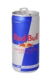

---
categories:
- ライフハック
date: Thu, 24 Jul 2014 16:31:06 +0000
slug: post-5979
tags:
- 早く帰りたい
title: 会社から早く帰りたい人のために。だったら出勤を早くしてみようぜ
---

ハローしんぺー(<a href="https://twitter.com/s_s_p_y" target="_blank">@s_s_p_y</a> )です。
オフィより詳しくて、wikiよりも有用なsukekiyo情報サイト「Gadget Zombie Parasite」へようこそ。<!--more--><!--more-->毎日毎日、急いで目の前の仕事を片付けようとしても、どうしても帰りが遅くなってしまう人よ。だったら出勤時間を早くしてみてはいかがでしょうか？

このブログ、最初ぼくの異動回数が多いことから、同じように異動を言い渡された人への救済にもなればなーとか思って作った側面もあったり
そして、そのあたりの要素からこんな記事も書いたりしてます。

どうしても早く帰りたい人におくる会社からの5つの脱出方法 | Gadget Zombie Parasite  

ほんで、今日はその関連記事を書きたいと思います。

<h2>30分早く出社してみよう</h2>

30分早く出社して、その日のタスク整理と大まかなタイムスケジュールを組んでみてはいかがでしょうか？

タスク整理とスケジュールを決めたらそれをなるべく消化することに基軸をおいて、その日を過ごしましょう。

ちっとはマシになるかもしれませんよ？

<h2>1時間早く出社してみましょう</h2>

30分よりも少しハードルが高いかもしれません。普段朝食を食べてから出かける人は朝食を会社で食べるようにすれば、スムーズに1時間早く家を出られるかもしれません。

1時間早ければ1時間早く帰れる？違います。

朝1時間早く出社すると、おそらくほとんどの人が出社していません。
いても数名です。

そうなると凄まじい集中力が発揮されて1時間も2時間にも相当する集中力が発揮できるでしょう。

ということで、この方法をおすすめします。

<h2>始発で出社してみましょう</h2>

もし、どうしても早く帰りたくて、どうしても終えられないような仕事量なら気合いで始発で出社しましょう。
冬なら真っ暗で、超寒いはずw

毎日始発ってのは無理かと思いますが、緊急時には試してもいいのではないでしょうか。

とくに夏休みなんかをとるのが決まっていて、どうしても今日中に仕事を片付けて、その日の飛行機に乗らなきゃとかっていう状況なら選択の余地はありません。

これで乗り切りましょう！

<h2>始発よりも前に出社してみましょう</h2>

ぼくは新入社員の時に1度だけやったことがあります。
始発よりも前にどうやってと思うかもしれませんが、ぼくは当時バイクに乗っていたため、電車が動く前にバイクで会社に来ました。

たしか4時くらいだったかな

どうしても早く帰りたかったのと、どうしても終わらない量の仕事があったので、選んだ選択でした。

しかし•••想定外の問題が

なんとビルのセキュリティの関係上ある時間をすぎないとエレベーターすら動かない！！

ということで、この方法を実行にするには、セキュリティの解除の仕方を知っておく必要があります。

<h2>しんぺーはこう思った。</h2>
会社によっては、ある時間よりも前に出社することを禁じているところもあると思います。
それは労務上、セキュリティ上の関係からです。

とはいえ、今まで挙げてきたような理由からどうしても早く帰りたいっていう状況があるはずです。

そんな時は、いつもよりも出社時間を変えてみるっていう選択をしてみるのもいいんではないでしょうか。

と言ったところで本日は以上になります。おやすみなさい。

<a href="http://www.amazon.co.jp/exec/obidos/ASIN/B005N4X6M2/warawareotoko-22/ref=nosim/" rel="nofollow" target="_blank">レッドブル(Red Bull) エナジードリンク 185ml×24本(1ケース)</a>
posted with <a href="http://kaereba.com" rel="nofollow" target="_blank">カエレバ</a>

 レッドブル・ジャパン     

