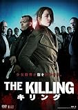
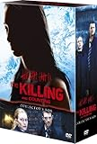
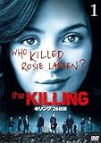

---
categories:
- 海外ドラマ
date: Sat, 02 Aug 2014 13:45:54 +0000
slug: post-6002
tags:
- 海外ドラマ
title: 【海外ドラマレビュー】デンマークのサスペンス「キリング」がめっちゃくちゃ面白い件
---

ハローしんぺー(<a href="https://twitter.com/s_s_p_y" target="_blank">@s_s_p_y</a> )です。
オフィより詳しくて、wikiよりも有用なsukekiyo情報サイト「Gadget Zombie Parasite」へようこそ。

<!--more-->

最近見たドラマでこれが一番面白かった。シーズン1をあっちゅーまに見終わったのでとりあえずのレビューを書きますわ。

<h2>「キリング」あらすじ</h2>

<blockquote>
舞台はデンマークの首都、コペンハーゲン。中心街には古い建物が整然と並び、そこから少し離れるとのどかな自然の風景が広がる。女性刑事サラ・ルンドは、一人息子のマークを連れて、スウェーデン人の恋人ベングトと共にスウェーデンへ移住する予定だった。しかし退職する日に少女の死体が発見され、移住も延期。後任の刑事イエン・マイヤーとともに捜査を続けることになった。
引用元：wikipedia「<a href="http://ja.wikipedia.org/wiki/THE_KILLING/キリング">キリング</a>」
</blockquote>

この少女の死体というのは、長時間監禁されて、暴行を加えられて殺害されていた。そしてこの少女を巡り、被害者・容疑者・操作側とそれぞれ立場の心情描写を絶妙な形で表現しつつ、常にミステリーを残してそれぞれの回を終えて次につなげるという、絶対に次が見たいと思わせる作り。

普通女子高生の殺害されるような事件だったら、変質者の犯行か同級生含め学校関係者かとかが犯人と相場が決まっているけど、この事件は全ての人間が何かしらの秘密があって、他人を思いやるための嘘や自分のための嘘が交錯して事件の解決を遅らせたり、新たな謎を生んだりとどんどん複雑になって行きます。

<h2>「キリング」のここが面白い</h2>

<h3>詳細に描かれる心情描写</h3>
上にも書いたけど、関係者それぞれの視点から事件が描かれている点。
いわれのない容疑をかけられる人たち。そのせいで、自分の生活が崩壊していく。それを必死に食い止めようともがく。でも何かしらの嘘があって、それが後々大きく発展したりとかして。

事件の被害者、つまり残された家族。この人たちはただ普通に生活をしていただけなのに、突然理不尽に不幸にたたき落とされて、それでも生きて行かなければいけない。そこが一番残酷だと思った。でも、じゃあ生きて行くためにはどうしたらいいのか。何かにケジメをつけなければいけない、誰かのせいにしなければいけない。そうしなければ生きていけない。

操作する側、つまり主人公。この人にも私生活がある。子供がいて、親がいて、恋人がいて、同僚がいる。それでも取り付かれたように事件を操作し続ける。もはや執念。でもこの執念がなかったら、事件は解決されなかった。主人公らしい主人公なんだけど、決して正義とかそういったものを振りかざしているわけではない。事件の解決こそが、結果的に被害者も加害者も救うと信じて操作にあたろうとしている感じ。

こんな風にそれぞれの立場が、すっごい詳細に描かれている。ここがやっぱり一番の見所

<h3>家具がめちゃくちゃお洒落！</h3>
それと、北欧ってこともあって家具がめちゃくちゃかっこいい！！
アメリカドラマのようなスタイリッシュな感じではなくて、IKEA的なおしゃれさと安心感、そしてどこの家庭にもありそうっていう親近感がある。この辺リアリティがあって面白かった。

<h3>島国だからか？日本的な間の取り方が見ていて疲れない</h3>

日本の映画は「間」とか「雰囲気」作りがうまいとか言われますが、このドラマも同じようなものを感じます。

決してスピーディではない。けど着実に解決に向けて進んでいる。
そして、沈黙をわざと使って行間で語っている感じ。

アメリカのドラマみたいに主人公が流れる水を数秒見つめてハッと何かを思いついて事件解決なんてものじゃない。じーっくり操作して、考えて、ようやくハッと何かに気がついてって感じで。見ていて中に入りやすい。

<h3>各話ラスト1分に事件が動き出すこのわくわく感！</h3>

ゆーっくりと操作が進むんだけど、各話のラスト1分にエンディングの曲が流れ出すと同時に事件の大きな手がかりが提示されたり、新たな謎が現れたりして、次の話への導線が引かれるんだけどこれがすっごいわくわくする。
え、まさかあいつがそんなことを！とか、この手がかりがこんな所にとか

とにかくこの1分に全てが凝縮されている。

<h3>「キリング」面白すぎてアメリカでも制作される</h3>

レンタルDVDやさんにいって混乱しました。

だって棚に
キリング
キリング17人の沈黙
キリング26日間

この中で本家のキリングつまりデンマーク産のキリングは「キリング」のみです。

<a href="http://www.amazon.co.jp/exec/obidos/ASIN/B00DUK5OEO/warawareotoko-22/ref=nosim/" rel="nofollow" target="_blank">THE KILLING/キリング DVD-BOXI</a>
posted with <a href="http://kaereba.com" rel="nofollow" target="_blank">カエレバ</a>

ソフィー・グローベール アミューズソフトエンタテインメント 2013-09-25    

<a href="http://www.amazon.co.jp/exec/obidos/ASIN/B00KD3G7Y2/warawareotoko-22/ref=nosim/" rel="nofollow" target="_blank">キリング/17人の沈黙 DVDコレクターズBOX</a>
posted with <a href="http://kaereba.com" rel="nofollow" target="_blank">カエレバ</a>

ミレイユ・イーノス 20世紀フォックス・ホーム・エンターテイメント・ジャパン 2014-08-02    

<a href="http://www.amazon.co.jp/exec/obidos/ASIN/B00A6N8WKG/warawareotoko-22/ref=nosim/" rel="nofollow" target="_blank">キリング/26日間 vol.1 [DVD]</a>
posted with <a href="http://kaereba.com" rel="nofollow" target="_blank">カエレバ</a>

ミレイユ・イーノス 20世紀フォックス・ホーム・エンターテイメント・ジャパン 2014-04-02    

あとはアメリカ産のリメイク版です。

で、キリング26日間が、シーズン1のリメイク。17人の沈黙はそのあとの話みたいです。

どうやら、このキリングが面白すぎた結果、アメリカでリメイクをされたみたいなんですが、調べてみたらどうやらキリングはデンマーク至上最高の視聴率を獲得したドラマだそうです。そりゃーそうでしょ。面白いもんw

そしてこのドラマがきっかけで、北欧ドラマをアメリカでリメイクする流れが活発になっているみたいです。
他にもザ・ブリッジっていうドラマがアメリカでリメイクされたみたいです。

デンマーク版とアメリカ版を同時進行で見るっていうのもやってみたいと思うんですけどどうでしょうかw多分こんがらがって頭おかしくなるw

<h2>しんぺーはこう思った。</h2>
ネタバレなしに書いてきましたが、どうでしょうか。
これ本当に面白かった！しかもけっこう前のドラマなので旧作の値段でレンタルできるはずです。

残念ながらHuluにはなかった。。。
アメリカ版はhuluにあり→<a href="http://ck.jp.ap.valuecommerce.com/servlet/referral?sid=3041033&pid=883551022" target="_blank" >海外の映画・ドラマが月額933円（税抜）で今すぐ見放題！今すぐ無料視聴！</a>

でも絶対面白いからおすすめです。夏休み中にいっきに見るとかいかがでしょうか！
とにかくおすすめです。
と言ったところで本日は以上になります。おやすみなさい。

<a href="http://www.amazon.co.jp/exec/obidos/ASIN/B00DUK5OEO/warawareotoko-22/ref=nosim/" rel="nofollow" target="_blank">THE KILLING/キリング DVD-BOXI</a>
posted with <a href="http://kaereba.com" rel="nofollow" target="_blank">カエレバ</a>

ソフィー・グローベール アミューズソフトエンタテインメント 2013-09-25    

