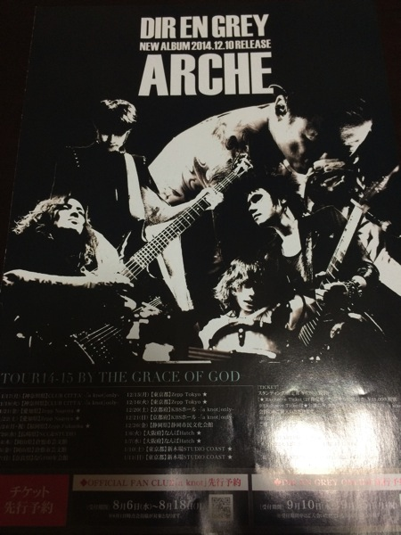
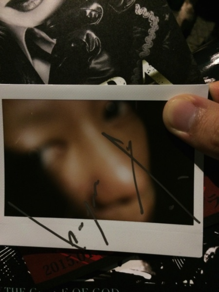

---
categories:
- DIR EN GREYのLIVEレポ
- TOUR14 PSYCHONNECT -mode of "GAUZE"?-
date: Tue, 05 Aug 2014 12:49:59 +0000
slug: post-6033
tags:
- DIR EN GREY
- LIVEレポ
title: 【ライブレポ】DIR EN GREY  TOUR14 PSYCHONNECT -mode of "GAUZE"?- a knot only 214_8_5@新木場スタジオコースト
---

ハローしんぺー(<a href="https://twitter.com/s_s_p_y" target="_blank" rel="noopener noreferrer">@s_s_p_y</a> )です。
オフィより詳しくて、wikiよりも有用なsukekiyo情報サイト「Gadget Zombie Parasite」へようこそ。<!--more-->

ニューアルバム「ARCHE」情報まとめ（レビュー、プロモなどなど）はこちら
<a style="color: #0070c5;" href="https://www.warawareotoko.com/2014/12/12/post-6711/" target="_blank" rel="noopener noreferrer">DIR EN GREY「ARCHE」まとめ（プロモ、メディア情報、そして感想） | Gadget Zombie Parasite</a> 暑かった。チケット争奪戦が激しかったことは虜なら誰しもが知っているだろうが、本日の物販も戦争だった。

参考：<a href="https://www.warawareotoko.com/2014/05/27/post-5390/">DIR EN GREY夏のGAUZEツアーのチケットが全く取れない件について</a>
参考：<a href="https://www.warawareotoko.com/2014/08/05/post-6013/">【物販状況報告】８月５日DIR EN GREY TOUR 2014 PSYCHONECT -mode of GAUZE-knot only @新木場スタジオコースト</a>

限定Tシャツは速攻売り切れ。限定ワークシャツも早めに並んだ人以外は入手できなかったかと思う。何より、新木場の橋の駅側まで列が並んでいたのは驚きだ。
物販レポに関しては上に挙げた過去記事を一読いただければと思う。スタッフの方々が暑い中、少しでも日陰を作ろうと工夫してくださっていた。ツアートラックも陰を作るように止められていたし。

さてLIVEレポです。
<h2>DIR EN GREY TOUR 2014 PSYCHONECT -mode of GAUZE-knot only 新木場スタジオコースト　8月5日</h2>
<h3>まずはセトリ</h3>
01.ゆらめき
02.304号室、白死の桜
03.新曲
04.DIFFERENT SENSE
05.MASK
06.Cage
07.輪郭
08.アクロの丘
09.mazohyst of decadence
10.raison detre
11.Schweinの椅子
12.蜜と唾
13.THE FINAL
14.残

EN
01.予感
02.蒼い月
03.業
04.SUSTAIN THE UNTRUTH
05.激しさと、この胸の中で絡み付いた灼熱の闇

最初はGAUZEの例の映像からはじまりました。否、昔のバージョンを新しくアレンジしたもののようです。ゆらめきから始まりました。当然歓声。

全体的に新旧おり混ざりつつ、大昔の曲をぶっこみつつ新曲も入れてくるという感じですね。

始まって数曲、いや1曲目あたりからすでに離脱者がいて、曲を追うごとに増えて行った。ステージの一階部分の後方にいたから気になったのかもしれないけれども、それにしても途中退出者が多かった。どんどん抜けて行った。
一説によるとコーストのキャパと言われる2400人以上の3000人近くを入れていたという。後方まで割とぎゅうぎゅうでした。ステージ前方のことを思うと大丈夫かと心配になります。

それと当然？ですが、京さんからGAUZE的振り付けはいっさいなかったです。
<h3>演出</h3>
・照明器具
会場に入ってまず目を引いたのが、低く下げられた照明器具たち。
一階部分の上部を覆うように下げられていました。肩車すれば手が届きそうなくらいの高さでした。
こちらの照明はLIVEが始まると高くなっていき、様々な効果の照明を映し出していました。中でも目を引いたのが「アクロの丘」でのステンドグラスでした。

・ステージ
ステージにはバックに上部下部に分かれたLEDの画面。そして下手の後方には工事現場の足場のようなものがたてられていました。ステージ側の照明は「輪郭」の時にいつもの<a href="https://www.youtube.com/watch?v=wlJxiSdJSF8#t=13">黒坂圭太監督のアニメーション</a>は流さず、真っ暗というか真っ赤な照明の中での演奏でした。この辺がGAUZE verなのかな。
<h3>メンバー衣装</h3>
後方のため、不確かですが。

京：学生帽と輪郭の時のような襟が大きなコート。金髪の短髪。
Die：いつも通りのかなり大きなフードつきノースリーブ。髪の毛真っ赤。
薫：ゆったりとしたハッピというかローブというか、長い布という印象
Toshiya：不明。髪型は以前の天草四郎ではなく、もしゃもしゃとしたのびていた。（<a href="http://www.amazon.co.jp/gp/product/B005YS5DN2/ref=as_li_ss_il?ie=UTF8&amp;camp=247&amp;creative=7399&amp;creativeASIN=B005YS5DN2&amp;linkCode=as2&amp;tag=warawareotoko-22">こちらの雑誌</a>と同じ）
Shinya:不明

アンコールの時の衣装
京：海外ドラマにでてくる外科医が着ているようなTシャツ
Die：覚えていないです。すいません。
Toshiya：タンクトップ？
Shinya：不明
薫：ペニュを思い浮かべてください。それです。とにかく、とにかくでかい布を塗ってきているような感じです
<h3>MC</h3>
「楽しんでるかー？」のみです。
でもこの一言からやっぱり、お祭りって意味が取れますね。
<h2>NEW ALBUM「ARCHE」12月10日発売</h2>

渡されたフライヤーの画像かっけーとか思ってスルーしてたw
ニューアルバムについてです。オフィシャルサイトの方でもすでに情報解禁されております。

こちらからメンバーのコメントが見れます。
<a href="http://www.sp-freewillonline.com/direngrey/information.php?id=733215710&amp;page=detail">DIR EN GREY online（スマートフォン専用サイト）</a>

コメントによると11月発売を予定していたけど、遅れて12月になったのね。
後述のツアーももしかして、発売と合わせてくまれてたのかなw本当は。

まあ、DIRっぽいから別にいいんですけどねw　でもこれで、また発売まで、先行試聴を聞かないか聞くかで色々と分かれてくるのねきっと。

ギリシャ語で「根源」の意。今日のLIVEのように、懐かしさの中に新しさを表現するような、そして新しさの中にDIR EN GREYが表現されているようなALBUMになることでしょう。

DIR EN GREY　9thALBUM
「ARCHE」2014年12月10日発売
<h2>TUOR 14-15 BY THE GRACE OF GOD</h2>
完全に忘れてました。このバンドがツアー初日に次の集金を告知するドSバンドだってことを。

先に予約のスケジュールから

a knot先行
8月6日〜18日
ということでえーっと、明けて今日からですね。

DIR EN GREY online先行
9月10日〜15日
一ヶ月先か

きっとknot先行の入金日はどうせ給料日前なんでしょ。ほんとにもー

さてツアー日程です。

2014/11/17(月) 【神奈川県】CLUB CITTA’ -｢a knot｣only-
2014/11/18(火) 【神奈川県】CLUB CITTA’ -｢a knot｣only-
2014/11/21(金) 【愛知県】Zepp Nagoya
2014/11/22(土) 【愛知県】Zepp Nagoya
2014/11/24(月・祝) 【福岡県】Zepp Fukuoka
2014/11/26(水) 【長崎県】NCC＆STUDIO
2014/12/4(木) 【岡山県】倉敷市芸文館
2014/12/5(金) 【岡山県】倉敷市芸文館
2014/12/7(日) 【奈良県】なら100年会館
2014/12/15(月) 【東京都】Zepp Tokyo
2014/12/16(火) 【東京都】Zepp Tokyo
2014/12/20(土) 【京都府】KBSホール -｢a knot｣only-
2014/12/21(日) 【京都府】KBSホール -｢a knot｣only-
2014/12/26(金) 【静岡県】静岡市民文化会館
2015/1/6(火) 【大阪府】なんばHatch
2015/1/7(水) 【大阪府】なんばHatch
2015/1/10(土) 【東京都】新木場STUDIO COAST
2015/1/11(日) 【東京都】新木場STUDIO COAST

詳細は<a href="http://direngrey.co.jp/tour/1420/">こちら</a>から
スマホの方は<a href="http://www.sp-freewillonline.com/direngrey/live.php?id=831414336&amp;page=detail">こちら</a>

とりあえず全通のチケット代だけここに書いておきますね。

10万8000円です。本当にありがとうございました。
本当に神の恩恵＝god of graceです。本当にありがとうございます。

どうせ、ノットフェストにも参加してsukekiyoの年末ミニツアーもウンヌンカンヌン
<h2>しんぺーはこう思った。</h2>
さいごになりましたが、また家宝が増えたのでご報告いたします。
<a href="https://www.warawareotoko.com/2014/08/02/post-5996/">以前の記事でご紹介した抽選会</a>で1等あたりました。
それがこちらです。

LIVE終了後に抽選会の所にいったら、透明なジップロック的な袋に入ったポラからスタッフさんが出して、裏返しにして差し出してくれました。
その中から、これだ！！と思うものを引いたら京さんでした。

完全な深読みですが、多分裏返しにされた上からメンバー順になってると思う。京→Die→薫→Toshiya→Shinyaという順番になってるんじゃないかと勝手に予想。
さてさて、家宝が増えましたよ。「ホ」はこれで<a href="https://www.warawareotoko.com/2014/05/01/post-5235/">sukekiyoの如意輪観賞</a>以来です。

さーってと明日もLIVEですね。明日も暑いと思いますのでしっかりと対策して参戦しましょう。明日は攻めます！

と言ったところで本日は以上になります。おやすみなさい。