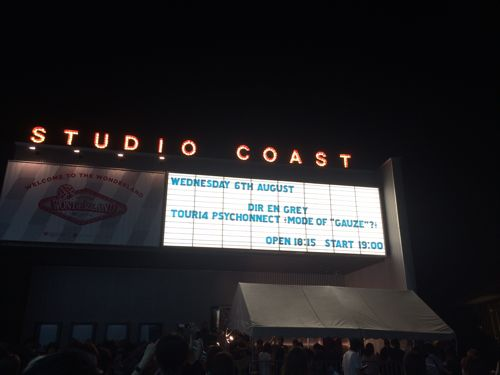

---
categories:
- DIR EN GREYのLIVEレポ
- TOUR14 PSYCHONNECT -mode of "GAUZE"?-
date: Wed, 06 Aug 2014 14:28:29 +0000
slug: post-6051
tags:
- DIR EN GREY
- LIVEレポ
title: 【ライブレポ】DIR EN GREY  TOUR14 PSYCHONNECT -mode of "GAUZE"?- a knot only 214_8_6@新木場スタジオコースト
---

ハロー。しんぺー(<a href="https://twitter.com/s_s_p_y" target="_blank" rel="noopener noreferrer">@s_s_p_y</a> )です。

オフィより詳しくて、wikiよりも有用なsukekiyo情報サイト「Gadget Zombie Parasite」へようこそ。

<!--more-->

<h2>まずはセトリ</h2>

GAUZE -mode of adam-
Schweinの椅子
raison detre
Cage
THE FINAL
LOTUS
SUSTAIN THE UNTRUTH
304号室、白死の桜輪郭
mazohyst of decadence
罪と規制
アクロの丘
ゆらめき
MASK
蜜と唾(remake ver)
残

EN
予感
新曲
蒼い月
羅刹国
激しさと、この胸の中で絡み付いた灼熱の闇

ステージは当たり前だけど昨日と一緒

<a href="https://www.warawareotoko.com/2014/08/05/post-6033/" target="_blank" rel="noopener noreferrer">【LIVEレポ】DIR EN GREY TOUR 2014 PSYCHONECT -mode of GAUZE-knot only 8月5日新木場スタジオコースト</a>

違ったのは照明が最初から上げっぱなしだったことと、映像による演出が極端に少なかったことくらい。

セトリも昨日と比べるとそこまでの大差はないように思います。むしろ昨日のノ限定はどの辺りが限定だったのか•••それと機材トラブルが頻発。前半京の音声が聞こえないこと多々あった。アンコではイヤモニが聞こえなかったみたい。そのせいか終始鬼の形相。

MASKで、左手で関節不自然な感じでバキューンてやってました。

<h2>演出</h2>

<h3>映像</h3>
これが昨日に比べて少なかった様に感じます。覚えているのがアクロの丘、新曲、MASKくらいで他に覚えている映像がありません。

LOTUSも映像なしの照明のみ。

<h3>メンバー衣装</h3>

京
学生帽に少しだけ長めのジャケット(胸にバッジ？つき)、ぼんたんみたいなパンツにシャツは柄が入ったTシャツ

Die
袖眺めの半袖に、カーゴ？パンツぽいもの

Shinya
精神病等の拘束服の様な、真っ白なシャツ。むしろサイボーグ009を、真っ白くしたような印象。首を覆うような襟がついてました。

Toshiya
えーっと不思議なことに記憶から消失しました。多分Toshiyaにしては作り込まない普通のシンプルな服装だったと思う。

薫
えーっと昨日と一緒ww布でした。

アンコのメンバー衣装
京、限定Tシャツ
Toshiya、限定Tシャツ
薫、みてないけど多分布
Die、なんかのシャツ
Shinya、ツアーTシャツかな？違うかも。それを袖をカットしてたのだと思います。

<h3>MC</h3>

俺の言いたいことわかってんなー？

<h2>その他</h2>

あとは今日気がついたのはこの辺りです！

https://twitter.com/s_s_p_y/status/496995293305393152

https://twitter.com/s_s_p_y/status/497010056500498433

https://twitter.com/s_s_p_y/status/497006716475543552

あとは餌巻きの時にDieが後ずさりしたらやもさんにあたったらしく、その後ヒップアタックしてたそうな。当たったとこまでしかみてなかったぜ、ちくしょー

<h2>しんぺーはこう思った。</h2>

昨日と打って変わって、前に攻め入ったんですが激しかったです。

上手側で押しまくってしまいました。複数の方に何度か反撃いただきました。すいません。でも、それがLIVEだと思うし嫌なら後ろに行けばとも思うのですが、ぼくのやり方がまずかったかもしれません。

LIVEはというと、明日起きたら多分体中痛くなってると思います。

さぁ、ツアーが始まりました。地方公演参戦される方、くれぐれも体調には気をつけてください。LIVE中もちゃんと水分取りましょうね。ぼくは普段のLIVEでは、LIVE中に飲み物絶対飲まない自分ルールがあるんですが、その禁を犯しましたよ。マジで。バーに売ってるクリスタルガイザーあたりをある程度飲んで、潰してパンツの後ろポケットに入れるか、ペットボトルネックストラップ的な物を使うといいんじゃないかと思います。今日もLIVE前に退出される方もいました。前の方でも担ぎ出される人や、アンコで力尽きる人もいました。

本当に、死人出るレベルです。皆様！ご武運を！

ぼくの次回参戦日はゼップです！次回のLIVEレポはゼップです。良かったらまたみに来てください。LIVEレポ以外にもこんなことも書いていますので、良かったらどうぞご贔屓に。

<a style="color:#0070C5;" href="https://www.warawareotoko.com/2014/06/19/post-5734/" target="_blank" rel="noopener noreferrer">LIVEの時のトイレってどうしてますか？ | Gadget Zombie Parasite</a>  

といったところで、本日は以上です。おやすみなさい。