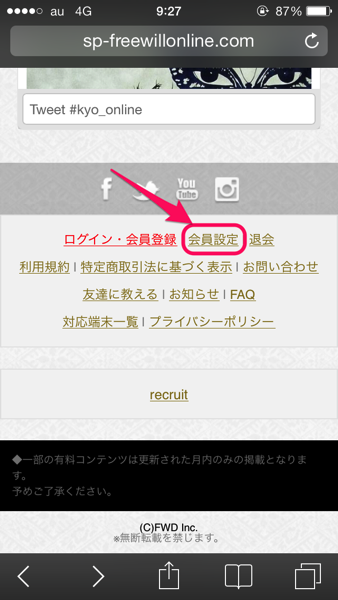
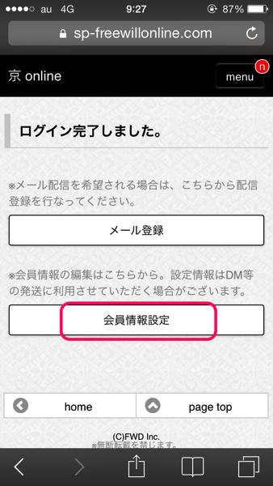

---
categories:
- sukekiyo
date: Sat, 09 Aug 2014 14:53:08 +0000
slug: post-6066
tags:
- sukekiyoまとめ
title: 今週のsukekiyoまとめ！8月4日〜8月8日
---

ハローしんぺー(<a href="https://twitter.com/s_s_p_y" target="_blank">@s_s_p_y</a> )です。
オフィより詳しくて、wikiよりも有用なsukekiyo情報サイト「Gadget Zombie Parasite」へようこそ。<!--more--><!--more-->GAUZEツアーいかがお過ごしでしょうか？メンバーがGAUZEツアーで全国を回ってる間に、sukekiyoの方がにわかに動き始めましたので久しぶりのsukekiyoまとめです。

<h2>sukekiyo海外ツアー「雨上がりの優詩」オフィシャルグッズ発表される</h2>

といっても<a href="http://sukekiyo-official.jp/index.html">オフィ</a>にのってるわけではありません。
なんで載せないのかしら。

facebook上に存在する<a href="https://www.facebook.com/NeoTokyoOfficial/timeline">こちらのページ</a>に掲載がありました。

Neo Tokyoというページです。<a href="http://www.neotokyo.de">http://www.neotokyo.de</a>

多分ドイツのサイトかな？サイト上でチケット等を販売したりしていることから、ドイツ側の日本文化紹介のハブ的なサイトなのかな。といってもKpopあたりが載っててNeoTokyoとはよく言ったもんだ。

それとkyoのオフィシャルがいいねしているあたりから、正しい情報だと思います。

 

<a href="https://www.facebook.com/kyo.official.jp/posts/687464697995999">投稿</a> by <a href="https://www.facebook.com/kyo.official.jp">Kyo</a>.

で、肝心のグッズがこちら

どれくらいの大きさか不明ですがポスターです。髪の毛の長さから判断して日本公演の前後に撮影したものと思われます。

 

<a href="https://www.facebook.com/NeoTokyoOfficial/photos/a.769356633111265.1073741831.104558676257734/769356653111263/?type=1">投稿</a> by <a href="https://www.facebook.com/NeoTokyoOfficial">Neo Tokyo</a>.

なんか四角いものです。バンダナかな

 

<a href="https://www.facebook.com/NeoTokyoOfficial/photos/a.769356633111265.1073741831.104558676257734/769356663111262/?type=1">投稿</a> by <a href="https://www.facebook.com/NeoTokyoOfficial">Neo Tokyo</a>.

これ欲しい！！！パーカー！バックプリントがかっけー！MAN WITH A MISSIONですかと間違われそうですが、そんな時はフロントのSUKEKIYOを見せていってやりましょう「I am Sanretsusha!」

 

<a href="https://www.facebook.com/NeoTokyoOfficial/photos/a.769356633111265.1073741831.104558676257734/769356659777929/?type=1">投稿</a> by <a href="https://www.facebook.com/NeoTokyoOfficial">Neo Tokyo</a>.

Tシャツ。これもかっこいいな！

 

<a href="https://www.facebook.com/NeoTokyoOfficial/photos/a.769356633111265.1073741831.104558676257734/769356723111256/?type=1">投稿</a> by <a href="https://www.facebook.com/NeoTokyoOfficial">Neo Tokyo</a>.

Tシャツ。これもかっこいい。ほしい

 

<a href="https://www.facebook.com/NeoTokyoOfficial/photos/a.769356633111265.1073741831.104558676257734/769356716444590/?type=1">投稿</a> by <a href="https://www.facebook.com/NeoTokyoOfficial">Neo Tokyo</a>.

Tシャツのデザインが多い！これもかっこいい。海外ではTシャツが売れるのかしら

 

<a href="https://www.facebook.com/NeoTokyoOfficial/photos/a.769356633111265.1073741831.104558676257734/769356739777921/?type=1">投稿</a> by <a href="https://www.facebook.com/NeoTokyoOfficial">Neo Tokyo</a>.

トートバッグ。例の色っぽいというかえろい女性のプリントがされています。普段使いを全く無視したプリントです。

 

<a href="https://www.facebook.com/NeoTokyoOfficial/photos/a.769356633111265.1073741831.104558676257734/769356709777924/?type=1">投稿</a> by <a href="https://www.facebook.com/NeoTokyoOfficial">Neo Tokyo</a>.

され、これが一番問題の品です。iPhoneケースなんですけど、えーっと牡蛎ですか。どうしてこれで大丈夫だと思ったwwwほしいわwwww

 

<a href="https://www.facebook.com/NeoTokyoOfficial/photos/a.769356633111265.1073741831.104558676257734/769356756444586/?type=1">投稿</a> by <a href="https://www.facebook.com/NeoTokyoOfficial">Neo Tokyo</a>.

<h2>kyo onlineにて個人情報を登録すると後日お楽しみがあるらしい</h2>

<blockquote class="twitter-tweet" lang="ja">
京 online会員の皆様へ。 TOPページの会員設定から住所等のお客様情報登録ができるようになりました。 8/11の17時ぐらいまでに情報を登録しておくと何かいいことがあるかも!? (wez)
&mdash; 京 (@kyo_official) <a href="https://twitter.com/kyo_official/statuses/497642491261104128">2014, 8月 8</a></blockquote>

kyo onlineの一番下にある、会員情報設定をタップ、ログインします。

その次の画面で会員情報設定をタップして、情報を入力していきます。

これで登録完了だと思います。

<h2>しんぺーはこう思った。</h2>
いいことってなんだろな〜

それと海外グッズほしいなぁ。。でも今下手にオークションとか高い金額で個人取引して、公式通販で販売しますとかだったら泣くしな。

それにDIRの方の冬ツアーのチケット入金も待っているわけですし。

これじゃああれだ、

<blockquote class="twitter-tweet" lang="ja">
冬ツに向けての虜の心境→雨上がりの融資
&mdash; しんぺー@mode of GAUZE (@s_s_p_y) <a href="https://twitter.com/s_s_p_y/statuses/497915054864347136">2014, 8月 9</a></blockquote>

と言ったところで本日は以上になります。おやすみなさい。