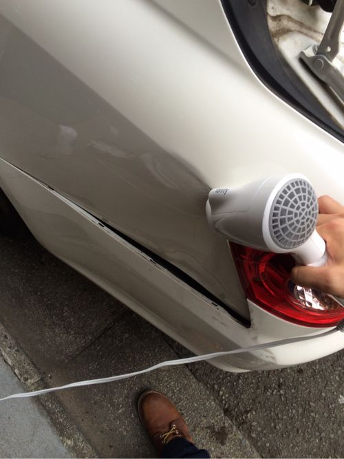

---
categories:
- ブログ
date: Wed, 20 Aug 2014 13:28:43 +0000
slug: post-6136
title: 車の凹みはドライヤーがあれば自分で直せる
---

ハロー。しんぺー(<a href="https://twitter.com/s_s_p_y" target="_blank">@s_s_p_y</a> )です。

オフィより詳しくて、wikiよりも有用なsukekiyo情報サイト「Gadget Zombie Parasite」へようこそ。

<!--more-->

先日駐車場を変えたんです。で、細い道の奥にある駐車場なんでバックでケツから入らないとダメな所にあるんですが、それが30mくらいバックするんですよ。

でバックする時、左側に電柱があるんですが慣れてないせいもあってやっちゃいました。

そっこー修理屋もって行きましたわ。正直、4,5万くらいかな？とか思ってましたよ。

そしたら、修理屋の人「あっちゃーこりゃ少なくとも20万かかるよ」

蝉のなく声が遠くで聞こえ、夏の日差しに音を感じました。

暑い、そうか•••
もう夏なんだ。ゲリラ豪雨が来そうな黒い雲を遠くに感じました。

風鈴の音すら鬱陶しく感じるぼくの背中に、一筋冷たいものが触れた感触がしました。

20•••まん•••だと？

ぶつけたことよりも、修理費に腹が立ち
そして狭い道路に太い電柱を立てた役所を国を世界を恨みました。

そして、何より自分の不注意を

暫く現実に目を逸らすように、そのままの日々が過ぎました。でも、車に乗ろうとする度に目がいく凹んだ傷跡は、抉られたぼくの心を表しているかのようでした。

耐えかねて、ダメもとで検索してみました。

「車 凹み 自分直す」

するとこんな動画が•••

http://youtu.be/9cWI3kyJEz8

は？バカな•••そんなわけない
最初は目を疑いました。

それから色々と検索した結果、次の二つの方法で、凹んだ車は自分で直せると確信しました。

それがこれ

<ol>
<li>ドライヤーで温めて、急激に冷却する</li>
<li>ドライヤーで温めて、裏側から押す</li>
</ol>

一つずつ解説

<h2>車の凹みはドライヤーで温めて、急激に冷却する</h2>

車のボディは一応金属。金属は元の形を記憶する特性があります。

そこで、温めて柔らかくしてから一気に冷やします。冷やすことで、急激に硬くなりますがその時にもとの形に戻ろうとするわけです。

冷やすためには、こいつを使います。

<a href="http://www.amazon.co.jp/exec/obidos/ASIN/B0019SZZVQ/warawareotoko-22/ref=nosim/" rel="nofollow" target="_blank">サンワサプライ エアダスター(逆さOKエコタイプ) CD-31SET</a>
posted with <a href="http://kaereba.com" rel="nofollow" target="_blank">カエレバ</a>

 サンワサプライ 2008-05-01    

PCや電子機器を掃除する時に使うエアダスターです。これを逆さまにして噴出することで冷却されたガスがでます。

<h3>注意事項</h3>

最近のエアダスターは親切設計でユーザビリティが凄い！逆さまにしても普通に使えちゃうんです。
だから、逆さまにしたらダメなやつを買ってください。

なお、このガスは体に良くないので換気のいいところとか火気とか気をつけてください。自己責任ってやつです。

ちなみに、ぼくはこれじゃ直りませんでした。

<h2>車の凹みはドライヤーで温めて、裏側から押す</h2>

原理は一緒。温めて柔らかくしたところを今度は物理的に直していく方法です。

ぶつけた場所にもよるけど、パーツの取り外しが必要になる可能性が高いのでDIYできない人は、調べるかできる友達に頼みましょう。

ちなみにこんな感じ

ずーっと当て続ける

で、あとは裏から押すというよりも叩きまくる。するとほら

完全までとはいかないけど、マシになったでしょ？

<h3>注意事項</h3>

ハンマーとかで殴っちゃダメです。ボコって飛び出ちゃうので。あくまで手のひらなどの柔らかいもので叩いてください。

それとドライヤーをかなり長時間当て続けますのでヤケドに注意。さらにドライヤーのコンセントが溶けました•••気をつけて

<a href="http://www.amazon.co.jp/exec/obidos/ASIN/B00FJTOWFQ/warawareotoko-22/ref=nosim/" rel="nofollow" target="_blank">Panasonic ヘアードライヤー イオニティ ゴールド調 EH-NE55-N</a>
posted with <a href="http://kaereba.com" rel="nofollow" target="_blank">カエレバ</a>

 パナソニック 2013-11-01    

なお、こういったヒートガンを使った方が効率的にできて、なおかつドライヤーよりも温度出るのでいいかもしれません。

<table  border="0" cellpadding="5" style="border:none"><tr><td style="border:none;text-align:left"><a href="http://www.amazon.co.jp/exec/obidos/ASIN/B004KVYZU6/warawareotoko-22/ref=nosim/" rel="nofollow" target="_blank" target="_top">(STRAIGHT/ストレート) ホットエアーガン 400℃ 17-491</a></td></tr><tr><td style="border:none"><table  border="0" cellpadding="0" style="border:none"><tr><td valign="top" style="border:none"></td><td valign="top" style="border:none;text-align:left">
 (TOOL COMPANY STRAIGHT) ツールカンパニーストレート 

売り上げランキング : 591
<table style="border:none;margin-top:10px"><tr><td style="border:none;text-align:left;">
<a href="http://www.amazon.co.jp/gp/search?keywords=%83q%81%5B%83g%83K%83%93&__mk_ja_JP=%83J%83%5E%83J%83i&tag=warawareotoko-22" rel="nofollow" target="_blank" title="アマゾン" >Amazon</a>

<a href="http://hb.afl.rakuten.co.jp/hgc/0f6e221b.2eb9748a.0f6e221c.35cc1e84/?pc=http%3A%2F%2Fsearch.rakuten.co.jp%2Fsearch%2Fmall%2F%25E3%2583%2592%25E3%2583%25BC%25E3%2583%2588%25E3%2582%25AC%25E3%2583%25B3%2F-%2Ff.1-p.1-s.1-sf.0-st.A-v.2%3Fx%3D0%26scid%3Daf_ich_link_urltxt%26m%3Dhttp%3A%2F%2Fm.rakuten.co.jp%2F" rel="nofollow" target="_blank" title="楽天市場" >楽天市場</a>

<a href="http://ck.jp.ap.valuecommerce.com/servlet/referral?sid=3041033&pid=882528283&vc_url=http%3A%2F%2Fshopping.search.yahoo.co.jp%2Fsearch%3FuIv%3Don%26ei%3DUTF-8%26tab_ex%3Dcommerce%26slider%3D0%26va%3D%25E3%2583%2592%25E3%2583%25BC%25E3%2583%2588%25E3%2582%25AC%25E3%2583%25B3" rel="nofollow"  target="_blank" title="Yahooショッピング" >Yahooショッピング</a>

<a href="http://ck.jp.ap.valuecommerce.com/servlet/referral?sid=3041033&pid=882660047&vc_url=http%3A%2F%2Fauctions.search.yahoo.co.jp%2Fsearch%3Fvo%3D%26ve%3D%26auccat%3D0%26aucminprice%3D%26aucmaxprice%3D%26aucmin_bidorbuy_price%3D%26aucmax_bidorbuy_price%3D%26loc_cd%3D0%26abatch%3D0%26istatus%3D0%26filtered%3D1%26ei%3DUTF-8%26tab_ex%3Dcommerce%26va%3D%25E3%2583%2592%25E3%2583%25BC%25E3%2583%2588%25E3%2582%25AC%25E3%2583%25B3" rel="nofollow"  target="_blank" title="ヤフオク!" >ヤフオク!</a>
</td><td style="vertical-align:bottom;padding-left:10px;font-size:x-small;border:none">by <a href="http://kaereba.com" rel="nofollow" target="_blank">カエレバ</a></td></tr></table></td></tr></table></td></tr></table>

<h2>しんぺーはこう思った。</h2>

まだまだ満足いく出来じゃないけど、とりあえずは目立たなくなったので良しとしよう。

けっこうヒドく凹んでいたので、ぼくより軽傷の人は完璧に直ると思います。

修理費がゼロで済むので、諦める前にまずは自分でトライしてみてはいかがでしょうか。
といったところで、本日は以上です。おやすみなさい。